# Monoliths to Microservices: App Transformation Hands-on Workshop


 This document contains a complete set of instructions for running the workshop, split into different _scenarios_. You can use this document as a companion as you progress through the scenarios, but keep in mind that some of the links in this document may not work as they will be specific to your online environment. You will be expected to substitute your own values for the following URLs:

 * **$OPENSHIFT_MASTER** - When you see this variable, replace it with the value of your own OpenShift master url, such as `http://master.openshift.com:8443` (be sure to include the port!).

# SCENARIO 1: Getting Started with this course

* Purpose: Understand concepts in this workshop
* Difficulty: `beginner`
* Time: `5 minutes`

## Intro
In this scenario you will get familiar with the environment in which you will work for the next day and get ready for the rest of
the Application Transformation Roadshow scenarios.

As modern application requirements become more complex, it’s apparent that one runtime, one
framework, or one architectural style is no longer a feasible strategy. Organizations must figure out how
to manage the complexity of distributed app development with diverse technologies, a lack of skilled
resources, and siloed processes.

In this hands-on workshop you’ll learn about:

* Migrating an existing legacy Java™ EE app to [Red Hat JBoss
Enterprise Application Platform](https://developers.redhat.com/products/eap/overview/) on [OpenShift](https://developers.redhat.com/products/openshift/overview/).
* Using modern frameworks like [Spring Boot](https://projects.spring.io/spring-boot/), [Wildfly Swarm](http://wildfly-swarm.io),
[Eclipse Vert.x](http://vertx.io), and [Node.js](https://nodejs.org) to implement microservices and
replace monolithic functionality.
* Developing and deploying using [Red Hat OpenShift Container
Platform](https://developers.redhat.com/products/openshift/overview/), [Red Hat OpenShift Application Runtimes](https://developers.redhat.com/products/rhoar/overview/), and
DevOps processes.
* The benefits and challenges with microservices, including use
cases for reactive microservices.
* Preventing and detecting issues in a distributed system.
* API gateways and microservices.

### The Environment

During this training course you will be using a hosted OpenShift environment that is created just for you.
This environment is not shared with other users of the system. **Your environment will only be active for
today**. As you progress
through the scenarios, your environment will remain the same, **as long as you use the same browser
session** (don't worry if your browser crashes or you accidentally close the browser tab, the persistence is
cookie-based and should survive).

The OpenShift environment that has been created for you is running the latest version of our open source
project called OpenShift Origin.  This deployment is a self contained environment that provides everything
you need to be successful in learning the platform.  This includes such things as the command line, web
console, and public URLs.

Now that you know how to interact with OpenShift, let's focus on some core concepts that you as a developer
will need to understand as you are building your applications!

## Understanding the Workshop Environment

This workshop is split into several _scenarios_, each of which focuses on a specific
area related to Application Modernization and Transformation with Red Hat technologies.

Each scenario in turn has a number of steps that you follow to complete the scenario in the
order shown on the front page.

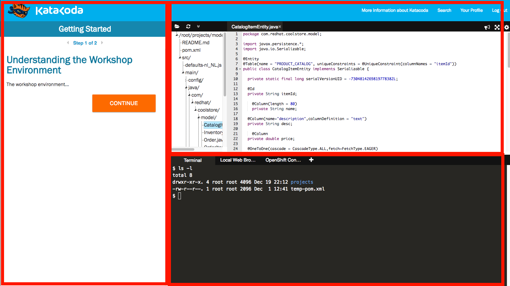

If you get stuck, you can always freely move between the steps with the left and right
arrows at the top of the instructions in case you missed a step, or start the entire scenario
from the beginning by simply reloading your browser's page.

As you complete each step within a scenario, click the **Continue** button to move on to the next
step.


## Following the scenarios

In the instructions pane on the left (where you're reading this text) are the instructions for each step of each scenario.
Follow the instructions to complete the scenario.

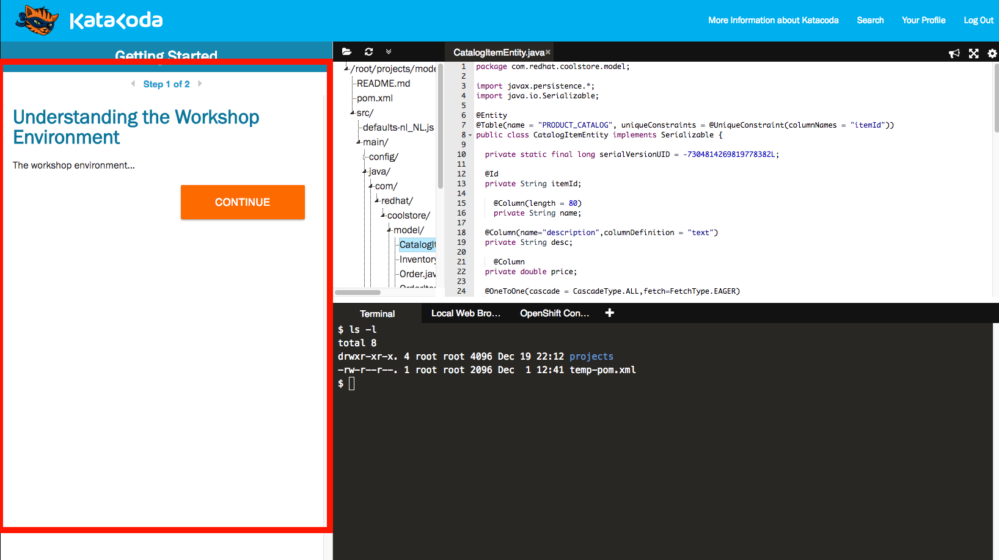

## Executing Commands

Occasionally you'll see an executable command with a little arrow on the right, such as:

``echo 'Hello World!'``### Run it!

You can manually type this command into the terminal on the right, or you can
click the command itself to automatically copy and paste and execute
the command in the terminal (which is a fully functional Linux terminal!)

## Links

Links are [highlighted](http://redhat.com) and can be clicked to open
a separate tab in your browser. You can then continue the scenario by returning to this tab (be sure not to close it!)

## Terminal Tabs

On the right, you'll see a set of tabs:


These tabs are quick links for you to use:

* **Terminal** - This tab is always present and is the main terminal into which you will type Linux commands like `ls` and others.
* **Local Web Browser** - This tab will open a new tab in your browser and give you access to programs running on HTTP port 8080 in your environment. This is used to
do testing of applications that run outside of OpenShift. You'll use this later on.
* **OpenShift Console** - This tab will open a new tab in your browser pointing to the OpenShift Web Console. You will use throughout
the workshop.
* **The Plus(+) Button** - This is used to open new Terminals and view applications running on other ports. You won't need to use this during the
workshop but it's useful if you want to run another command in a separate terminal.

## Opening files

You may also encounter instructions that ask you to open a file in the
editor, and be provided a link such as this one: `hello.txt`. Clicking
on the filename will open the file's content into the editor at the upper right,
and you can edit the file right away.

## Editing code

The code editor at the upper right is a fully functional text-based
editor for editing code. You can edit the code directly in the window and your
changes will automatically be saved. Occasionally you may encounter code
snippets with a **Copy to Editor** link, such as:

```java
This is code that I can copy and paste without having to type it in!
```

These snippets save you time by writing code for you, but you're always encouraged
to try and type the code in yourself where it makes sense and doesn't take too much
time.


## Summary

You are now ready to start on your first scenario and learn about transforming applications using Red Hat Developer technologies.
If you have any questions, be sure to ask any of the workshop teachers!

As you progress through the scenarios, your progress is tracked:

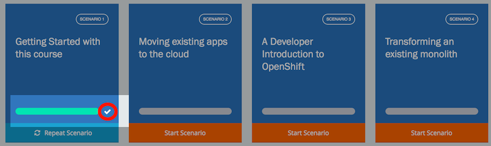


# SCENARIO 2: Moving existing apps to the cloud

* Purpose: 
* Difficulty: `intermediate`
* Time: `45 minutes`

## Intro
In this scenario you will see how easy it is to migrate from legacy platforms to JBoss EAP.
We'll answer questions like:

* Why move applications to OCP and cloud?
* What does the lift and shift process look like?

We will then take the following steps to migrate (lift & shift) an existing Java EE app to EAP+OpenShift using [Red Hat Application Migration Toolkit](https://developers.redhat.com/products/rhamt/overview/) (RHAMT)

* Analyze existing WebLogic monolith application using RHAMT.
* Review the report and update code and config to run on JBoss EAP
* Deploy to OpenShift
* Use OpenShift features like automatic clustering and failover to enhance the application

## What is Red Hat Application Migration Toolkit?


Red Hat Application Migration Toolkit (RHAMT) is an extensible and customizable rule-based tool that helps simplify migration of Java applications.

It is used by organizations for:

* Planning and work estimation
* Identifying migration issues and providing solutions
* Detailed reporting
* Using built-in rules and migration paths
* Rule extension and customizability
* Ability to analyze source code or application archives

RHAMT examines application artifacts, including project source directories and application archives, then produces an HTML report that highlights areas needing changes. RHAMT can be used to migrate Java applications from previous versions of Red Hat JBoss Enterprise Application Platform or from other containers, such as Oracle® WebLogic Server or IBM® WebSphere® Application Server.

## How Does Red Hat Application Migration Toolkit Simplify Migration?

Red Hat Application Migration Toolkit looks for common resources and highlights technologies and known trouble spots when migrating applications. The goal is to provide a high-level view into the technologies used by the application and provide a detailed report organizations can use to estimate, document, and migrate enterprise applications to Java EE and Red Hat JBoss Enterprise Application Platform.

> RHAMT is usually part of a much larger application migration and modernization program that involves well defined and repeatable phases over weeks or months and involves many people from a given business. Do not be fooled into thinking that every single
migration is a simple affair and takes an hour or less! To learn more about Red Hat's philosophy and proven methodology, check out
the [RHAMT documentation](https://access.redhat.com/documentation/en/red-hat-application-migration-toolkit) and contact your local Red Hat representative when embarking on a real world migration and modernization strategy.

## More RHAMT Resources

* [Documentation](https://access.redhat.com/documentation/en/red-hat-application-migration-toolkit)
* [Developer Homepage](https://developers.redhat.com/products/rhamt/overview/)


## Analyzing a Java EE app using Red Hat Application Migration Toolkit

In this step we will analyze an existing application built for use with
Oracle® WebLogic Server (WLS). This application is a Java EE application
using a number of different technologies, including standard Java EE APIs
as well as proprietary Weblogic APIs and best practices.

The Red Hat Application Migration Toolkit can be installed and used in a few different ways:

* **Web Console** - The web console for Red Hat Application Migration Toolkit is a web-based system that allows a team of users to assess and prioritize migration and modernization efforts for a large number of applications. It allows you to group applications into projects for analysis and provides numerous reports that highlight the results.
* **Command Line Interface** - The CLI is a command-line tool that allows users to assess and prioritize migration and modernization efforts for applications. It provides numerous reports that highlight the analysis results.
* **Eclipse Plugin** - The Eclipse plugin for Red Hat Application Migration Toolkit provides assistance directly in Eclipse and Red Hat JBoss Developer Studio for developers making changes for a migration or modernization effort. It analyzes your projects using RHAMT, marks migration issues in the source code, provides guidance to fix the issues, and offers automatic code replacement when possible.

For this scenario, we will use the CLI as you are the only one that will run RHAMT in this system. For multi-user use, the Web Console would be a good option.

**1. Verify Red Hat Application Migration Toolkit CLI**

The RHAMT CLI is has been installed for you. To verify that the tool was properly installed, run:

`${HOME}/rhamt-cli-4.0.0.Beta4/bin/rhamt-cli --version`### Run it!

You should see:

```
Using RHAMT at /root/rhamt-cli-4.0.0.Beta4
> Red Hat Application Migration Toolkit (RHAMT) CLI, version 4.0.0.Beta4.
```

**2. Inspect the project source code**

The sample project we will migrate is a monolithic Java EE application that implements
an online shopping store called _Coolstore_ containing retail items that you can add to a shopping
cart and purchase. The source code is laid out in different
subdirectories according to Maven best practices.

> Click on the `tree` command below to automatically copy it into the terminal and execute it

``tree -L 3``### Run it!

You should see:

```console
.
+-- hello.txt
+-- pom.xml
+-- README.md
\-- src
    \-- main
        +-- java
        +-- openshift
        +-- resources
        \-- webapp

6 directories, 3 files
```

This is a minimal Java EE project which uses [JAX-RS](https://docs.oracle.com/javaee/7/tutorial/jaxrs.htm) for building
RESTful services and the [Java Persistence API (JPA)](https://docs.oracle.com/javaee/7/tutorial/partpersist.htm) for connecting
to a database and an [AngularJS](https://angularjs.org) frontend.

When you later deploy the application, it will look like:


**3. Run the RHAMT CLI against the project**

The RHAMT CLI has a number of options to control how it runs. Click on the below command
to execute the RHAMT CLI and analyze the existing project:

```
~/rhamt-cli-4.0.0.Beta4/bin/rhamt-cli \
  --sourceMode \
  --input ~/projects/monolith \
  --output ~/rhamt-report \
  --overwrite \
  --source weblogic \
  --target eap:7
```### Run it!

> Note the use of the ``--source`` and ``--target`` options. This allows you to target specific migration paths supported by RHMAT. Other
migration paths include **IBM® WebSphere® Application Server** and **JBoss EAP** 5/6/7.

**Wait for it to complete before continuing!**. You should see `Report created: /root/rhamt-report/index.html`.

**3. View the results**

The RHAMT CLI generated an HTML report. To view the report, first startup a simple web server in a separate terminal:

```docker run --privileged -v ~/rhamt-report:/usr/share/nginx/html:ro,z -p 9000:80 -it nginx```### Run it!

> **NOTE**: This command will not output anything

Then [click to view the report](https://$OPENSHIFT_MASTER/)

You should see the landing page for the report:

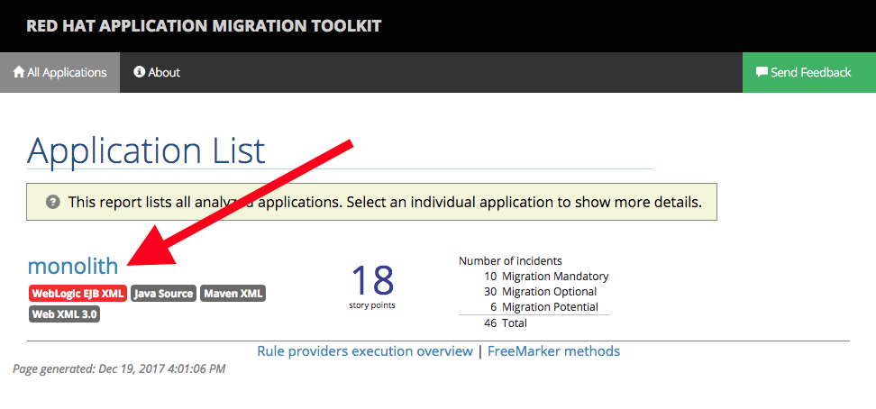

The main landing page of the report lists the applications that were processed. Each row contains a high-level overview of the story points, number of incidents, and technologies encountered in that application.

Click on the `monolith` link to access details for the project:

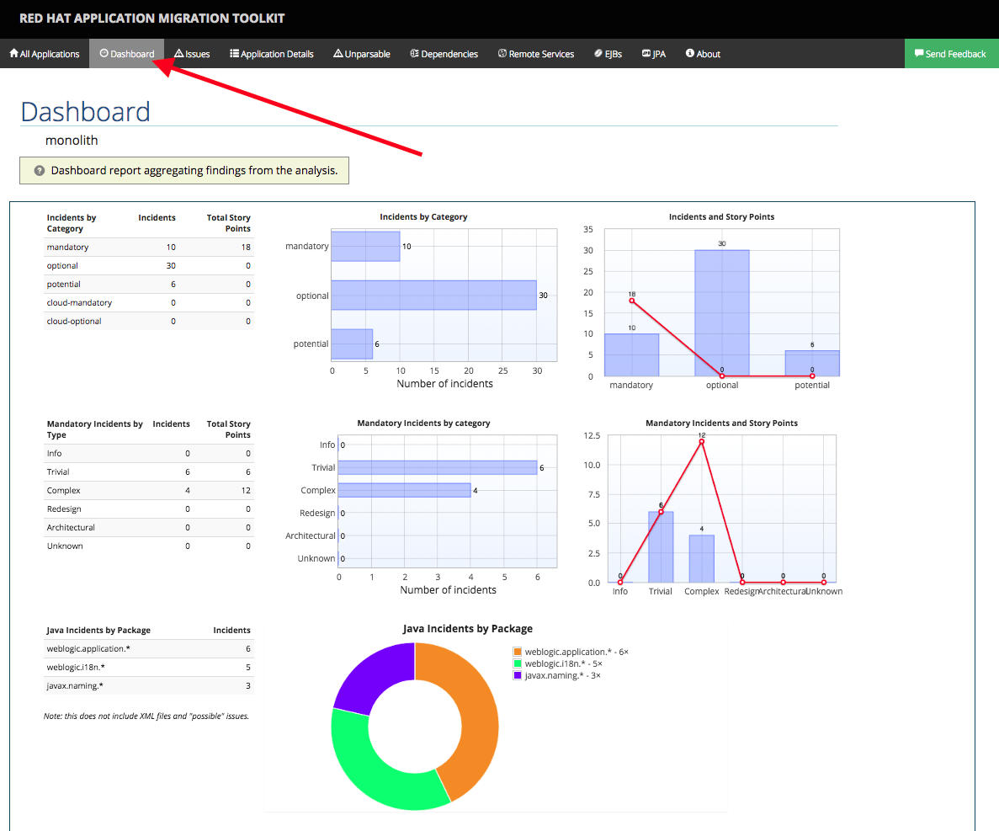

## Understanding the report

The Dashboard gives an overview of the entire application migration effort. It summarizes:

* The incidents and story points by category
* The incidents and story points by level of effort of the suggested changes
* The incidents by package

> Story points are an abstract metric commonly used in Agile software development to estimate the relative level of effort needed to implement a feature or change.
Red Hat Application Migration Toolkit uses story points to express the level of effort needed to migrate particular application constructs, and the application as a whole.
The level of effort will vary greatly depending on the size and complexity of the application(s) to migrate.

There are several other sub-pages accessible by the menu near the top. Cick on each one and observe the results for each of these pages:

* **Issues** Provides a concise summary of all issues that require attention.
* **Application Details** provides a detailed overview of all resources found within the application that may need attention during the migration.
* **Unparsable** shows all files that RHAMT could not parse in the expected format. For instance, a file with a .xml or .wsdl suffix is assumed to be an XML file. If the XML parser fails, the issue is reported here and also where the individual file is listed.
* **Dependencies** displays all Java-packaged dependencies found within the application.
* **Remote Services** Displays all remote services references that were found within the application.
* **EJBs** vontains a list of EJBs found within the application.
* **JBPM** vontains all of the JBPM-related resources that were discovered during analysis.
* **JPA** vontains details on all JPA-related resources that were found in the application.
* **Hibernate** vontains details on all Hibernate-related resources that were found in the application.
* **Server Resources** Displays all server resources (for example, JNDI resources) in the input application.
* **Spring Beans** Contains a list of Spring beans found during the analysis.
* **Hard-coded IP Addresses** Provides a list of all hard-coded IP addresses that were found in the application.
* **Ignored Files** Lists the files found in the application that, based on certain rules and RHAMT configuration, were not processed. See the --userIgnorePath option for more information.
* **About** Describes the current version of RHAMT and provides helpful links for further assistance.

> Some of the above sections may not appear depending on what was detected in the project.

Now that you have the RHAMT report available, let's get to work migrating the app!


## Migrate Application Startup Code

In this step we will migrate some Weblogic-specific code in the app to use standard Java EE interfaces.

**1. Open the file**

Open the file `src/main/java/com/redhat/coolstore/utils/StartupListener.java` using this link.
The first issue we will tackle is the one reporting the use of _Weblogic ApplicationLifecyleEvent_ and
_Weblogic LifecycleListener_ in this file.
The WebLogic `ApplicationLifecycleListener` abstract class is used to perform functions or schedule jobs at Oracle WebLogic Server start and stop. In this case we have
code in the `postStart` and `preStop` methods which are executed after Weblogic starts up and before it shuts down, respectively.

**1. Review the issue related to `ApplicationLifecycleListener`**

[Open the Issues report](https://$OPENSHIFT_MASTER/reports/migration_issues.html):

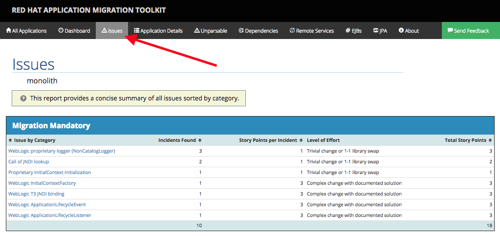

RHAMT provides helpful links to understand the issue deeper and offer guidance for the migration.

In JBoss Enterprise Application Platform, there is no equivalent to intercept these events, but you can get equivalent functionality using a _Singleton EJB_ with standard annotations,
as suggested in the issue in the RHAMT report.

We will use the `@Startup` annotation to tell the container to initialize the singleton session
bean at application start. We will similarly use the `@PostConstruct` and `@PreDestroy` annotations to specify the
methods to invoke at the start and end of the application lifecyle achieving the same result but without
using proprietary interfaces.

**2. Remove weblogic-specific `import` statements and inheritance**

Open the file: `src/main/java/com/redhat/coolstore/utils/StartupListener.java`,
and remove all instances of `import weblogic.x.y.z` at the top of the file. This ensures that our code will
not compile or run until we complete the migration. Remove the import statements for `weblogic.application.ApplicationLifecycleEvent` and
`weblogic.application.ApplicationLifecycleListener`.

Next, remove the inherited class by removing `extends ApplicationLifecycleListener` from the class definition. We no longer need it.

Finally change the method signatures for the `postStart` and `preStop` methods to remove the weblogic arguments and the `@Override`
annotations since our methods no longer override the Weblogic-specific super class. The methods should look like:

```
public void postStart() { ... }
public void preStop() { ... }
```

**3. Annotate the class**

Add `@Startup` and `@Singleton` annotations to the class definition. These annotations tell the server to initialize the class
at application server startup time, and declare it as a singleton so we only ever get 1 copy created.

Also, don't forget to add new `import` statements for the class (while leaving the others as-is)

```
import javax.ejb.Startup;
import javax.inject.Singleton;

@Startup
@Singleton
public class StartupListener {
```

**4. Annotate the methods**

Add the `@PostConstruct` and `@PreDestroy` annotations to each of the methods `postStart` and `preStop` to declare at which time they must be run. And don't forget
the additional `import` statements!

```
...
import javax.annotation.PostConstruct;
import javax.annotation.PreDestroy;
...
@PostConstruct
public void postStart() { ... }

@PreDestroy
public void preStop() { ... }
```

The final class code should look like this (click **Copy To Editor** to automatically copy this to the editor and replace the entire code):

```java
package com.redhat.coolstore.utils;

import javax.annotation.PostConstruct;
import javax.annotation.PreDestroy;
import javax.ejb.Startup;
import javax.inject.Singleton;
import javax.inject.Inject;
import java.util.logging.Logger;

@Singleton
@Startup
public class StartupListener {

    @Inject
    Logger log;

    @PostConstruct
    public void postStart() {
        log.info("AppListener(postStart)");
    }

    @PreDestroy
    public void preStop() {
        log.info("AppListener(preStop)");
    }

}
```

While the code in our startup and shutdown is very simple, in the real world this code may require additional thought as part of the migration. However,
using this method makes the code much more portable.

When we run our newly-migrated application later on, you'll be able to verify that the logic is executed at startup and shutdown, just as before on weblogic.

## Test the build

Build and package the app using Maven to make sure you code still compiles:

`mvn clean package`### Run it!

If builds successfully (you will see `BUILD SUCCESS`), then let's move on to the next issue! If it does not compile,
verify you made all the changes correctly and try the build again.

Once it builds, let's move on to the next issue!

## Migrate Logging

In this step we will migrate some Weblogic-specific code in the app to use standard Java EE interfaces.

Some of our application makes use of Weblogic-specific logging methods, which offer features related to logging of
internationalized content, and client-server logging.

In this case we are using Weblogic's `NonCatalogLogger` which is a simplified logging framework that doesn't use
localized message catalogs (hence the term _NonCatalog_).

The WebLogic `NonCatalogLogger` is not supported on JBoss EAP (or any other Java EE platform), and should be migrated to a supported logging framework, such as the JDK Logger or JBoss Logging.

**1. Open the file**

Click here to open the offending file `src/main/java/com/redhat/coolstore/service/OrderServiceMDB.java`

**2. Remove weblogic-specific `import` statements and inheritance**

The first step is to remove all instances of `import weblogic.x.y.z` at the top of the file. This ensures that our code will
not compile or run until we complete the migration. Remove the import statements for `import weblogic.i18n.logging.NonCatalogLogger;`.

Next, change the type of the `log` class variable to be `Logger` and to initialize it with the name of the class:

```java
private Logger log = Logger.getLogger(OrderServiceMDB.class.getName());
```

Don't forget to add the new import statement at the top of the file:

```java
import java.util.logging.Logger;
```

This makes our class use the standard Java Logging framework, a much more portable framework. The framework also
[supports internationalization](https://docs.oracle.com/javase/8/docs/technotes/guides/logging/overview.html#a1.17) if needed.

Finally, notice that the use of the `log` class variable does not need to change as the method signatures are identical.
For example, `log.info("Received order: " + orderStr);`. If your real world application used tons of Weblogic logging, at least
you save some time here!

The final class code should look like this (click **Copy To Editor** to automatically copy this to the editor and replace the entire code):

```java
package com.redhat.coolstore.service;

import javax.ejb.ActivationConfigProperty;
import javax.ejb.MessageDriven;
import javax.inject.Inject;
import javax.jms.JMSException;
import javax.jms.Message;
import javax.jms.MessageListener;
import javax.jms.TextMessage;

import com.redhat.coolstore.model.Order;
import com.redhat.coolstore.utils.Transformers;

import java.util.logging.Logger;

@MessageDriven(name = "OrderServiceMDB", activationConfig = {
	@ActivationConfigProperty(propertyName = "destinationLookup", propertyValue = "topic/orders"),
	@ActivationConfigProperty(propertyName = "destinationType", propertyValue = "javax.jms.Topic"),
	@ActivationConfigProperty(propertyName = "acknowledgeMode", propertyValue = "Auto-acknowledge")})
public class OrderServiceMDB implements MessageListener {

	@Inject
	OrderService orderService;

	@Inject
	CatalogService catalogService;

	private Logger log = Logger.getLogger(OrderServiceMDB.class.getName());

	@Override
	public void onMessage(Message rcvMessage) {
		TextMessage msg = null;
		try {
				if (rcvMessage instanceof TextMessage) {
						msg = (TextMessage) rcvMessage;
						String orderStr = msg.getBody(String.class);
						log.info("Received order: " + orderStr);
						Order order = Transformers.jsonToOrder(orderStr);
						log.info("Order object is " + order);
						orderService.save(order);
						order.getItemList().forEach(orderItem -> {
							catalogService.updateInventoryItems(orderItem.getProductId(), orderItem.getQuantity());
						});
				}
		} catch (JMSException e) {
			throw new RuntimeException(e);
		}
	}

}
```

When we run our newly-migrated application later you will be able to verify the logging works correctly by inspecting the log file output.

That one was pretty easy.

## Test the build

Build and package the app using Maven to make sure you code still compiles:

`mvn clean package`### Run it!

If builds successfully (you will see `BUILD SUCCESS`), then let's move on to the next issue! If it does not compile,
verify you made all the changes correctly and try the build again.

Once it builds, let's move on to the next issue!

## Migrate JMS Topic

In this final step we will again migrate some Weblogic-specific code in the app to use standard Java EE interfaces,
and one JBoss-specific interface.

Our application uses [JMS](https://en.wikipedia.org/wiki/Java_Message_Service) to communicate. Each time an order is placed in the application, a JMS message is sent to
a JMS Topic, which is then consumed by listeners (subscribers) to that topic to process the order using [Message-driven beans](https://docs.oracle.com/javaee/6/tutorial/doc/gipko.html), a form
of Enterprise JavaBeans (EJBs) that allow Java EE applications to process messages asynchronously.

In this case, `InventoryNotificationMDB` is subscribed to and listening for messages from `ShoppingCartService.java`. When
an order comes through the `ShoppingCartService`, a message is placed on the JMS Topic. At that point, the `InventoryNotificationMDB`
receives a message and if the inventory service is below a pre-defined threshold, sends a message to the log indicating that
the supplier of the product needs to be notified.

Unfortunately this MDB was written a while ago and makes use of weblogic-proprietary interfaces to configure and operate the
MDB. RHAMT has flagged this and reported it using a number of issues.

**1. Review the issues**

[Open the Issues report](https://$OPENSHIFT_MASTER/reports/migration_issues.html).

In the list of issues for our migration, RHAMT has identified several issues with our use of weblogic MDB interfaces:

* **Call of JNDI lookup** - Our apps use a weblogic-specific [JNDI](https://en.wikipedia.org/wiki/Java_Naming_and_Directory_Interface) lookup scheme.
* **Proprietary InitialContext initialization** - Weblogic has a very different lookup mechanism for InitialContext objects
* **WebLogic InitialContextFactory** - This is related to the above, essentially a Weblogic proprietary mechanism
* **WebLogic T3 JNDI binding** - The way EJBs communicate in Weblogic is over T2, a proprietary implementation of Weblogic.

All of the above interfaces have equivalents in JBoss, however they are greatly simplified and overkill for our application which uses
JBoss EAP's internal message queue implementation provided by [Apache ActiveMQ Artemis](https://activemq.apache.org/artemis/).

**2. Understand the changes necessary**

Open `src/main/java/com/redhat/coolstore/service/InventoryNotificationMDB.java`. The main logic of this class is in the `onMessage` method.
 ll of the other code in the class is related to the initialization and lifecycle management of the MDB itself in the Weblogic environment, which we need to remove.

JBoss EAP provides and even more efficient and declarative way
to configure and manage the lifecycle of MDBs. In this case, we can use annotations to provide the necessary initialization
and configuration logic and settings. We will use the
`@MessageDriven` and `@ActivationConfigProperty` annotations, along with the `MessageListener` interfaces to provide the
same functionality as from Weblogic.

Much of Weblogic's interfaces for EJB components like MDBs reside in Weblogic descriptor XML files. Open
``src/main/webapp/WEB-INF/weblogic-ejb-jar.xml`` to see one of these descriptors. There are many different configuration
possibilities for EJBs and MDBs in this file, but luckily our application only uses one of them, namely it configures
`<trans-timeout-seconds>` to 30, which means that if a given transaction within an MDB operation takes too
long to complete (over 30 seconds), then the transaction is rolled back and exceptions are thrown. This interface is
Weblogic-specific so we'll need to find an equivalent in JBoss.

> You should be aware that this type of migration is more involved than the previous migrations, and in real world applications
it will rarely be as simple as changing one line at a time for a migration. Consult the [RHAMT documentation](https://access.redhat.com/documentation/en/red-hat-application-migration-toolkit) for more detail on Red Hat's
Application Migration strategies or contact your local Red Hat representative to learn more about how Red Hat can help you
on your migration path.

**3. Remove the Weblogic EJB Descriptor**

The first step is to remove the unneeded `weblogic-ejb-jar.xml` file. This file is not recognized or processed by JBoss
EAP. Type or click the following command to remove it:

`rm -f src/main/webapp/WEB-INF/weblogic-ejb-jar.xml`### Run it!

While we're at it, let's remove the stub weblogic implementation classes added as part of the scenario.
Run or click on this command to remove them:

`rm -rf src/main/java/weblogic`### Run it!

**4. Remove unneeded class variables and methods**

Open `src/main/java/com/redhat/coolstore/service/InventoryNotificationMDB.java`.

JBoss EAP and Java EE define a much richer and more efficient way to configure MDBs through annotations. You can remove
the class variables `JNDI_FACTORY`, `JMS_FACTORY`, `TOPIC`, `tcon`, `tsession` and `tsubscriber` variables from near the
top of the class definition.

Also remove unneeded methods `init()`, `close()`, and `getInitialContext()`. This is handled by JBoss EAP internally.

**5. Add MDB annotations**

To properly initialize and allow JBoss EAP to manage the MDB, add the following annotations to the class definition.
Don't forget the new import statements!

```java
import javax.ejb.ActivationConfigProperty;
import javax.ejb.MessageDriven;

...

@MessageDriven(name = "InventoryNotificationMDB", activationConfig = {
	@ActivationConfigProperty(propertyName = "destinationLookup", propertyValue = "topic/orders"),
	@ActivationConfigProperty(propertyName = "destinationType", propertyValue = "javax.jms.Topic"),
	@ActivationConfigProperty(propertyName = "transactionTimeout", propertyValue = "30"),
	@ActivationConfigProperty(propertyName = "acknowledgeMode", propertyValue = "Auto-acknowledge")})
public class OrderServiceMDB implements MessageListener {

...

```

Remember the `<trans-timeout-seconds>` setting from the `weblogic-ejb-jar.xml` file? This is now set as an
`@ActivationConfigProperty` above. There are pros and cons to using annotations vs. XML descriptors and care should be
taken to consider the needs of the application.

Your MDB should now be properly migrated to JBoss EAP.

The final class code should look like this (click **Copy To Editor** to automatically copy this to the editor and replace the entire code):

```java
package com.redhat.coolstore.service;

import com.redhat.coolstore.model.Order;
import com.redhat.coolstore.utils.Transformers;

import javax.ejb.ActivationConfigProperty;
import javax.ejb.MessageDriven;
import javax.inject.Inject;
import javax.jms.JMSException;
import javax.jms.Message;
import javax.jms.MessageListener;
import javax.jms.TextMessage;
import java.util.logging.Logger;

@MessageDriven(name = "InventoryNotificationMDB", activationConfig = {
        @ActivationConfigProperty(propertyName = "destinationLookup", propertyValue = "topic/orders"),
        @ActivationConfigProperty(propertyName = "destinationType", propertyValue = "javax.jms.Topic"),
        @ActivationConfigProperty(propertyName = "transactionTimeout", propertyValue = "30"),
        @ActivationConfigProperty(propertyName = "acknowledgeMode", propertyValue = "Auto-acknowledge")})
public class InventoryNotificationMDB implements MessageListener {

    private static final int LOW_THRESHOLD = 50;

    @Inject
    private CatalogService catalogService;

    @Inject
    private Logger log;

    public void onMessage(Message rcvMessage) {
        TextMessage msg;
        {
            try {
                if (rcvMessage instanceof TextMessage) {
                    msg = (TextMessage) rcvMessage;
                    String orderStr = msg.getBody(String.class);
                    Order order = Transformers.jsonToOrder(orderStr);
                    order.getItemList().forEach(orderItem -> {
                        int old_quantity = catalogService.getCatalogItemById(orderItem.getProductId()).getInventory().getQuantity();
                        int new_quantity = old_quantity - orderItem.getQuantity();
                        if (new_quantity < LOW_THRESHOLD) {
                            log.warning("Inventory for item " + orderItem.getProductId() + " is below threshold (" + LOW_THRESHOLD + "), contact supplier!");
                        }
                    });
                }


            } catch (JMSException jmse) {
                System.err.println("An exception occurred: " + jmse.getMessage());
            }
        }
    }
}
```

When we run our newly-migrated application later you will be able to verify the inventory notification works correctly
by inspecting the log file output.

We'll run the report again to verify our changes in the next step.

## Test the build

Build and package the app using Maven to make sure you code still compiles:

`mvn clean package`### Run it!

If builds successfully (you will see `BUILD SUCCESS`), then let's move on to the next issue! If it does not compile,
verify you made all the changes correctly and try the build again.

Once it builds, let's move on to the next issue!

## Re-Run the RHAMT report

In this step we will re-run the RHAMT report to verify our migration was successfu.

**1. Run the RHAMT CLI against the project**

Click on the below command to clean the old build artifacts and re-execute the RHAMT CLI and analyze the new project:

```
mvn clean && \
~/rhamt-cli-4.0.0.Beta4/bin/rhamt-cli \
  --sourceMode \
  --input ~/projects/monolith \
  --output ~/rhamt-report \
  --overwrite \
  --source weblogic \
  --target eap:7
```### Run it!

**Wait for it to complete before continuing!**. You should see `Report created: /root/rhamt-report/index.html`.

**2. View the results**

The RHAMT CLI generates an updated HTML report.

To view the updated report, first stop the web server:

`clear`### Run it!

Then start it again:

`docker run --privileged -v ~/rhamt-report:/usr/share/nginx/html:ro,z -p 9000:80 -it nginx`### Run it!

If this does not work you may need to manually click into the **Terminal 2** and type `CTRL-C` to stop the web server, then restart using
the above command.

Then [reload the report web page](https://$OPENSHIFT_MASTER/)

And verify that it now reports 0 Story Points:

You have successfully migrated
this app to JBoss EAP, congratulations!

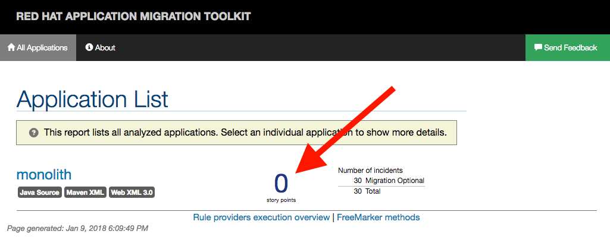

> You can ignore the remaining issues, as they are for informational purposes only.

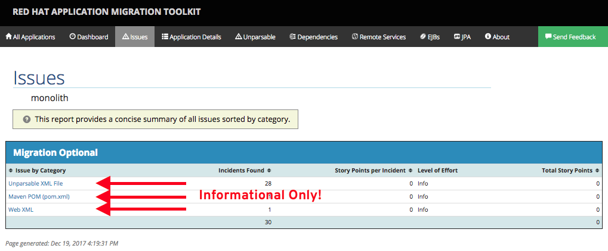

## Migration Complete!

Now that we've migrated the app, let's deploy it and test it out and start to explore some of the features that JBoss EAP
plus Red Hat OpenShift bring to the table.

## Before moving on

Stop the report web server by clicking in **Terminal 2** and type CTRL-C to stop the server (or click this command: `clear`### Run it!)

## Migrate and run the project

Now that we migrated the application you are probably eager to test it. To test it we locally we first need to install JBoss EAP.

Run the following command in the terminal window.

``unzip -d $HOME $HOME/jboss-eap-7.1.0.zip``### Run it!

We should also set the `JBOSS_HOME` environment variable like this:

``export JBOSS_HOME=$HOME/jboss-eap-7.1``### Run it!

Done! That is how easy it is to install JBoss EAP. 

Open the `pom.xml` file.

## The maven-wildfly-plugin
JBoss EAP comes with a nice maven-plugin tool that can stop, start, deploy, and configure JBoss EAP directly from Apache Maven. Let's add that the pom.xml file.

At the `TODO: Add wildfly plugin here` we are going to add a the following configuration

```java
<plugin>
    <groupId>org.wildfly.plugins</groupId>
    <artifactId>wildfly-maven-plugin</artifactId>
    <version>1.2.1.Final</version>
    <!-- TODO: Add configuration here -->
</plugin>
```

Next we are going to add some configuration. First we need to point to our JBoss EAP installation using the `jboss-home` configuration. After that we will also have to tell JBoss EAP to use the profile configured for full Java EE, since it defaults to use the Java EE Web Profile. This is done by adding a `server-config` and set it to value `standalone-full.xml`

```java
<configuration>
    <jboss-home>${env.JBOSS_HOME}</jboss-home>
    <server-config>standalone-full.xml</server-config>
    <resources>
<!-- TODO: Add Datasource definition here -->
<!-- TODO: Add JMS Topic definition here -->
    </resources>
    <server-args>
        <server-arg>-Djboss.https.port=8888</server-arg>
        <server-arg>-Djboss.bind.address=0.0.0.0</server-arg>
    </server-args>
    <javaOpts>-Djava.net.preferIPv4Stack=true</javaOpts>
</configuration>
```

Since our application is using a Database we also configuration that by adding the following at the ```<-- TODO: Add Datasource definition here -->``` comment

```java
<resource>
    <addIfAbsent>true</addIfAbsent>
    <address>subsystem=datasources,data-source=CoolstoreDS</address>
    <properties>
        <jndi-name>java:jboss/datasources/CoolstoreDS</jndi-name>
        <enabled>true</enabled>
        <connection-url>jdbc:h2:mem:test;DB_CLOSE_DELAY=-1</connection-url>
        <driver-class>org.h2.Driver</driver-class>
        <driver-name>h2</driver-name>
        <user-name>sa</user-name>
        <password>sa</password>
    </properties>
</resource>
```

Since our application is using a JMS Topic we are also need to add the configuration for that by adding the following at the ```<-- TODO: Add JMS Topic here -->``` comment

```java
<resource>
    <address>subsystem=messaging-activemq,server=default,jms-topic=orders</address>
    <properties>
        <entries>!!["topic/orders"]</entries>
    </properties>
</resource>
```

We are now ready to build and test the project

## Configuring the JBoss EAP 

Our application is at this stage pretty standards based, but it needs two things. One is the  we need to add the JMS Topic since our application depends on it. 

``mvn wildfly:start wildfly:add-resource wildfly:shutdown``### Run it!

Wait for a `BUILD SUCCESS` message. If it fails, check that you made all the correct changes and try again!

> NOTE: The reason we are using `wildfly:start` and `wildfly:shutdown` is because the `add-resource` command requires a running server. After we have added these resource we don't have to run this command again.

## Deploying the application

We are now ready to deploy the application

``mvn wildfly:run``### Run it!

Wait for the server to startup. You should see `Deployed "ROOT.war" (runtime-name: "ROOT.war")`
## Test the application

Access the application by clicking [here](https://$OPENSHIFT_MASTER/) and shop around for some cool stuff.


You may see WARNINGs in the console output. We will fix these soon!

## Shutdown the application

Before moving on, click here to stop the process: `clear`### Run it! (or click in the **Terminal** window and type CTRL-C).


## Deploy the monolith to OpenShift

We now have a fully migrated application that we tested locally. Let's deploy it to OpenShift.

**1. Add a OpenShift profile**

Open the `pom.xml` file.

At the `<!-- TODO: Add OpenShift profile here -->` we are going to add a the following configuration to the pom.xml

```java
<profile>
  <id>openshift</id>
  <build>
      <plugins>
          <plugin>
              <artifactId>maven-war-plugin</artifactId>
              <version>2.6</version>
              <configuration>
                  <webResources>
                      <resource>
                          <directory>${basedir}/src/main/webapp/WEB-INF</directory>
                          <filtering>true</filtering>
                          <targetPath>WEB-INF</targetPath>
                      </resource>
                  </webResources>
                  <outputDirectory>deployments</outputDirectory>
                  <warName>ROOT</warName>
              </configuration>
          </plugin>
      </plugins>
  </build>
</profile>
```

**2. Create the OpenShift project**

First, click on the **OpenShift Console** tab next to the Terminal tab:


This will open a new browser with the openshift console.

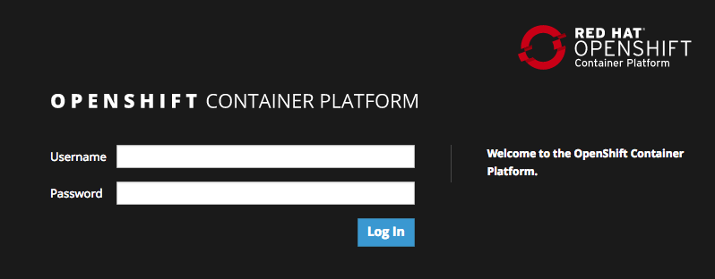

Login using:

* Username `developer`
* Password: `developer`

You will see the OpenShift landing page:

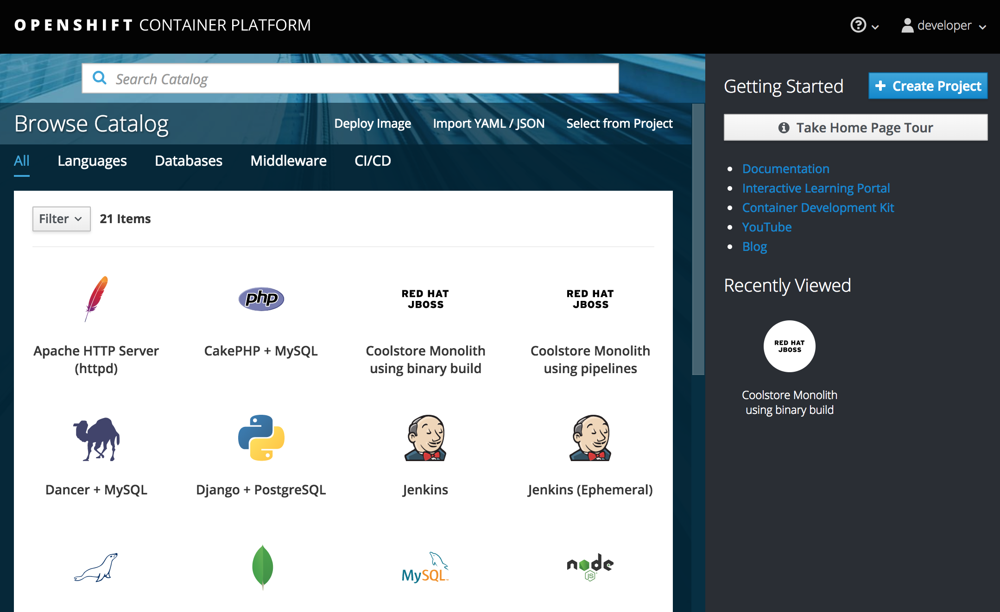

Click **Create Project**, fill in the fields, and click **Create**:

* Name: `coolstore-dev`
* Display Name: `Coolstore Monolith - Dev`
* Description: _leave this field empty_

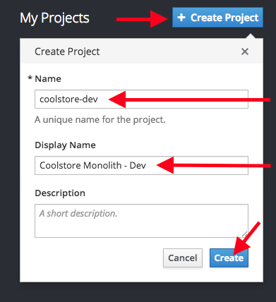

Click on the name of the newly-created project:

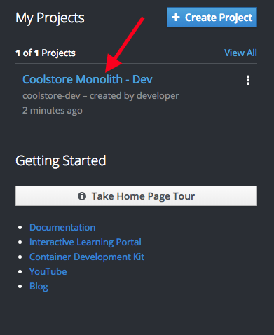

This will take you to the project overview. There's nothing there yet, but that's about to change.

**3. Deploy the monolith**

We'll use the CLI to deploy the components for our monolith. To deploy the monolith template using the CLI, execute the following commands:

Switch to the developer project you created earlier:

`oc project coolstore-dev`### Run it!

And finally deploy template:

`oc new-app coolstore-monolith-binary-build`### Run it!

This will deploy both a PostgreSQL database and JBoss EAP, but it will not start a build for our application.

Then [open up the Monolith Overview page](https://$OPENSHIFT_MASTER/console/project/coolstore-dev/)
and verify the monolith template items are created:

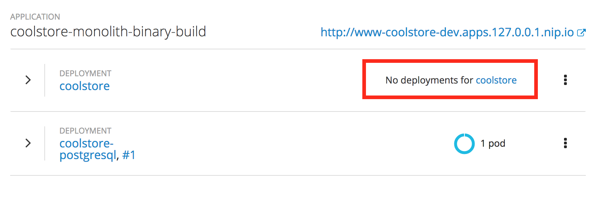

You can see the components being deployed on the
Project Overview, but notice the **No deployments for Coolstore**. You have not yet deployed
the container image built in previous steps, but you'll do that next.


**4. Deploy application using Binary build**

In this development project we have selected to use a process called binary builds, which
means that instead of pointing to a public Git Repository and have the S2I (Source-to-Image) build process
download, build, and then create a container image for us we are going to build locally
and just upload the artifact (e.g. the `.war` file). The binary deployment will speed up
the build process significantly.

First, build the project once more using the `openshift` Maven profile, which will create a
suitable binary for use with OpenShift (this is not a container image yet, but just the `.war`
file). We will do this with the `oc` command line.

Build the project:

``mvn clean package -Popenshift``### Run it!

Wait for the build to finish and the `BUILD SUCCESS` message!

And finally, start the build process that will take the `.war` file and combine it with JBoss
EAP and produce a Linux container image which will be automatically deployed into the project,
thanks to the *DeploymentConfig* object created from the template:

``oc start-build coolstore --from-file=deployments/ROOT.war``### Run it!

Check the OpenShift web console and you'll see the application being built:

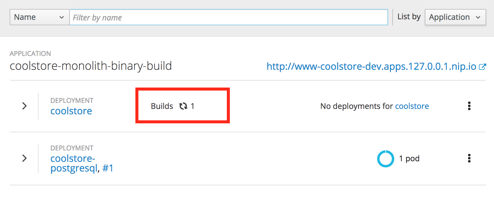

Wait for the build and deploy to complete:

``oc rollout status -w dc/coolstore``### Run it!

This command will be used often to wait for deployments to complete. Be sure it returns success when you use it!
You should eventually see `replication controller "coolstore-1" successfully rolled out`.

> If the above command reports `Error from server (ServerTimeout)` then simply re-run the command until it reports success!


When it's done you should see the application deployed successfully with blue circles for the
database and the monolith:

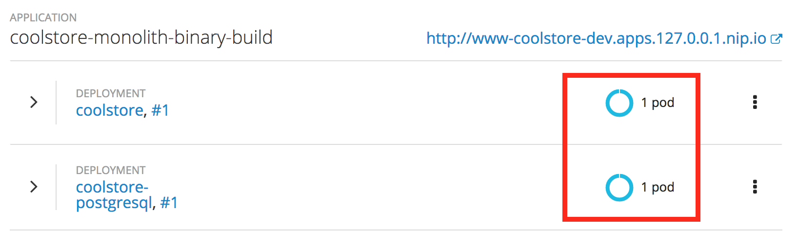

Test the application by clicking on the [Route link](http://www-coolstore-dev.$OPENSHIFT_MASTER),
which will open the same monolith Coolstore in your browser, this time running on OpenShift:

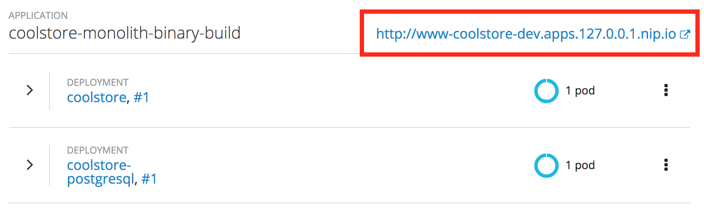

## Congratulations!

Now you are using the same application that we built locally on OpenShift. That wasn't too hard right?


In the next step you'll explore more of the developer features of OpenShift in preparation for moving the
monolith to a microservices architecture later on. Let's go!


## Summary

Now that you have migrating an existing Java EE app to the cloud 
with JBoss and OpenShift, you are ready to start modernizing the
application by breaking the monolith into smaller microservices in
incremental steps, and employing modern techniques to ensure the
application runs well in a distributed and containerized environment.

But first, you'll need to dive a bit deeper into OpenShift and how
it supports the end-to-end developer workflow.

# SCENARIO 3: A Developer Introduction to OpenShift

* Purpose: Learn how developing apps is easy and fun
* Difficulty: `intermediate`
* Time: `45-60 minutes`

## Intro
In the previous scenario you learned how to take an existing application to the cloud with JBoss EAP and OpenShift,
and you got a glimpse into the power of OpenShift for existing applications.

In this scenario you will go deeper into how to use the OpenShift Container Platform as a developer to build,
deploy, and debug applications. We'll focus on the core features of OpenShift as it relates to developers, and
you'll learn typical workflows for a developer (develop, build, test, deploy, debug, and repeat).

## Let's get started

If you are not familiar with the OpenShift Container Platform, it's worth taking a few minutes to understand
the basics of the platform as well as the environment that you will be using for this workshop.

The goal of OpenShift is to provide a great experience for both Developers and System Administrators to
develop, deploy, and run containerized applications.  Developers should love using OpenShift because it
enables them to take advantage of both containerized applications and orchestration without having the
know the details.  Developers are free to focus on their code instead of spending time writing Dockerfiles
and running docker builds.

Both Developers and Operators communicate with the OpenShift Platform via one of the following methods:

* **Command Line Interface** - The command line tool that we will be using as part of this training is called the *oc* tool. You used this briefly
in the last scenario. This tool is written in the Go programming language and is a single executable that is provided for
Windows, OS X, and the Linux Operating Systems.
* **Web Console** -  OpenShift also provides a feature rich Web Console that provides a friendly graphical interface for
interacting with the platform. You can always access the Web Console using the link provided just above
the Terminal window on the right:
 * 
* **REST API** - Both the command line tool and the web console actually communicate to OpenShift via the same method,
the REST API.  Having a robust API allows users to create their own scripts and automation depending on
their specific requirements.  For detailed information about the REST API, check out the [official documentation](https://docs.openshift.org/latest/rest_api/index.html).
You will not use the REST API directly in this workshop.

During this workshop, you will be using both the command line tool and the web console.  However, it
should be noted that there are plugins for several integrated development environments as well.
For example, to use OpenShift from the Eclipse IDE, you would want to use the official [JBoss Tools](https://tools.jboss.org/features/openshift.html) plugin.

Now that you know how to interact with OpenShift, let's focus on some core concepts that you as a developer
will need to understand as you are building your applications!

## Developer Concepts

There are several concepts in OpenShift useful for developers, and in this workshop
you should be familiar with them.

## Projects

[Projects](https://docs.openshift.com/container-platform/3.6/architecture/core_concepts/projects_and_users.html#projects)
are a top level concept to help you organize your deployments. An
OpenShift project allows a community of users (or a user) to organize and manage
their content in isolation from other communities. Each project has its own
resources, policies (who can or cannot perform actions), and constraints (quotas
and limits on resources, etc). Projects act as a wrapper around all the
application services and endpoints you (or your teams) are using for your work.

## Containers
The basic units of OpenShift applications are called containers (sometimes called Linux Containers).
[Linux container technologies](https://access.redhat.com/articles/1353593) are lightweight mechanisms for isolating running processes
so that they are limited to interacting with only their designated resources.

Though you do not directly interact with the Docker CLI or service when using OpenShift Container
Platform, understanding their capabilities and terminology is important for understanding their
role in OpenShift Container Platform and how your applications function inside of containers.

## Pods
OpenShift Container Platform leverages the Kubernetes concept of a pod, which is one or more
containers deployed together on one host, and the smallest compute unit that can be defined,
deployed, and managed.

Pods are the rough equivalent of a machine instance (physical or virtual) to a container.
Each pod is allocated its own internal IP address, therefore owning its entire port space,
and containers within pods can share their local storage and networking.


## Images
Containers in OpenShift are based on Docker-formatted container images.
An image is a binary that includes all of the requirements for running a single container,
as well as metadata describing its needs and capabilities.

You can think of it as a packaging technology. Containers only have access to resources
defined in the image unless you give the container additional access when creating it.
By deploying the same image in multiple containers across multiple hosts and load balancing
between them, OpenShift Container Platform can provide redundancy and horizontal scaling
for a service packaged into an image.

## Image Streams
An image stream and its associated tags provide an abstraction for referencing
Images from within OpenShift. The image stream and its tags allow you
to see what images are available and ensure that you are using the specific image you need
even if the image in the repository changes.

## Builds
A build is the process of transforming input parameters into a resulting object. Most often,
the process is used to transform input parameters or source code into a runnable image. A
_BuildConfig_ object is the definition of the entire build process. It can build from different
sources, including a Dockerfile, a source code repository like Git, or a Jenkins Pipeline
definition.

## Pipelines
Pipelines allow developers to define a _Jenkins_ pipeline for execution by the Jenkins
pipeline plugin. The build can be started, monitored, and managed by OpenShift Container
Platform in the same way as any other build type.

Pipeline workflows are defined in a Jenkinsfile, either embedded directly in the
build configuration, or supplied in a Git repository and referenced by the build configuration.


## Deployments
An OpenShift Deployment describes how images are deployed to pods, and how the pods are deployed
to the underlying container runtime platform. OpenShift deployments also provide the ability to transition from
an existing deployment of an image to a new one and also define hooks to be run before or after
creating the replication controller.

## Services
A Kubernetes service serves as an internal load balancer. It identifies a set of replicated
pods in order to proxy the connections it receives to them. Backing pods can be added to or
removed from a service arbitrarily while the service remains consistently available, enabling
anything that depends on the service to refer to it at a consistent address.

## Routes
_Services_ provide internal abstraction and load balancing within an
OpenShift environment, sometimes clients (users, systems, devices, etc.)
**outside** of OpenShift need to access an application. The way that external
clients are able to access applications running in OpenShift is through the
OpenShift routing layer. And the data object behind that is a _Route_.

The default OpenShift router (HAProxy) uses the HTTP header of the incoming
request to determine where to proxy the connection. You can optionally define
security, such as TLS, for the _Route_. If you want your _Services_, and, by
extension, your _Pods_,  to be accessible to the outside world, you need to
create a _Route_.

## Templates

Templates contain a collection of object definitions (BuildConfigs, DeploymentConfigs,
Services, Routes, etc) that compose an entire working project. They are useful for packaging
up an entire collection of runtime objects into a somewhat portable representation of a
running application, including the configuration of the elements.

You will use several pre-defined templates to initialize different environments for the
application. You've already used one in the previous scenario to deploy the application
into a _dev_ environment, and you'll use more in this scenario to provision the _production_
environment as well.

Consult the [OpenShift documentation](https://docs.openshift.com) for more details on these and other concepts.


## Verifying the Dev Environment

In the previous lab you created a new OpenShift project called `coolstore-dev` which represents
your developer personal project in which you deployed the CoolStore monolith.

**1. Verify Application**

Let's take a moment and review the OpenShift resources that are created for the Monolith:

* Build Config: **coolstore** build config is the configuration for building the Monolith
image from the source code or WAR file
* Image Stream: **coolstore** image stream is the virtual view of all coolstore container
images built and pushed to the OpenShift integrated registry.
* Deployment Config: **coolstore** deployment config deploys and redeploys the Coolstore container
image whenever a new coolstore container image becomes available. Similarly, the **coolstore-postgresql**
does the same for the database.
* Service: **coolstore** and **coolstore-postgresql** service is an internal load balancer which identifies a set of
pods (containers) in order to proxy the connections it receives to them. Backing pods can be
added to or removed from a service arbitrarily while the service remains consistently available,
enabling anything that depends on the service to refer to it at a consistent address (service name
or IP).
* Route: **www** route registers the service on the built-in external load-balancer
and assigns a public DNS name to it so that it can be reached from outside OpenShift cluster.

You can review the above resources in the OpenShift Web Console or using the `oc get` or `oc describe` commands
(`oc describe` gives more detailed info):

> You can use short synonyms for long words, like `bc` instead of `buildconfig`,
and `is` for `imagestream`, `dc` for `deploymentconfig`, `svc` for service,
etc.

> **NOTE**: Don't worry about reading and understanding the output of `oc describe`. Just make sure
the command doesn't report errors!

Run these commands to inspect the elements:

`oc get bc coolstore`### Run it!

`oc get is coolstore`### Run it!

`oc get dc coolstore`### Run it!

`oc get svc coolstore`### Run it!

`oc describe route www`### Run it!

Verify that you can access the monolith by clicking on the
[exposed OpenShift route](http://www-coolstore-dev.$OPENSHIFT_MASTER)
to open up the sample application in a separate browser tab.

You should also be able to see both the CoolStore monolith and its database
running in separate pods:

`oc get pods -l application=coolstore`### Run it!

The output should look like this:

```console
NAME                           READY     STATUS    RESTARTS   AGE
coolstore-2-bpkkc              1/1       Running   0          4m
coolstore-postgresql-1-jpcb8   1/1       Running   0          9m
```

**1. Verify Database**

You can log into the running Postgres container using the following:

`oc --server https://master:8443 rsh dc/coolstore-postgresql`### Run it!

Once logged in, use the following command to execute an SQL statement to show some content from the database:

`psql -U $POSTGRESQL_USER $POSTGRESQL_DATABASE -c 'select name from PRODUCT_CATALOG;'`### Run it!

You should see the following:

```console
          name
------------------------
 Red Fedora
 Forge Laptop Sticker
 Solid Performance Polo
 Ogio Caliber Polo
 16 oz. Vortex Tumbler
 Atari 2600 Joystick
 Pebble Smart Watch
 Oculus Rift
 Lytro Camera
(9 rows)```

Don't forget to exit the pod's shell with `exit`### Run it!

With our running project on OpenShift, in the next step we'll explore how you as a developer can work with the running app
to make changes and debug the application!


## Making Changes to Containers

In this step you will learn how to transfer files between your local machine and a running
container.

One of the properties of container images is that they are **immutable**. That is, although you can
make changes to the local container filesystem of a running image, the changes are _not permanent_.
When that container is stopped, _any changes are discarded_. When a new container is started from
the same container image, it _reverts back_ to what was originally built into the image.

Although any changes to the local container filesystem are discarded when the container is stopped,
it can sometimes be convenient to be able to upload files into a running container. One example of
where this might be done is during development and a dynamic scripting language like javascript or
static content files like html is being used. By being able to modify code in the container, you can modify the application to test
changes before rebuilding the image.

In addition to uploading files into a running container, you might also want to be able to download
files. During development these may be data files or log files created by the application.

## Copy files from container

As you recall from the last step, we can use `oc rsh` to execute commands inside the running pod.

For our Coolstore Monolith running with JBoss EAP, the application is installed in the `/opt/eap` directory in the running
container. Execute the `ls` command inside the container to see this:

`oc --server https://master:8443 rsh dc/coolstore ls -l /opt/eap`### Run it!

You should see a listing of files in this directory **in the running container**.

> It is very important to remember where commands are executed! If you think you are in a container and in fact are on some other machine,
destructive commands may do real harm, so be careful! In general it is not a good idea to operate inside immutable containers outside of the
development environment. But for doing testing and debugging it's OK.

Let's copy the EAP configuration in use so that we can inspect it. To copy files from a running container
on OpenShift, we'll use the `oc rsync` command. This command expects the name of the pod to copy from,
which can be seen with this command:

`oc get pods --selector deploymentconfig=coolstore`### Run it!

The output should show you the name of the pod:

```console
NAME                           READY     STATUS    RESTARTS   AGE
coolstore-2-bpkkc              1/1       Running   0          32m
```

The name of my running coolstore monolith pod is `coolstore-2-bpkkc` but **yours will be different**.

Save the name of the pod into an environment variable called `COOLSTORE_DEV_POD_NAME` so that we can use it for future
commands:

`export COOLSTORE_DEV_POD_NAME=$(oc get pods --selector deploymentconfig=coolstore -o jsonpath='{.items[?(@.status.phase=="Running")].metadata.name}')`### Run it!

Verify the variable holds the name of your pod with:

`echo $COOLSTORE_DEV_POD_NAME`### Run it!

Next, run the `oc rsync` command in your terminal window, using the new variable to refer to the name of the pod running our coolstore:

`oc --server https://master:8443 rsync $COOLSTORE_DEV_POD_NAME:/opt/eap/standalone/configuration/standalone-openshift.xml .`### Run it!

The output will show that the file was downloaded:

```console
receiving incremental file list
standalone-openshift.xml

sent 30 bytes  received 31,253 bytes  62,566.00 bytes/sec
total size is 31,152  speedup is 1.00
```

Now you can open the file locally using this link: `standalone-openshift.xml` and inspect
its contents (don't worry if you don't understand the contents of this file, it is the JBoss EAP configuration file).

This is useful for verifying that the contents of files in your applications are what you expect.

You can also upload files using the same `oc rsync` command but
unlike when copying from the container to the local machine, there is no form for copying a
single file. To copy selected files only, you will need to use the ``--exclude`` and ``--include`` options
to filter what is and isn't copied from a specified directory. We will use this in the next step.

Manually copying is cool, but what about automatic live copying on change? That's in the next step too!

## Before moving on

Let's clean up the temp files we used. Execute:

`rm -f standalone-openshift.xml hello.txt`### Run it!

## Live Synchronization of Project Files

In addition to being able to manually upload or download files when you choose to, the ``oc rsync``
command can also be set up to perform live synchronization of files between your local computer and the container.
When there is a change to a file, the changed file will be automatically copied up to the container.

This same process can also be run in the opposite direction if required, with changes made in the
container being automatically copied back to your local computer.

An example of where it can be useful to have changes automatically copied from your local computer
into the container is during the development of an application.

For scripted programming languages such as JavaScript, PHP, Python or Ruby, where no separate compilation
phase is required you can perform live code development with your application running inside of OpenShift.

For JBoss EAP applications you can sync individual files (such as HTML/CSS/JS files), or sync entire application
.WAR files. It's more challenging to synchronize individual files as it requires that you use an *exploded*
archive deployment, so the use of [JBoss Developer Studio](https://developers.redhat.com/products/devstudio/overview/) is
recommended, which automates this process (see [these docs](https://tools.jboss.org/features/livereload.html) for more info).

## Live synchronization of project files

For this workshop, we'll Live synchronize the entire WAR file.

First, click on the [Coolstore application link](http://www-coolstore-dev.$OPENSHIFT_MASTER)
to open the application in a browser tab so you can watch changes.

**1. Turn on Live Sync**

Turn on **Live sync** by executing this command:

`oc --server https://master:8443 rsync deployments/ $COOLSTORE_DEV_POD_NAME:/deployments --watch --no-perms &`### Run it!

> The `&` character at the end places the command into the background. We will kill it at the end of this step.

Now `oc` is watching the `deployments/` directory for changes to the `ROOT.war` file. Anytime that file changes,
`oc` will copy it into the running container and we should see the changes immediately (or after a few seconds). This is
much faster than waiting for a full re-build and re-deploy of the container image.

**2. Make a change to the UI**

Next, let's make a change to the app that will be obvious in the UI.

First, open `src/main/webapp/app/css/coolstore.css`, which contains the CSS stylesheet for the
CoolStore app.

Add the following CSS to turn the header bar background to Red Hat red (click **Copy To Editor** to automatically add it):

```java

.navbar-header {
    background: #CC0000
}

```

**2. Rebuild application For RED background**

Let's re-build the application using this command:

`mvn package -Popenshift`### Run it!

This will update the ROOT.war file and cause the application to change.

Re-visit the app by reloading the Coolstore webpage (or clicking again on the [Coolstore application link](http://www-coolstore-dev.$OPENSHIFT_MASTER)).

You should now see the red header:

> **NOTE** Some browsers (most, actually) will cache the web content including CSS files. If you don't see the read
header or get errors, first try to reload the page a few times. If it still doesn't show the changed
header you may need to [clear the browser
cache](https://www.lifewire.com/how-to-clear-cache-2617980) to see the changes! You can also open a separate browser or
an "incognito" or "private browsing" tab and visit the same URL.

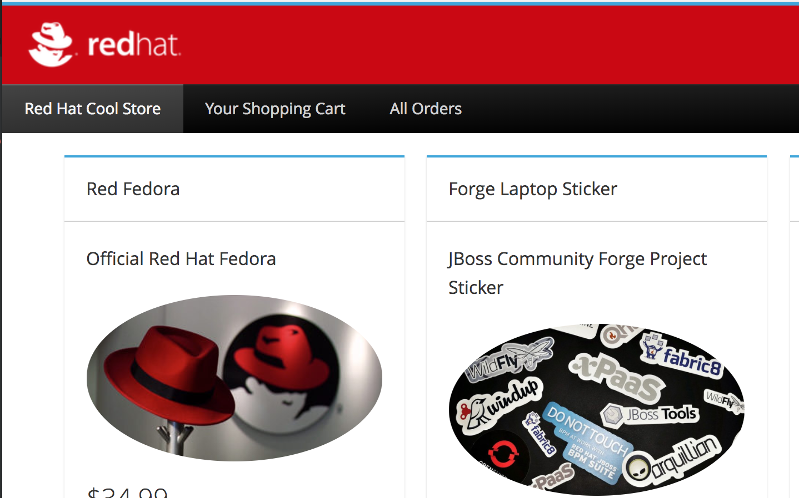

**3. Rebuild again for BLUE background**

Repeat the process, but replace the background color to be blue (click **Copy to Editor** to do this automatically):

```java
background: blue
```

Again, re-build the app:

`mvn package -Popenshift`### Run it!

This will update the ROOT.war file again and cause the application to change.

Re-visit the app by reloading the Coolstore webpage (or clicking again on the [Coolstore application link](http://www-coolstore-dev.$OPENSHIFT_MASTER)).

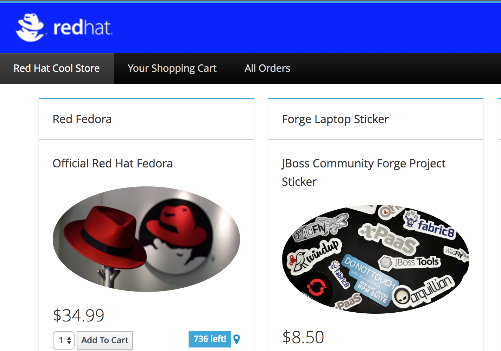

It's blue! You can do this as many times as you wish, which is great for speedy development and testing.

We'll leave the blue header for the moment, but will change it back to the original color soon.

## Before continuing

Kill the `oc rsync` processes we started earlier in the background. Execute:

`kill %1`### Run it!

On to the next challenge!

## Debugging the App

In this step you will debug the coolstore application using Java remote debugging and
look into line-by-line code execution as the code runs inside a container on OpenShift.

## Witness the bug

The CoolStore application seem to have a bug that causes the inventory status for one of the
products to be not shown at all. Carefully inspect the storefront page and notice that the
Atari 2600 Joystick product shows nothing at all for inventory:

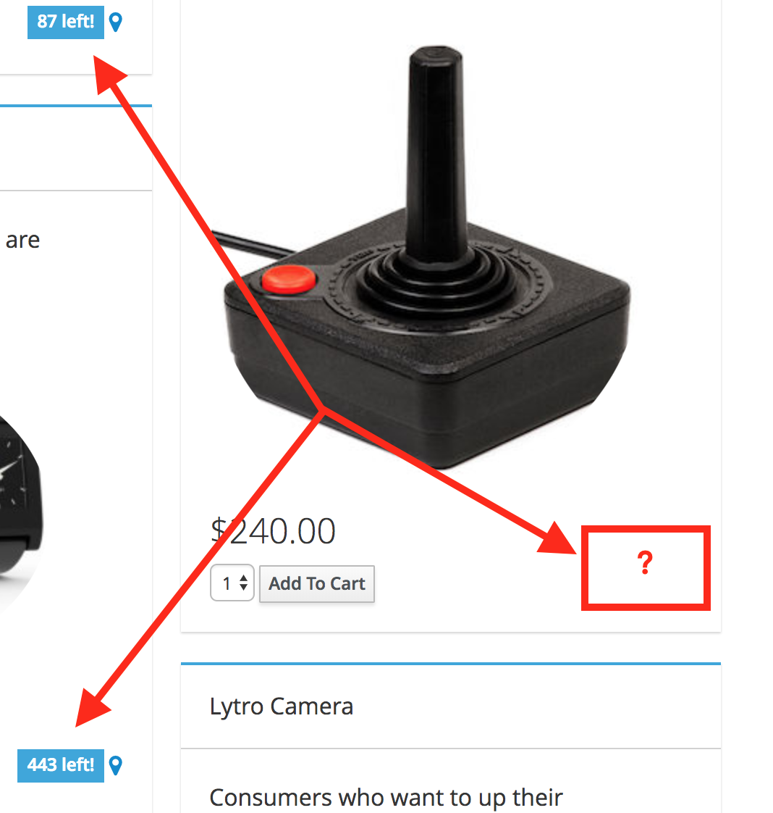

Since the product list is provided by the monolith, take a look into the logs to see if there are any warnings:

`oc --server https://master:8443 logs dc/coolstore | grep -i warning`### Run it!

Oh! Something seems to be wrong with the inventory for the product id **444437**

```console
...
WARNING [com.redhat.coolstore.utils.Transformers] (default task-83) Inventory for Atari 2600 Joystick[444437] unknown and missing
...
```

## Check the REST API Response

Invoke the Product Catalog API using `curl` for the suspect product id to see what actually
happens when the UI tries to get the catalog:

`curl http://www-coolstore-dev.$OPENSHIFT_MASTER/services/products/444437 ; echo`### Run it!

The response clearly shows that the inventory values for `location` and `link` and `quantity` are not being returned properly (they should not be `null`):

```json
{"itemId":"444437","name":"Atari 2600 Joystick","desc":"Based on the original design of the joystick controller for the famed Atari 2600 console, the Joystick from Retro-Bit features a similar stick and single-button layout. ","price":240.0,"location":null,"quantity":0,"link":null}
```

Let's debug the app to get to the bottom of this!

## Enable remote debugging

Remote debugging is a useful debugging technique for application development which allows
looking into the code that is being executed somewhere else on a different machine and
execute the code line-by-line to help investigate bugs and issues. Remote debugging is
part of  Java SE standard debugging architecture which you can learn more about it in [Java SE docs](https://docs.oracle.com/javase/8/docs/technotes/guides/jpda/architecture.html).

The EAP image on OpenShift has built-in support for remote debugging and it can be enabled
by setting the `JAVA_OPTS_APPEND` environment variables on the deployment config for the pod
that you want to remotely debug. This will pass additional variables to the JVM when it starts up.

`oc set env dc/coolstore JAVA_OPTS_APPEND="-Xdebug -Xnoagent -Xrunjdwp:transport=dt_socket,address=8787,server=y,suspend=n"`### Run it!

This will cause a re-deployment of the app to enable the remote debugging agent on TCP port 8787.

Wait for the re-deployment to complete before continuing by executing:

`oc rollout status -w dc/coolstore && sleep 10`### Run it!

The re-deployment also invoked a new pod, so let's update our environment variable again:

`export COOLSTORE_DEV_POD_NAME=$(oc get pods --selector deploymentconfig=coolstore -o jsonpath='{.items[?(@.status.phase=="Running")].metadata.name}')`### Run it!

Verify the variable holds the name of your new pod with:

`echo $COOLSTORE_DEV_POD_NAME`### Run it!

## Expose debug port locally

Next, let's use `oc port-forward` to enable us to connect to `localhost:8787` to debug. Without this,
we would have to expose the running app to everyone outside the OpenShift cluster, so instead we
will just open it for ourselves with `oc port-forward`.

Execute:

`oc --server https://master:8443 port-forward $COOLSTORE_DEV_POD_NAME 8787 &`### Run it!

This will forward traffic to/from the container's port 8787 to your `localhost` port 8787.

You are all set now to start debugging using the tools of you choice.

Remote debugging can be done using the widely available
Java Debugger (`jdb`) command line or any modern IDE like **JBoss
Developer Studio (Eclipse)** and **IntelliJ IDEA**.

## Use `jdb` to debug

The [Java Debugger (JDB)](http://docs.oracle.com/javase/8/docs/technotes/tools/windows/jdb.html)
is a simple command-line debugger for Java. The `jdb` command is included by default in
Java SE and provides inspection and debugging of a local or remote JVM. Although JDB is not
the most convenient way to debug Java code, it's a handy tool since it can be run on any environment
that Java SE is available.

The instructions in this section focuses on using JDB however if you are familiar with JBoss Developer
Studio, Eclipse or IntelliJ you can use them for remote debugging.

Start JDB by pointing at the folder containing the Java source code for the application under debug:

`jdb -attach localhost:8787 -sourcepath :src/main/java/`### Run it!

## Add a breakpoint

Now that you are connected to the JVM running inside the Coolstore pod on OpenShift, add
a breakpoint to pause the code execution when it reaches the Java method handling the
REST API `/services/products` Review the `src/main/java/com/redhat/coolstore/service/ProductService.java` class and note that the
`getProductByItemId()` is the method where you should add the breakpoint.

Add a breakpoint by executing:

`stop in com.redhat.coolstore.service.ProductService.getProductByItemId`### Run it!

## Trigger the bug again

In order to pause code execution at the breakpoint, you have to invoke the REST API once more.

Execute:

`curl http://www-coolstore-dev.$OPENSHIFT_MASTER/services/products/444437`### Run it! to invoke the REST API in a separate terminal:

> This command will trigger the breakpoint, and as a result will timeout, which you can ignore.

The code execution pauses at the `getProductByItemId()` method. You can verify it
using the `list`### Run it! command to see the source code in the terminal window where
you started JDB. The arrow shows which line is to execute next:

`list`### Run it!

You'll see an output similar to this.

```
default task-3[1] list
24            return cm.getCatalogItems().stream().map(entity -> toProduct(entity)).collect(Collectors.toList());
25        }
26
27        public Product getProductByItemId(String itemId) {
28 =>         CatalogItemEntity entity = cm.getCatalogItemById(itemId);
29            if (entity == null)
30                return null;
31            return Transformers.toProduct(entity);
32        }
33
```

Execute one line of code using `next` command so the the CatalogItemEntity object is
retrieved from the database.

`next`### Run it!

Use `locals` command to see the local variables and verify the retrieved
object from the database.

`locals`### Run it!

You'll see an output similar to this.

```
default task-2[1] locals
Method arguments:
itemId = "444437"
Local variables:
entity = instance of com.redhat.coolstore.model.CatalogItemEntity(id=20281)
```

Look at the value of the `entity` variable using the `print` command:

`print entity`### Run it!

```
 entity = "ProductImpl [itemId=444437, name=Atari 2600 Joystick, desc=Based on the original design of the joystick controller for the famed Atari 2600 console, the Joystick from Retro-Bit features a similar stick and single-button layout. , price=240.0]"
```

Looks good so far. What about the `inventory` object that's part of this object? Execute:

`print entity.getInventory()`### Run it!

```
 entity.getInventory() = null
```

Oh! Did you notice the problem?

The `inventory` object which is the object retrieved from the database
for the provided product id is `null` and is returned as the REST response! The non-existing
product id is not a problem on its own because it simply could mean this product is discontinued
and removed from the Inventory database but it's not removed from the product catalog database
yet. The bug is however caused because the code returns this `null` value instead of a sensible
REST response. If the product id does not exist, a proper JSON response stating a zero inventory
should be returned instead of `null`

Exit the debugger using the `quit` command:

`quit`### Run it!

## Fix the code

Open `src/main/java/com/redhat/coolstore/utils/Transformers.java`. We'll add some code to add in
a sensible value for an Inventory in case it is not there. To make this change, add in this code to the end
of the `toProduct` method (or simply click **Copy to Editor** to do it for you):


```java
        // Add inventory if needed and return entity
            prod.setLink("http://redhat.com");
            prod.setLocation("Unavailable");
            prod.setQuantity(0);
```

## Re-build and redeploy the application

With our code fix in place, let's re-build the application to test it out. To rebuild, execute:

`mvn clean package -Popenshift`### Run it!

Let's use our new `oc rsync` skills to re-deploy the app to the running container. Execute:

`oc --server https://master:8443 rsync deployments/ $COOLSTORE_DEV_POD_NAME:/deployments --no-perms`### Run it!

After a few seconds, reload the [Coolstore Application](http://www-coolstore-dev.$OPENSHIFT_MASTER) in your browser
and notice now the application behaves properly and displays `Inventory Unavailable` whereas before it was totally and confusingly blank:

> **NOTE** Some browsers (most, actually) will cache the web content including CSS files. You may need to [clear the browser
cache](https://www.lifewire.com/how-to-clear-cache-2617980) to see the changes! You can also open a separate browser or
an "incognito" or "private browsing" tab and visit the same URL.

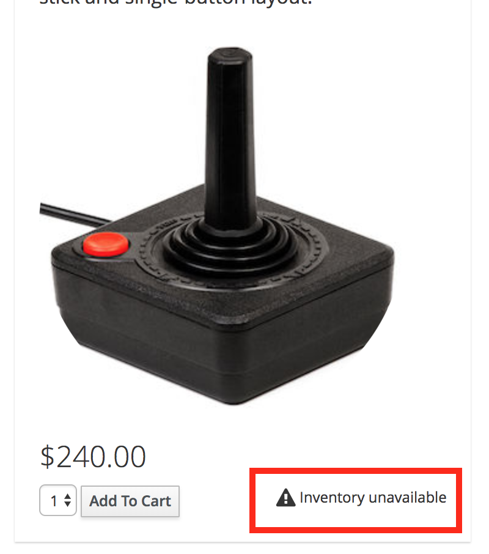

Well done, you've fixed the bug using your new debugging skills and saved the world!

Let's kill the `oc port-forward` processes we started earlier in the background. Execute:

`kill %1`### Run it!

Because we used `oc rsync` to re-deploy the bugfix to the running pod, it will not survive if we restart the pod. Let's update the container image
to contain our new fix (keeping the blue header for now). Execute:

`oc start-build coolstore --from-file=deployments/ROOT.war`### Run it!

And again, wait for it to complete by executing:

`oc rollout status -w dc/coolstore`### Run it!

## Congratulations!

Congratulations on completing this step! On to the next challenge!

## Deploying the Production Environment

In the previous scenarios, you deployed the Coolstore monolith using an
OpenShift Template into the `coolstore-dev` Project. The template
created the necessary objects (BuildConfig, DeploymentConfig, ImageStreams, Services, and Routes)
and gave you as a Developer a "playground" in which to run the app, make
changes and debug.

In this step we are now going to setup a separate production environment and explore some
best practices and techniques for developers and DevOps teams for getting code from
the developer (that's YOU!) to production with less downtime and greater consistency.

## Prod vs. Dev

The existing `coolstore-dev` project is used as a developer environment for building new
versions of the app after code changes and deploying them to the development environment.

In a real project on OpenShift, _dev_, _test_ and _production_ environments would typically use different
OpenShift projects and perhaps even different OpenShift clusters.

For simplicity in this scenario we will only use a _dev_ and _prod_ environment, and no test/QA
environment.

## Create the production environment

We will create and initialize the new production environment using another template
in a separate OpenShift project.

**1. Initialize production project environment**

Execute the following `oc` command to create a new project:

`oc new-project coolstore-prod --display-name='Coolstore Monolith - Production'`### Run it!

This will create a new OpenShift project called `coolstore-prod` from which our production application will run.

**2. Add the production elements**

In this case we'll use the production template to create the objects. Execute:

`oc new-app --template=coolstore-monolith-pipeline-build`### Run it!

This will use an OpenShift Template called `coolstore-monolith-pipeline-build` to construct the production application.
As you probably guessed it will also include a Jenkins Pipeline to control the production application (more on this later!)

Navigate to the Web Console to see your new app and the components using this link:

* [Coolstore Prod Project Overview](https://$OPENSHIFT_MASTER/console/project/coolstore-prod/overview)

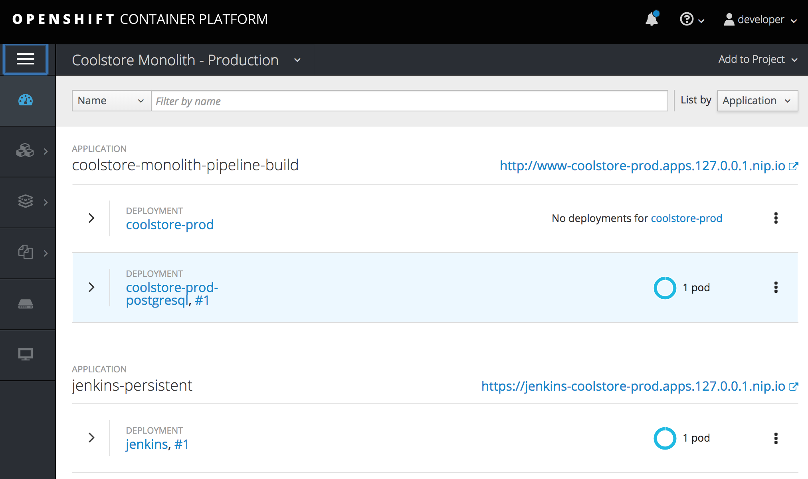

You can see the production database, and an application called _Jenkins_ which OpenShift uses
to manage CI/CD pipeline deployments. There is no running production
app just yet. The only running app is back in the _dev_ environment, where you used a binary
build to run the app previously.

In the next step, we'll _promote_ the app from the _dev_ environment to the _production_
environment using an OpenShift pipeline build. Let's get going!

## Promoting Apps Across Environments with Pipelines

#### Continuous Delivery
So far you have built and deployed the app manually to OpenShift in the _dev_ environment. Although
it's convenient for local development, it's an error-prone way of delivering software when
extended to test and production environments.

Continuous Delivery (CD) refers to a set of practices with the intention of automating 
various aspects of delivery software. One of these practices is called delivery pipeline 
which is an automated process to define the steps a change in code or configuration has 
to go through in order to reach upper environments and eventually to production. 

OpenShift simplifies building CI/CD Pipelines by integrating
the popular [Jenkins pipelines](https://jenkins.io/doc/book/pipeline/overview/) into
the platform and enables defining truly complex workflows directly from within OpenShift.

The first step for any deployment pipeline is to store all code and configurations in 
a source code repository. In this workshop, the source code and configurations are stored
in a GitHub repository we've been using at [https://github.com/RedHat-Middleware-Workshops/modernize-apps-labs].
This repository has been copied locally to your environment and you've been using it ever since!

You can see the changes you've personally made using `git --no-pager status`### Run it! to show the code changes you've made using the Git command (part of the
[Git source code management system](https://git-scm.com/)).

## Pipelines

OpenShift has built-in support for CI/CD pipelines by allowing developers to define
a [Jenkins pipeline](https://jenkins.io/solutions/pipeline/) for execution by a Jenkins
automation engine, which is automatically provisioned on-demand by OpenShift when needed.

The build can get started, monitored, and managed by OpenShift in
the same way as any other build types e.g. S2I. Pipeline workflows are defined in
a Jenkinsfile, either embedded directly in the build configuration, or supplied in
a Git repository and referenced by the build configuration. They are written using the
[Groovy scripting language](http://groovy-lang.org/).

As part of the production environment template you used in the last step, a Pipeline build
object was created. Ordinarily the pipeline would contain steps to build the project in the
_dev_ environment, store the resulting image in the local repository, run the image and execute
tests against it, then wait for human approval to _promote_ the resulting image to other environments
like test or production.

**1. Inspect the Pipeline Definition**

Our pipeline is somewhat simplified for the purposes of this Workshop. Inspect the contents of the
pipeline using the following command:

`oc describe bc/monolith-pipeline`### Run it!

You can see the Jenkinsfile definition of the pipeline in the output:

```console
Jenkinsfile contents:
  node ('maven') {
    stage 'Build'
    sleep 5

    stage 'Run Tests in DEV'
    sleep 10

    stage 'Deploy to PROD'
    openshiftTag(sourceStream: 'coolstore', sourceTag: 'latest', namespace: 'coolstore-dev', destinationStream: 'coolstore', destinationTag: 'prod', destinationNamespace: 'coolstore-prod')
    sleep 10

    stage 'Run Tests in PROD'
    sleep 30
  }
```

Pipeline syntax allows creating complex deployment scenarios with the possibility of defining
checkpoint for manual interaction and approval process using
[the large set of steps and plugins that Jenkins provides](https://jenkins.io/doc/pipeline/steps/) in
order to adapt the pipeline to the process used in your team. You can see a few examples of
advanced pipelines in the
[OpenShift GitHub Repository](https://github.com/openshift/origin/tree/master/examples/jenkins/pipeline).

To simplify the pipeline in this workshop, we simulate the build and tests and skip any need for human input.
Once the pipeline completes, it deploys the app from the _dev_ environment to our _production_
environment using the above `openshiftTag()` method, which simply re-tags the image you already
created using a tag which will trigger deployment in the production environment.

**2. Promote the dev image to production using the pipeline**

You can use the _oc_ command line to invoke the build pipeline, or the Web Console. Let's use the
Web Console. Open the production project in the web console:

* [Web Console - Coolstore Monolith Prod](https://$OPENSHIFT_MASTER/console/project/coolstore-prod)

Next, navigate to _Builds -> Pipelines_ and click __Start Pipeline__ next to the `coolstore-monolith` pipeline:

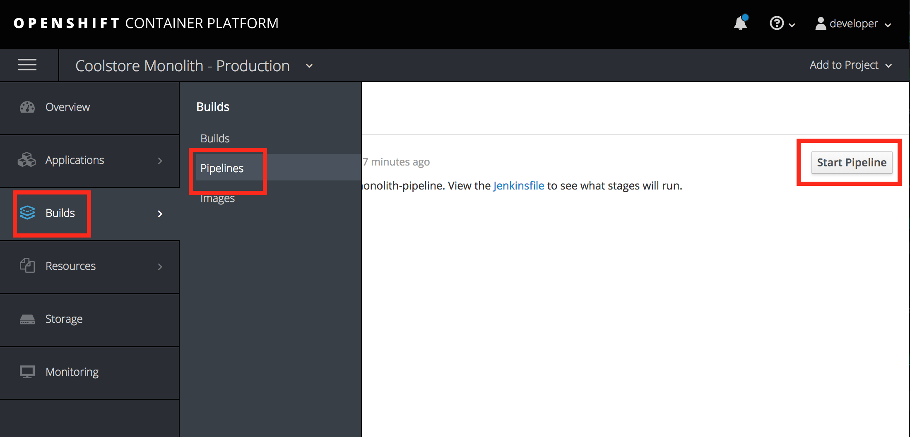

This will start the pipeline. **It will take a minute or two to start the pipeline** (future runs will not
take as much time as the Jenkins infrastructure will already be warmed up). You can watch the progress of the pipeline:

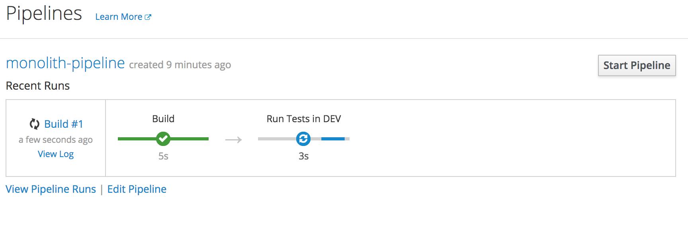

Once the pipeline completes, return to the [Prod Project Overview](https://$OPENSHIFT_MASTER/console/project/coolstore-prod)
and notice that the application is now deployed and running!

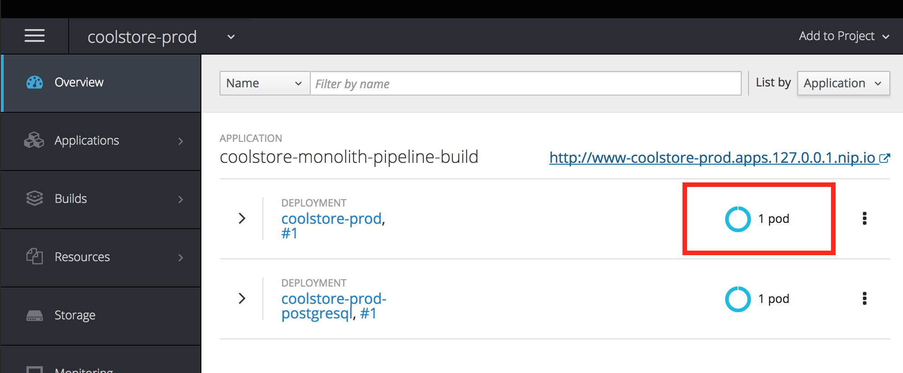

View the production app **with the blue header from before** is running by clicking: [CoolStore Production App](http://www-coolstore-prod.$OPENSHIFT_MASTER) (it may take
a few moments for the container to deploy fully.)

## Congratulations!

You have successfully setup a development and production environment for your project and can
use this workflow for future projects as well.

In the final step we'll add a human interaction element to the pipeline, so that you as a project
lead can be in charge of approving changes.

## More Reading

* [OpenShift Pipeline Documentation](https://docs.openshift.com/container-platform/3.7/dev_guide/dev_tutorials/openshift_pipeline.html)


## Adding Pipeline Approval Steps

In previous steps you used an OpenShift Pipeline to automate the process of building and
deploying changes from the dev environment to production.

In this step, we'll add a final checkpoint to the pipeline which will require you as the project
lead to approve the final push to production.

**1. Edit the pipeline**

Ordinarily your pipeline definition would be checked into a source code management system like Git,
and to change the pipeline you'd edit the _Jenkinsfile_ in the source base. For this workshop we'll
just edit it directly to add the necessary changes. You can edit it with the `oc` command but we'll
use the Web Console.

Open the `monolith-pipeline` configuration page in the Web Console (you can navigate to it from
_Builds -> Pipelines_ but here's a quick link):

* [Pipeline Config page](https://$OPENSHIFT_MASTER/console/project/coolstore-prod/browse/pipelines/monolith-pipeline?tab=configuration)

On this page you can see the pipeline definition. Click _Actions -> Edit_ to edit the pipeline:

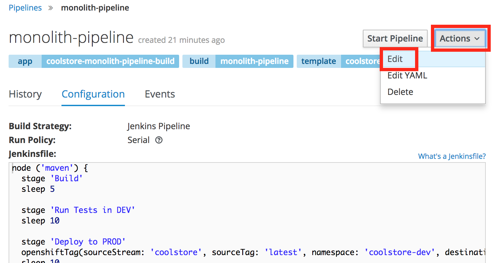

In the pipeline definition editor, add a new stage to the pipeline, just before the `Deploy to PROD` step:

> **NOTE**: You will need to copy and paste the below code into the right place as shown in the below image.

```groovy
  stage 'Approve Go Live'
  timeout(time:30, unit:'MINUTES') {
    input message:'Go Live in Production (switch to new version)?'
  }
```

Your final pipeline should look like:

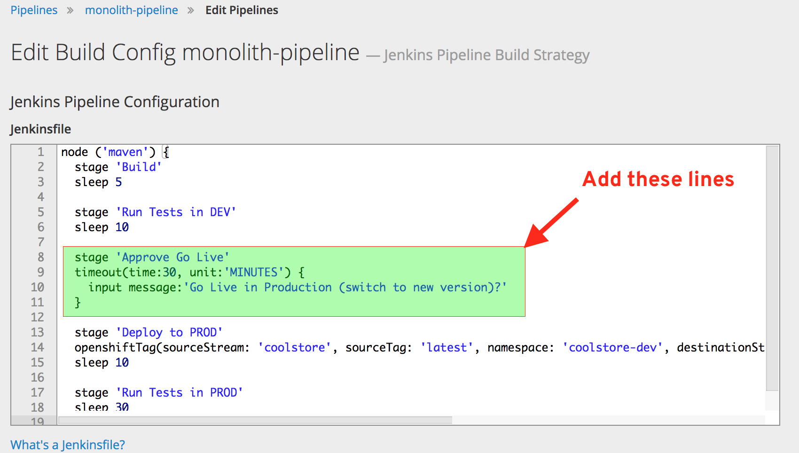

Click **Save**.

**2. Make a simple change to the app**

With the approval step in place, let's simulate a new change from a developer who wants to change
the color of the header in the coolstore back to the original (black) color.

As a developer you can easily un-do edits you made earlier to the CSS file using the source control
management system (Git). To revert your changes, execute:

`git checkout src/main/webapp/app/css/coolstore.css`### Run it!

Next, re-build the app once more:

`mvn clean package -Popenshift`### Run it!

And re-deploy it to the dev environment using a binary build just as we did before:

`oc start-build -n coolstore-dev coolstore --from-file=deployments/ROOT.war`### Run it!

Now wait for it to complete the deployment:

`oc -n coolstore-dev rollout status -w dc/coolstore`### Run it!

And verify that the original black header is visible in the dev application:

* [Coolstore - Dev](http://www-coolstore-dev.$OPENSHIFT_MASTER)

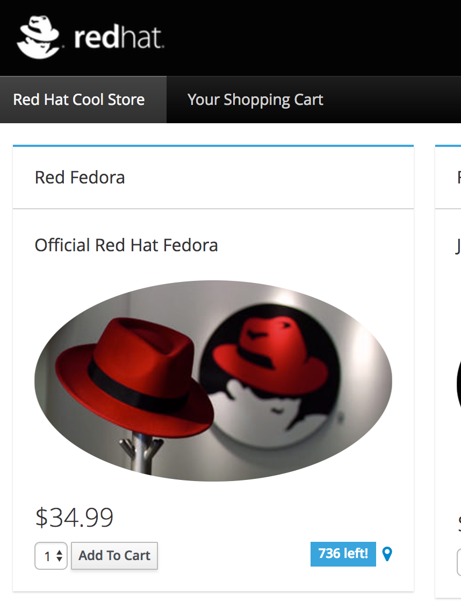

While the production application is still blue:

* [Coolstore - Prod](http://www-coolstore-prod.$OPENSHIFT_MASTER)


We're happy with this change in dev, so let's promote the new change to prod, using the new approval step!

**3. Run the pipeline again**

Invoke the pipeline once more by clicking **Start Pipeline** on the [Pipeline Config page](https://$OPENSHIFT_MASTER/console/project/coolstore-prod/browse/pipelines/monolith-pipeline)

The same pipeline progress will be shown, however before deploying to prod, you will see a prompt in the pipeline:

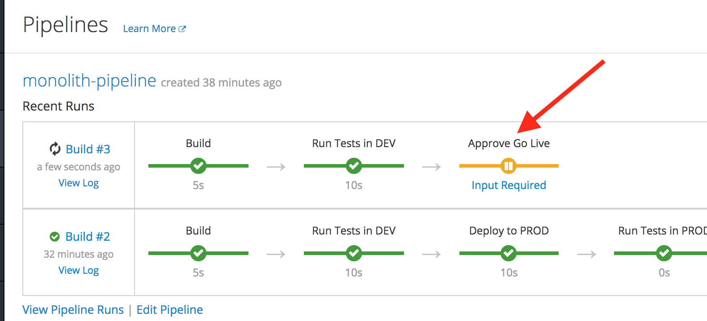

Click on the link for `Input Required`. This will open a new tab and direct you to Jenkins itself, where you can login with
the same credentials as OpenShift:

* Username: `developer`
* Password: `developer`

Accept the browser certificate warning and the Jenkins/OpenShift permissions, and then you'll find yourself at the approval prompt:

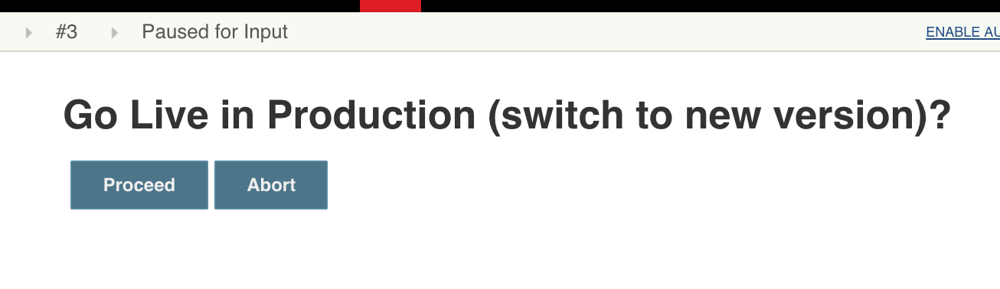

**3. Approve the change to go live**

Click **Proceed**, which will approve the change to be pushed to production. You could also have
clicked **Abort** which would stop the pipeline immediately in case the change was unwanted or unapproved.

Once you click **Proceed**, you will see the log file from Jenkins showing the final progress and deployment.

Wait for the production deployment to complete:

`oc rollout -n coolstore-prod status dc/coolstore-prod`### Run it!

Once it completes, verify that the production application has the new change (original black header):

* [Coolstore - Prod](http://www-coolstore-prod.$OPENSHIFT_MASTER)


## Congratulations!

You have added a human approval step for all future developer changes. You now have two projects that can be visualized as:

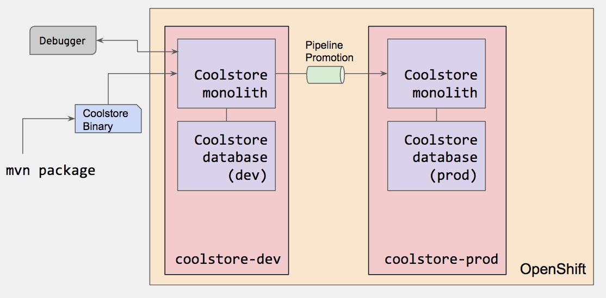


## Summary

In this scenario you learned how to use the OpenShift Container Platform as a developer to build,
deploy, and debug applications. You also learned how OpenShift makes your life easier as a developer,
architect, and DevOps engineer.

You can use these techniques in future projects to modernize your existing applications and add
a lot of functionality without major re-writes.

The monolithic application we've been using so far works great, but is starting to show its age.
Even small changes to one part of the app require many teams to be involved in the push to production.

In the next few scenarios we'll start to modernize our application and begin to move away from
monolithic architectures and toward microservice-style architectures using Red Hat technology. Let's go!

# SCENARIO 4: Transforming an existing monolith (Part 1)

* Purpose: Showing developers and architects how Red Hat jumpstarts modernization
* Difficulty: `intermediate`
* Time: `45 minutes`

## Intro
In the previous scenarios you learned how to take an existing monolithic Java EE application to the cloud
with JBoss EAP and OpenShift, and you got a glimpse into the power of OpenShift for existing applications.

You will now begin the process of modernizing the application by breaking the application into multiple
microservices using different technologies, with the eventual goal of re-architecting the entire application as a set of
distributed microservices. Later on we'll explore how you can better manage and monitor the application after
it is re-architected.

In this scenario you will learn more about [WildFly Swarm](https://wildfly-swarm.io), one of the runtimes
included in [Red Hat OpenShift Application Runtimes](https://developers.redhat.com/products/rhoar). WildFly
Swarm is a great place to start since our application is a Java EE application, and your skills as a Java EE
developer will naturally translate to the world of WildFly Swarm.

You will implement one component of the monolith as a WildFly Swarm microservice and modify it to address
microservice concerns, understand its structure, deploy it to OpenShift and exercise the interfaces between
WildFly Swarm apps, microservices, and OpenShift/Kubernetes.

## Goals of this scenario

The goal is to deploy this new microservice alongside the existing monolith, and then later on we'll tie them together.
But after this scenario, you should end up with something like:

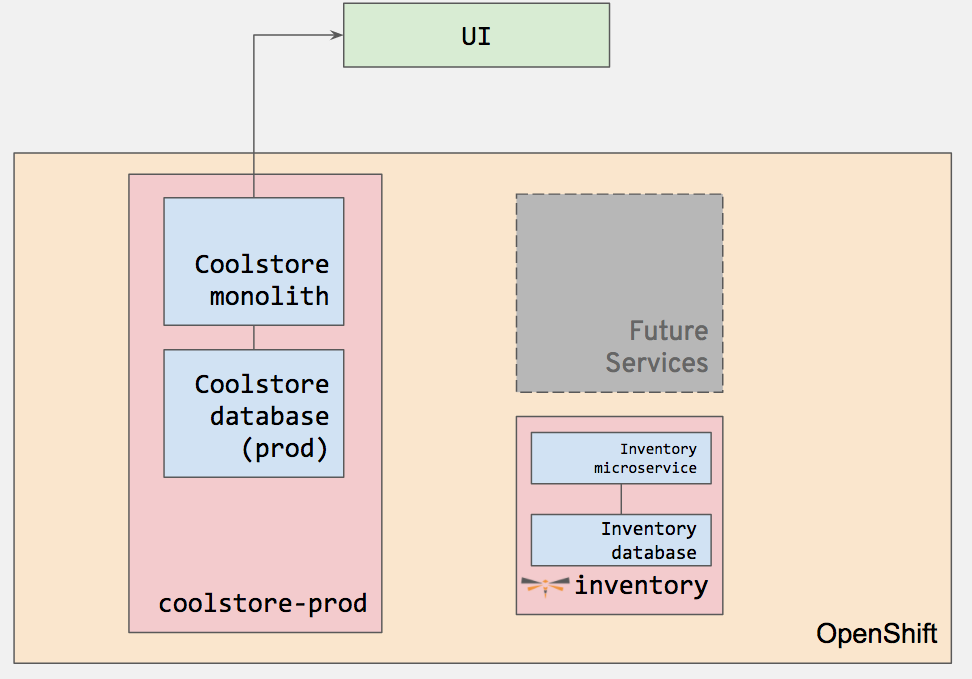

## What is WildFly Swarm? 


Java EE applications are traditionally created as an **ear** or **war** archive including all 
dependencies and deployed in an application server. Multiple Java EE applications can and 
were typically deployed in the same application server. This model is well understood in 
the development teams and has been used over the past several years.

[WildFly Swarm](http://wildfly-swarm.io) offers an innovative approach to packaging and 
running Java EE applications by 
packaging them with just enough of the Java EE server runtime to be able to run them directly 
on the JVM using **java -jar** For more details on various approaches to packaging Java 
applications,
read [this blog post](https://developers.redhat.com/blog/2017/08/24/the-skinny-on-fat-thin-hollow-and-uber).

WildFly Swarm is based on WildFly and it's compatible with 
[Eclipse MicroProfile](https://microprofile.io), which is a community effort to standardized the subset of Java EE standards 
such as JAX-RS, CDI and JSON-P that are useful for building microservices applications.

Since WildFly Swarm is based on Java EE standards, it significantly simplifies refactoring 
existing Java EE application to microservices and allows much of existing code-base to be 
reused in the new services.


## Examine the sample project

The sample project shows the components of a basic WildFly Swarm project laid out in different
subdirectories according to Maven best practices.

**1. Examine the Maven project structure.**

> Click on the `tree` command below to automatically copy it into the terminal and execute it

``tree``### Run it!

This is a minimal Java EE project with support for JAX-RS for building
RESTful services and JPA for connecting
to a database. [JAX-RS](https://docs.oracle.com/javaee/7/tutorial/jaxrs.htm)
is one of Java EE standards that uses Java annotations
to simplify the development of RESTful web services. [Java Persistence API (JPA)](https://docs.oracle.com/javaee/7/tutorial/partpersist.htm) is
another Java EE standard that provides Java developers with an
object/relational mapping facility for managing relational data in Java applications.

This project currently contains no code other than the main class for exposing a single
RESTful application defined in `src/main/java/com/redhat/coolstore/rest/RestApplication.java`.

Run the Maven build to make sure the skeleton project builds successfully. You
should get a **BUILD SUCCESS** message in the logs, otherwise the build has failed.

> Make sure to run the **package** Maven goal and not **install**. The latter would
> download a lot more dependencies and do things you don't need yet!

`mvn clean package`### Run it!

You should see a **BUILD SUCCESS** in the logs.

Once built, the resulting *jar* is located in the **target** directory:

`ls target/*.jar`### Run it!

The listed jar archive, **inventory-1.0.0-SNAPSHOT-swarm.jar** , is an uber-jar with
all the dependencies required packaged in the *jar* to enable running the
application with **java -jar**. WildFly Swarm also creates a *war* packaging as a standard Java EE web app
that could be deployed to any Java EE app server (for example, JBoss EAP, or its upstream WildFly project).

Now let's write some code and create a domain model, service interface and a RESTful endpoint to access inventory:

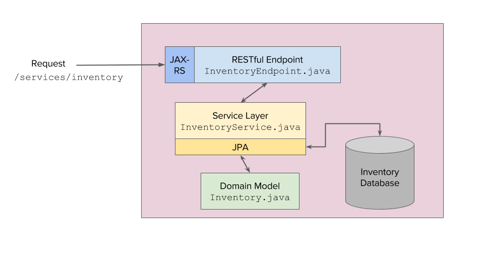


## Create Inventory Domain

With our skeleton project in place, let's get to work defining the business logic.

The first step is to define the model (definition) of an Inventory object. Since WildFly Swarm uses JPA,
we can re-use the same model definition from our monolithic application - no need to re-write or re-architect!

Create a new Java class named `Inventory.java` in
`com.redhat.coolstore.model` package with the following code, identical to the monolith code (click **Copy To Editor** to create the class):

```java
package com.redhat.coolstore.model;

import javax.persistence.Entity;
import javax.persistence.Id;
import javax.persistence.Table;
import javax.persistence.UniqueConstraint;
import java.io.Serializable;

@Entity
@Table(name = "INVENTORY", uniqueConstraints = @UniqueConstraint(columnNames = "itemId"))
public class Inventory implements Serializable {

    private static final long serialVersionUID = -7304814269819778382L;

    @Id
    private String itemId;


    private String location;


    private int quantity;


    private String link;

    public Inventory() {

    }

    public Inventory(String itemId, int quantity, String location, String link) {
        super();
        this.itemId = itemId;
        this.quantity = quantity;
        this.location = location;
        this.link = link;
    }

    public String getItemId() {
		return itemId;
	}

	public void setItemId(String itemId) {
		this.itemId = itemId;
	}

	public String getLocation() {
		return location;
	}

	public void setLocation(String location) {
		this.location = location;
	}

	public int getQuantity() {
		return quantity;
	}

	public void setQuantity(int quantity) {
		this.quantity = quantity;
	}

	public String getLink() {
		return link;
	}

	public void setLink(String link) {
		this.link = link;
	}

	@Override
    public String toString() {
        return "Inventory [itemId=" + itemId + ", availability=" + quantity + "/" + location + " link=" + link + "]";
    }
}

```

Review the **Inventory** domain model and note the JPA annotations on this class. **@Entity** marks
the class as a JPA entity, **@Table** customizes the table creation process by defining a table
name and database constraint and **@Id** marks the primary key for the table.

WildFly Swarm configuration is done to a large extent through detecting the intent of the
developer and automatically adding the required dependencies configurations to make sure it can
get out of the way and developers can be productive with their code rather than Googling for
configuration snippets. As an example, configuration database access with JPA is composed of
the following steps:

1. Adding the `org.wildfly.swarm:jpa` dependency to **pom.xml**
2. Adding the database driver (e.g. `org.postgresql:postgresql`) to ** pom.xml**
3. Adding database connection details in **src/main/resources/project-stages.yml**

Examine `pom.xml` and note the `org.wildfly.swarm:jpa` that is already added to enable JPA:

```xml
<dependency>
    <groupId>org.wildfly.swarm</groupId>
    <artifactId>jpa</artifactId>
</dependency>
```

Examine `src/main/resources/META-INF/persistence.xml` to see the JPA datasource configuration
for this project. Also note that the configurations uses `src/main/resources/META-INF/load.sql` to import
initial data into the database.

Examine `src/main/resources/project-stages.yml` to see the database connection details.
An in-memory H2 database is used in this scenario for local development and in the following
steps will be replaced with a PostgreSQL database with credentials coming from an OpenShift _secret_. Be patient! More on that later.

Build and package the Inventory service using Maven to make sure you code compiles:

`mvn clean package`### Run it!

If builds successfully, continue to the next step to create a new service.


## Create Inventory Service

In this step we will mirror the abstraction of a _service_ so that we can inject the Inventory _service_ into
various places (like a RESTful resource endpoint) in the future. This is the same approach that our monolith
uses, so we can re-use this idea again. Create an **InventoryService** class in the
`com.redhat.coolstore.service` package by clicking **Copy To Editor** with the below code:

```java
package com.redhat.coolstore.service;


import javax.ejb.Stateless;
import javax.persistence.EntityManager;
import javax.persistence.PersistenceContext;
import javax.persistence.Query;

import com.redhat.coolstore.model.Inventory;

import java.util.Collection;
import java.util.List;

@Stateless
public class InventoryService {

    @PersistenceContext
    private EntityManager em;

    public InventoryService() {

    }

    public boolean isAlive() {
        return em.createQuery("select 1 from Inventory i")
                .setMaxResults(1)
                .getResultList().size() == 1;
    }
    public Inventory getInventory(String itemId) {
        return em.find(Inventory.class, itemId);
    }

    public List<Inventory> getAllInventory() {
        Query query = em.createQuery("SELECT i FROM Inventory i");
        return query.getResultList();
    }
}
```

Review the **InventoryService** class and note the EJB and JPA annotations on this class:

* **@Stateless** marks
the class as a _Stateless EJB_, and its name suggests, means that instances of the class do not maintain state,
which means they can be created and destroyed at will by the management system, and be re-used by multiple clients
without instantiating multiple copies of the bean. Because they can support multiple
clients, stateless EJBs can offer better scalability for applications that require large numbers of
clients.

* **@PersistenceContext** objects are created by the Java EE server based on the JPA definition in `persistence.xml` that
we examined earlier, so to use it at runtime it is injected by this annotation and can be used to issue queries against
the underlying database backing the **Inventory** entities.

This service class exposes a few APIs that we'll use later:

* **isAlive()** - A simple health check to determine if this service class is ready to accept requests. We will use
this later on when defining OpenShift health checks.

* **getInventory()** and **getAllInventory()** are APIs used to query for one or all of the stored **Inventory* entities. We'll use this
later on when implementing a RESTful endpoint.

Re-Build and package the Inventory service using Maven to make sure your code compiles:

`mvn clean package`### Run it!

You should see a **BUILD SUCCESS** in the build logs. If builds successfully, continue to the next step to
create a new RESTful endpoint that uses this service.


## Create RESTful Endpoints

WildFly Swarm uses JAX-RS standard for building REST services. Create a new Java class named
`InventoryEndpoint.java` in `com.redhat.coolstore.rest` package with the following
content by clicking on *Copy to Editor*:

```java
package com.redhat.coolstore.rest;

import java.io.Serializable;
import java.util.List;

import javax.enterprise.context.RequestScoped;
import javax.inject.Inject;
import javax.ws.rs.GET;
import javax.ws.rs.Path;
import javax.ws.rs.PathParam;
import javax.ws.rs.Produces;
import javax.ws.rs.core.MediaType;

import com.redhat.coolstore.model.Inventory;
import com.redhat.coolstore.service.InventoryService;

@RequestScoped
@Path("/inventory")
public class InventoryEndpoint implements Serializable {

    private static final long serialVersionUID = -7227732980791688773L;

    @Inject
    private InventoryService inventoryService;

    @GET
    @Produces(MediaType.APPLICATION_JSON)
    public List<Inventory> getAll() {
        return inventoryService.getAllInventory();
    }

    @GET
    @Path("{itemId}")
    @Produces(MediaType.APPLICATION_JSON)
    public Inventory getAvailability(@PathParam("itemId") String itemId) {
        return inventoryService.getInventory(itemId);
    }

}

```

The above REST services defines two endpoints:

* `/services/inventory` that is accessible via **HTTP GET** which will return all known product Inventory entities as JSON
* `/services/inventory/<id>` that is accessible via **HTTP GET** at
for example **/services/inventory/329299** with
the last path parameter being the product id which we want to check its inventory status.

The code also injects our new **InventoryService** using the [CDI @Inject](https://docs.oracle.com/javaee/7/tutorial/partcdi.htm) annotation, which gives
us a runtime handle to the service we defined in the previous steps that we can use to query
the database when the RESTful APIs are invoked.

Build and package the Inventory service again using Maven:

`mvn clean package`### Run it!

You should see a **BUILD SUCCESS** in the build logs.


## Test Locally

Using the WildFly Swarm maven plugin (predefined in `pom.xml`), you can conveniently run the application locally and test the endpoint.

`mvn wildfly-swarm:run`### Run it!

> As an uber-jar, it could also be run with `java -jar target/inventory-1.0-SNAPSHOT-swarm.jar` but you don't need to do this now

Once the application is done initializing you should see:

```console
INFO  [org.wildfly.swarm] (main) WFSWARM99999: WildFly Swarm is Ready
```

Running locally using `wildfly-swarm:run` will use an in-memory database with default credentials. In a production application you
will use an external source for credentials using an OpenShift _secret_ in later steps, but for now this will work for development and
testing.

**3. Test the application**

To test the running application, click on the **Local Web Browser** tab in the console frame of this browser window. This will open another tab or window of your browser pointing to port 8080 on your client.


> or use [this](https://$OPENSHIFT_MASTER/) link.

You should now see a html page that looks like this

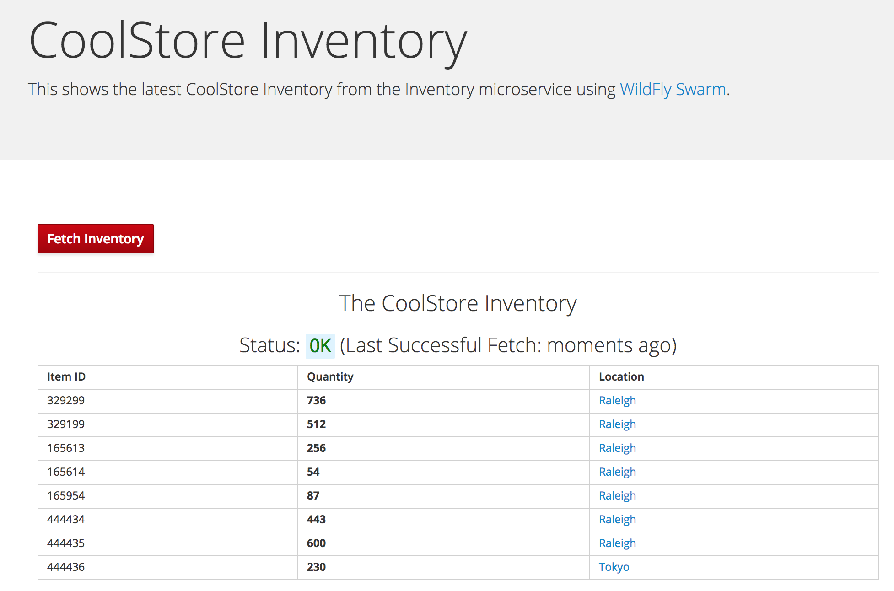

This is a simple webpage that will access the inventory *every 2 seconds* and refresh the table of product inventories.

You can also click the **Fetch Inventory** button to force it to refresh at any time.

To see the raw JSON output using `curl`, you can open an new terminal window by clicking on the plus (+)
icon on the terminal toolbar and then  choose **Open New Terminal**. You can also click on the following
command to automatically open a new terminal and run the test:

`curl http://localhost:8080/services/inventory/329299 ; echo`### Run it!

You would see a JSON response like this:

```
{"itemId":"329299","location":"Raleigh","quantity":736,"link":"http://maps.google.com/?q=Raleigh"}
```

The REST API returned a JSON object representing the inventory count for this product. Congratulations!

**4. Stop the application**

Before moving on, click in the first terminal window where WildFly Swarm is running
and then press `CTRL-C` to stop the running application! (or click this command to issue
a `CTRL-C` for you: `clear`### Run it!)

You should see something like:

```console
WFLYSRV0028: Stopped deployment inventory-1.0.0-SNAPSHOT.war (runtime-name: inventory-1.0.0-SNAPSHOT.war) in 70ms
```

This indicates the application is stopped.

## Congratulations

You have now successfully created your first microservice using WildFly Swarm and implemented a basic RESTful
API on top of the Inventory database. Most of the code is the same as was found in the monolith, demonstrating how
easy it is to migrate existing monolithic Java EE applications to microservices using WildFly Swarm.

In next steps of this scenario we will deploy our application to OpenShift Container Platform and then start
adding additional features to take care of various aspects of cloud native microservice development.


## Create OpenShift Project

We have already deployed our coolstore monolith to OpenShift, but now we are working on re-architecting it to be
microservices-based.

In this step we will deploy our new Inventory microservice for our CoolStore application,
so let's create a separate project to house it and keep it separate from our monolith and our other microservices we will
create later on.

**1. Create project**

Create a new project for the _inventory_ service:

`oc new-project inventory --display-name="CoolStore Inventory Microservice Application"`### Run it!

**3. Open the OpenShift Web Console**

You should be familiar with the OpenShift Web Console by now!
Click on the "OpenShift Console" tab:


And navigate to the new _inventory_ project overview page (or use [this quick link](https://$OPENSHIFT_MASTER/console/project/inventory/)

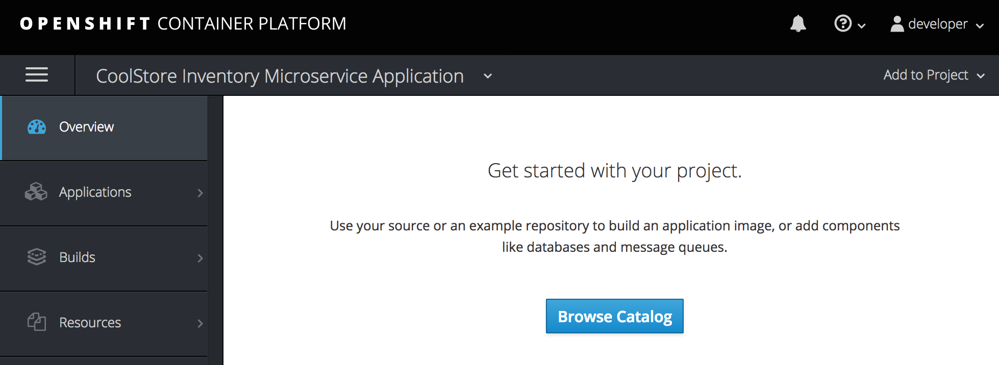

There's nothing there now, but that's about to change.


## Deploy to OpenShift

Let's deploy our new inventory microservice to OpenShift!

**1. Deploy the Database**

Our production inventory microservice will use an external database (PostgreSQL) to house inventory data.
First, deploy a new instance of PostgreSQL by executing:

`oc new-app -e POSTGRESQL_USER=inventory \
             -e POSTGRESQL_PASSWORD=mysecretpassword \
             -e POSTGRESQL_DATABASE=inventory \
             openshift/postgresql:latest \
             --name=inventory-database`### Run it!

> **NOTE:** If you change the username and password you also need to update `src/main/fabric8/credential-secret.yml` which contains
the credentials used when deploying to OpenShift.

This will deploy the database to our new project. Wait for it to complete:

`oc rollout status -w dc/inventory-database`### Run it!

**2. Build and Deploy**

Red Hat OpenShift Application Runtimes includes a powerful maven plugin that can take an
existing WildFly Swarm application and generate the necessary Kubernetes configuration.
You can also add additional config, like ``src/main/fabric8/inventory-deployment.yml`` which defines
the deployment characteristics of the app (in this case we declare a few environment variables which map our credentials
stored in the secrets file to the application), but OpenShift supports a wide range of [Deployment configuration options](https://docs.openshift.org/latest/architecture/core_concepts/deployments.html) for apps).

Build and deploy the project using the following command, which will use the maven plugin to deploy:

`mvn clean fabric8:deploy -Popenshift`### Run it!

The build and deploy may take a minute or two. Wait for it to complete. You should see a **BUILD SUCCESS** at the
end of the build output.

> **NOTE**: If you see messages like `Current reconnect backoff is 2000 milliseconds (T1)` you can safely
ignore them, it is a known issue and is harmless.

After the maven build finishes it will take less than a minute for the application to become available.
To verify that everything is started, run the following command and wait for it complete successfully:

`oc rollout status -w dc/inventory`### Run it!

>**NOTE:** Even if the rollout command reports success the application may not be ready yet and the reason for
that is that we currently don't have any liveness check configured, but we will add that in the next steps.

**3. Access the application running on OpenShift**

This sample project includes a simple UI that allows you to access the Inventory API. This is the same
UI that you previously accessed outside of OpenShift which shows the CoolStore inventory. Click on the
[route URL](http://inventory-inventory.$OPENSHIFT_MASTER)
to access the sample UI.

> You can also access the application through the link on the OpenShift Web Console Overview page.

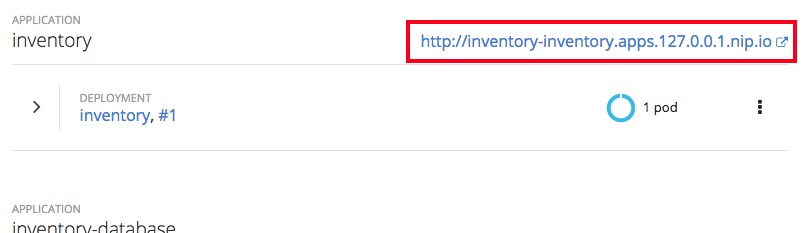

> **NOTE**: If you get a '404 Not Found' error, just reload the page a few times until the Inventory UI appears. This
is due to a lack of health check which you are about to fix!

The UI will refresh the inventory table every 2 seconds, as before.

Back on the OpenShift console, Navigate to _Applications_ -> _Deployments_ -> `inventory` (or just click [this link](https://$OPENSHIFT_MASTER/console/project/inventory/browse/dc/inventory?tab=history) ) and then click on
the top-most `(latest)` deployment in the listing (most likely `#1` or `#2`):

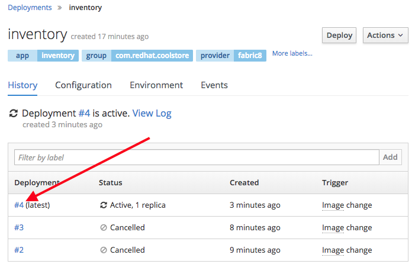

Notice OpenShift is warning you that the inventory application has no health checks:

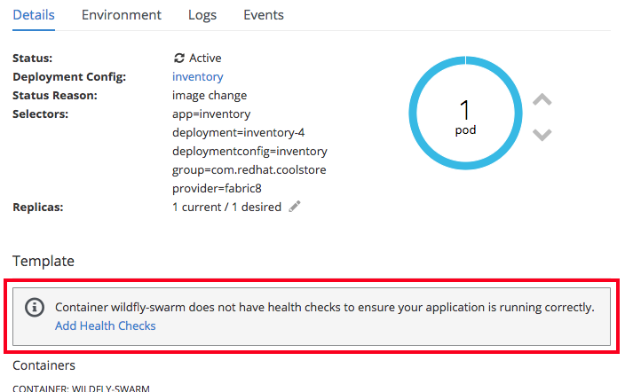

In the next steps you will enhance OpenShift's ability to manage the application lifecycle by implementing
a _health check pattern_. By default, without health checks (or health _probes_) OpenShift considers services
to be ready to accept service requests even before the application is truly ready or if the application is hung
or otherwise unable to service requests. OpenShift must be _taught_ how to recognize that our app is alive and ready
to accept requests. 


## Add Health Check Fraction

## What is a Fraction?

WildFly Swarm is defined by an unbounded set of capabilities. Each piece of functionality is called a fraction.
Some fractions provide only access to APIs, such as JAX-RS or CDI; other fractions provide higher-level capabilities,
such as integration with RHSSO (Keycloak).

The typical method for consuming WildFly Swarm fractions is through Maven coordinates, which you add to the pom.xml
file in your application. The functionality the fraction provides is then packaged with your application into an
_Uberjar_.  An uberjar is a single Java .jar file that includes everything you need to execute your application.
This includes both the runtime components you have selected, along with the application logic.

## What is a Health Check?

A key requirement in any managed application container environment is the ability to determine when the application is in a ready state. Only when an
application has reported as ready can the manager (in this case OpenShift) act on the next step of the deployment process. OpenShift
makes use of various _probes_ to determine the health of an application during its lifespan. A _readiness_
probe is one of these mechanisms for validating application health and determines when an
application has reached a point where it can begin to accept incoming traffic. At that point, the IP
address for the pod is added to the list of endpoints backing the service and it can begin to receive
requests. Otherwise traffic destined for the application could reach the application before it was fully
operational resulting in error from the client perspective.

Once an application is running, there are no guarantees that it will continue to operate with full
functionality. Numerous factors including out of memory errors or a hanging process can cause the
application to enter an invalid state. While a _readiness_ probe is only responsible for determining
whether an application is in a state where it should begin to receive incoming traffic, a _liveness_ probe
is used to determine whether an application is still in an acceptable state. If the liveness probe fails,
OpenShift will destroy the pod and replace it with a new one.

In our case we will implement the health check logic in a REST endpoint and let WildFly Swarm publish
that logic on the `/health` endpoint for use with OpenShift.

** 2. Add `monitor` fraction**

First, open the `pom.xml` file.

WildFly Swarm includes the `monitor` fraction which automatically adds health check infrastructure to your
application when it is included as a fraction in the project. Click **Copy To Editor** to insert the new dependencies
into the `pom.xml` file:

```java
<dependency>
    <groupId>org.wildfly.swarm</groupId>
    <artifactId>monitor</artifactId>
</dependency>
```


By adding the `monitor` fraction, Fabric8 will automatically add a _readinessProbe_ and _livenessProbe_ to the OpenShift
_DeploymentConfig_, published at `/health`, once deployed to OpenShift. But you still need to implement the logic behind
the health check, which you'll do next.


## Define Health Check Endpoint

We are now ready to define the logic of our health check endpoint.

**1. Create empty Java class**

The logic will be put into a new Java class.

Click this link to create and open the file which will contain the new class: `src/main/java/com/redhat/coolstore/rest/HealthChecks.java`

Methods in this new class will be annotated with both the JAX-RS annotations as well as
[WildFly Swarm's `@Health` annotation](https://wildfly-swarm.gitbooks.io/wildfly-swarm-users-guide/content/advanced/monitoring.html), indicating it should be used as a health check endpoint.

**2. Add logic**

Next, let's fill in the class by creating a new RESTful endpoint which will be used by OpenShift to probe our services.

Click on **Copy To Editor** below to implement the logic.

```java
package com.redhat.coolstore.rest;

import javax.inject.Inject;
import javax.ws.rs.GET;
import javax.ws.rs.Path;

import com.redhat.coolstore.service.InventoryService;
import org.wildfly.swarm.health.Health;
import org.wildfly.swarm.health.HealthStatus;

@Path("/infra")
public class HealthChecks {

    @Inject
    private InventoryService inventoryService;

    @GET
    @Health
    @Path("/health")
    public HealthStatus check() {

        if (inventoryService.isAlive()) {
            return HealthStatus.named("service-state").up();
        } else {
            return HealthStatus.named("service-state").down();
        }
    }
}
```

The `check()` method exposes an HTTP GET endpoint which will return the status of the service. The logic of
this check does a simple query to the underlying database to ensure the connection to it is stable and available.
The method is also annotated with WildFly Swarm's `@Health` annotation, which directs WildFly Swarm to expose
this endpoint as a health check at `/health`.

With our new health check in place, we'll need to build and deploy the updated application in the next step.


## Re-Deploy to OpenShift

**1. Rebuild and re-deploy**

With our health check in place, lets rebuild and redeploy using the same command as before:

`mvn fabric8:undeploy clean fabric8:deploy -Popenshift`### Run it!

You should see a **BUILD SUCCESS** at the end of the build output.

During build and deploy, you'll notice WildFly Swarm adding in health checks for you:

```console
[INFO] F8: wildfly-swarm-health-check: Adding readiness probe on port 8080, path='/health', scheme='HTTP', with initial delay 10 seconds
[INFO] F8: wildfly-swarm-health-check: Adding liveness probe on port 8080, path='/health', scheme='HTTP', with initial delay 180 seconds
```

To verify that everything is started, run the following command and wait for it report
`replication controller "inventory-xxxx" successfully rolled out`

`oc rollout status -w dc/inventory`### Run it!

Once the project is deployed, you should be able to access the health check logic
at the `/health` endpoint using a simple _curl_ command. This is the same API that OpenShift will repeatedly poll to determine application health.

Click here to try it (you may need to try a few times until the project is fully deployed):

``curl http://inventory-inventory.$OPENSHIFT_MASTER/health``### Run it!

You should see a JSON response like:

```
{"checks": [
{"id":"service-state","result":"UP"}],
"outcome": "UP"
}
```

You can see the definition of the health check from the perspective of OpenShift:

`oc describe dc/inventory | egrep 'Readiness|Liveness'`### Run it!

You should see:

```console
    Liveness:	http-get http://:8080/health delay=180s timeout=1s period=10s #success=1 #failure=3
    Readiness:	http-get http://:8080/health delay=10s timeout=1s period=10s #success=1 #failure=3
```

**2. Adjust probe timeout**

The various timeout values for the probes can be configured in many ways. Let's tune the _liveness probe_ initial delay so that
we don't have to wait 3 minutes for it to be activated. Use the **oc** command to tune the
probe to wait 20 seconds before starting to poll the probe:

`oc set probe dc/inventory --liveness --initial-delay-seconds=30`### Run it!

And verify it's been changed (look at the `delay=` value for the Liveness probe):

`oc describe dc/inventory | egrep 'Readiness|Liveness'`### Run it!

```console
    Liveness:	http-get http://:8080/health delay=30s timeout=1s period=10s #success=1 #failure=3
    Readiness:	http-get http://:8080/health delay=10s timeout=1s period=10s #success=1 #failure=3
```

> You can also edit health checks from the OpenShift Web Console, for example click on [this link](https://$OPENSHIFT_MASTER/console/project/inventory/edit/health-checks?kind=DeploymentConfig&name=inventory)
to access the health check edit page for the Inventory deployment.

In the next step we'll exercise the probe and watch as it fails and OpenShift recovers the application.

## Exercise Health Check

From the OpenShift Web Console overview page, click on the route link to open the sample application UI:


This will open up the sample application UI in a new browser tab:


The app will begin polling the inventory as before and report success:

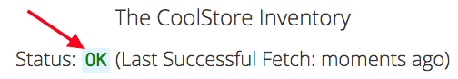

Now you will corrupt the service and cause its health check to start failing.
To simulate the app crasing, let's kill the underlying service so it stops responding. Execute:

`oc --server https://master:8443 rsh dc/inventory pkill java`### Run it!

This will execute the Linux `pkill` command to stop the running Java process in the container.

Check out the application sample UI page and notice it is now failing to access the inventory data, and the
`Last Successful Fetch` counter starts increasing, indicating that the UI cannot access inventory. This could have
been caused by an overloaded server, a bug in the code, or any other reason that could make the application
unhealthy.

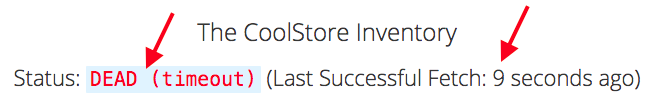

At this point, return to the OpenShift web console and click on the _Overview_ tab for the project. Notice that the
dark blue circle has now gone light blue, indicating the application is failing its _liveness probe_:

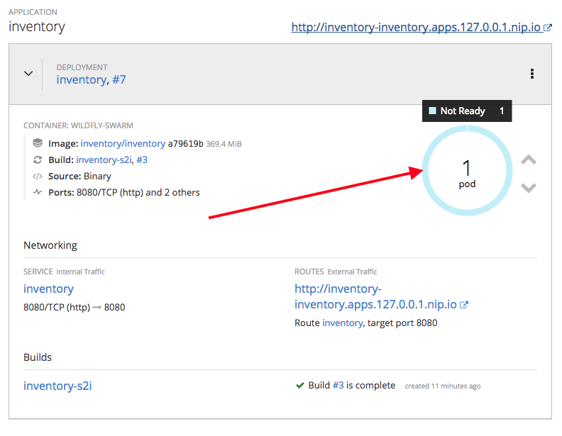

After too many liveness probe failures, OpenShift will forcibly kill the pod and container running the service, and spin up a new one to take
its place. Once this occurs, the light blue circle should return to dark blue. This should take about 30 seconds.

Return to the same sample app UI (without reloading the page) and notice that the UI has automatically
re-connected to the new service and successfully accessed the inventory once again:


## Summary

In this scenario you learned a bit more about what WildFly Swarm is, and how it can be used to create
modern Java microservice-oriented applications.

You created a new Inventory microservice representing functionality previously implmented in the monolithic
CoolStore application. For now this new microservice is completely disconnected from our monolith and is
not very useful on its own. In future steps you will link this and other microservices into the monolith to
begin the process of [strangling the monolith](https://www.martinfowler.com/bliki/StranglerApplication.html).

WildFly Swarm brings in a number of concepts and APIs from the Java EE community, so your existing
Java EE skills can be re-used to bring your applications into the modern world of containers,
microservices and cloud deployments.

WildFly Swarm is one of many components of Red Hat OpenShift Application Runtimes. In the next scenario
you'll use Spring Boot, another popular framework, to implement additional microservices. Let's go!


# SCENARIO 5: Transforming an existing monolith (Part 2)

* Purpose: Showing developers and architects how Red Hat jumpstarts modernization
* Difficulty: `intermediate`
* Time: `60-70 minutes`

## Intro
In the previous scenarios, you learned how to take an existing monolithic app and refactor a single _inventory_ service using
WildFly Swarm. Since WildFly Swarm is using Java EE much of the technology from the monolith can be reused directly,
like JPA and JAX-RS. The previous scenario resulted in you creating an inventory service, but so far we haven't started
_strangling_ the monolith. That is because the inventory service is never called directly by the UI. It's a backend service
that is only used only by other backend services. In this scenario, you will create the catalog service and the catalog
service will call the inventory service. When you are ready, you will change the route to tie the UI calls to new service.

To implement this, we are going to use the Spring Framework. The reason for using Spring for this service is to introduce you
to Spring Development, and how [Red Hat OpenShift Application Runtimes](https://developers.redhat.com/products/rhoar) helps to
make Spring development on Kubernetes easy. In real life, the reason for choosing Spring vs. WF Swarm mostly depends on
personal preferences, like existing knowledge, etc. At the core Spring and Java EE are very similar.

The goal is to produce something like:

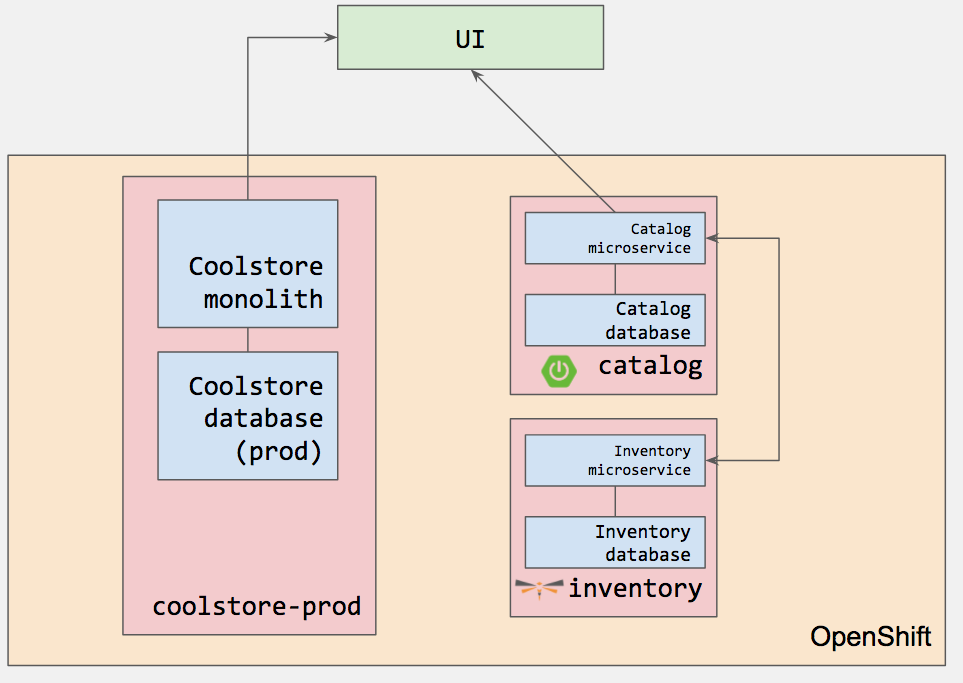

## What is Spring Framework?

Spring is one of the most popular Java Frameworks and offers an alternative to the Java EE programming model. Spring
is also very popular for building applications based on microservices architectures. Spring Boot is a popular tool in
the Spring ecosystem that helps with organizing and using 3rd-party libraries together with Spring and also provides a
mechanism for boot strapping embeddable runtimes, like Apache Tomcat. Bootable applications (sometimes also called _fat jars_)
fits the container model very well since in a container platform like OpenShift responsibilities like starting, stopping and
monitoring applications are then handled by the container platform instead of an Application Server.

## Aggregate microservices calls
Another thing you will learn in this scenario is one of the techniques to aggregate services using service-to-service calls.
Other possible solutions would be to use a microservices gateway or combine services using client-side logic.

## Examine the sample project

For your convenience, this scenario has been created with a base project using the Java programming language and the Apache Maven build tool.

Initially, the project is almost empty and doesn't do anything. Start by reviewing the content by executing a
``tree``### Run it! in your terminal.

The output should look something like this

```sh
.
+-- pom.xml
+-- README.md
\-- src
    +-- main
    |   +-- fabric8
    |   |   +-- catalog-deployment.yml
    |   |   +-- catalog-route.yml
    |   |   \-- credential-secret.yml
    |   +-- java
    |   |   \-- com
    |   |       \-- redhat
    |   |           \-- coolstore
    |   |               +-- client
    |   |               +-- model
    |   |               |   +-- Inventory.java
    |   |               |   \-- Product.java
    |   |               +-- RestApplication.java
    |   |               \-- service
    |   \-- resources
    |       +-- application-default.properties
    |       +-- schema.sql
    |       \-- static
    |           \-- index.html
    \-- test
        \-- java
            \-- com
                \-- redhat
                    \-- coolstore
                        \-- service
```


As you can see, there are some files that we have prepared for you in the project. Under `src/main/resources/static/index.html`
we have for example prepared a simple html-based UI file for you. Except for the `fabric8/` folder and `index.html`, this
matches very well what you would get if you generated an empty project from the [Spring Initializr](https://start.spring.io) web
page. For the moment you can ignore the content of the `fabric8/` folder (we will discuss this later).

One this that differs slightly is the `pom.xml`. Please open the and examine it a bit closer (but do not change anything
at this time)

``pom.xml``

As you review the content, you will notice that there are a lot of **TODO** comments. **Do not remove them!** These comments
are used as a marker and without them, you will not be able to finish this scenario.

Notice that we are not using the default BOM (Bill of material) that Spring Boot projects typically use. Instead, we are using
a BOM provided by Red Hat as part of the [Snowdrop](http://snowdrop.me/) project.

```xml
<dependencyManagement>
<dependencies>
  <dependency>
    <groupId>me.snowdrop</groupId>
    <artifactId>spring-boot-bom</artifactId>
    <version>${spring-boot.bom.version}</version>
    <type>pom</type>
    <scope>import</scope>
  </dependency>
</dependencies>
</dependencyManagement>
```

We use this bill of material to make sure that we are using the version of for example Apache Tomcat that Red Hat supports. 

**Adding web (Apache Tomcat) to the application**

Since our applications (like most) will be a web application, we need to use a servlet container like Apache Tomcat or
Undertow. Since Red Hat offers support for Apache Tomcat (e.g., security patches, bug fixes, etc.), we will use it.

>**NOTE:** Undertow is another an open source project that is maintained by Red Hat and therefore Red Hat plans to
add support for Undertow shortly.

To add Apache Tomcat to our project all we have to do is to add the following lines in ``pom.xml``. Click **Copy to Editor**
to automatically add these lines:

```java
    <dependency>
      <groupId>org.springframework.boot</groupId>
      <artifactId>spring-boot-starter-web</artifactId>
    </dependency>
```

We will also make use of Java Persistance API (JPA) so we need to add the following to `pom.xml`

```java
    <dependency>
      <groupId>org.springframework.boot</groupId>
      <artifactId>spring-boot-starter-data-jpa</artifactId>
    </dependency>
```

We will go ahead and add a bunch of other dependencies while we have the pom.xml open. These will be explained later.

```java
    <dependency>
      <groupId>org.springframework.boot</groupId>
      <artifactId>spring-boot-starter-actuator</artifactId>
    </dependency>

    <dependency>
      <groupId>org.springframework.cloud</groupId>
      <artifactId>spring-cloud-starter-feign</artifactId>
    </dependency>

    <dependency>
      <groupId>org.springframework.cloud</groupId>
      <artifactId>spring-cloud-starter-hystrix</artifactId>
    </dependency>
```

**Test the application locally**

As we develop the application, we might want to test and verify our change at different stages. We can do that
locally, by using the `spring-boot` maven plugin.

Run the application by executing the below command:

``mvn spring-boot:run``### Run it!

>**NOTE:** The Katacoda terminal window is like your local terminal. Everything that you run here you should
be able to execute on your local computer as long as you have a `Java SDK 1.8` and `Maven`. In later steps, we
will also use the `oc` command line tool.

Wait for it to complete startup and report `Started RestApplication in ***** seconds (JVM running for ******)`

**3. Verify the application**

To begin with, click on the **Local Web Browser** tab in the console frame of this browser window, which will open another tab or window of your browser pointing to port 8081 on your client.


or use [this](https://$OPENSHIFT_MASTER/) link.

You should now see an HTML page that looks like this:

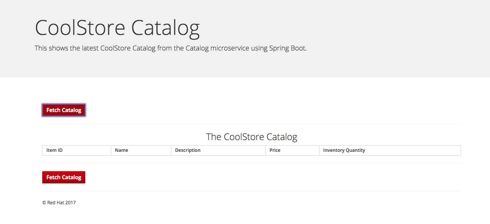

> **NOTE:** The service calls to get products from the catalog doesn't work yet. Be patient! We will work on it in the next steps.

**4. Stop the application**

Before moving on, click here: `clear`### Run it! to stop the running application.

## Congratulations

You have now successfully executed the first step in this scenario. 

Now you've seen how to get started with Spring Boot development on Red Hat OpenShift Application Runtimes

In next step of this scenario, we will add the logic to be able to read a list of fruits from the database.


## Create Domain Objects


## Creating a test.

Before we create the database repository class to access the data it's good practice to create test cases for the different methods that we will use.

Click to open ``src/test/java/com/redhat/coolstore/service/ProductRepositoryTest.java`` to create the empty file and
then **Copy to Editor** to copy the below code into the file:

```java
package com.redhat.coolstore.service;

import java.util.List;
import java.util.stream.Collectors;
import org.junit.Test;
import org.junit.runner.RunWith;
import org.springframework.beans.factory.annotation.Autowired;
import org.springframework.boot.test.context.SpringBootTest;
import org.springframework.test.context.junit4.SpringRunner;

import static org.assertj.core.api.Assertions.assertThat;

import com.redhat.coolstore.model.Product;


@RunWith(SpringRunner.class)
@SpringBootTest()
public class ProductRepositoryTest {

//TODO: Insert Catalog Component here

//TODO: Insert test_readOne here

//TODO: Insert test_readAll here

}

```

Next, inject a handle to the future repository class which will provide access to the underlying data repository. It is
injected with Spring's `@Autowired` annotation which locates, instantiates, and injects runtime instances of classes automatically,
and manages their lifecycle (much like Java EE and it's CDI feature). Click to create this code:

```java
@Autowired
ProductRepository repository;
```

The `ProductRepository` should provide a method called `findById(String id)` that returns a product and collect that from the database. We test this by querying for a product with id "444434" which should have name "Pebble Smart Watch". The pre-loaded data comes from the `src/main/resources/schema.sql` file.

Click to insert this code:

```java
@Test
public void test_readOne() {
    Product product = repository.findById("444434");
    assertThat(product).isNotNull();
    assertThat(product.getName()).as("Verify product name").isEqualTo("Pebble Smart Watch");
    assertThat(product.getQuantity()).as("Quantity should be ZEOR").isEqualTo(0);
}
```

The `ProductRepository` should also provide a methods called `readAll()` that returns a list of all products in the catalog. We test this by making sure that the list contains a "Red Fedora", "Forge Laptop Sticker" and "Oculus Rift".
Again, click to insert the code:

```java
@Test
public void test_readAll() {
    List<Product> productList = repository.readAll();
    assertThat(productList).isNotNull();
    assertThat(productList).isNotEmpty();
    List<String> names = productList.stream().map(Product::getName).collect(Collectors.toList());
    assertThat(names).contains("Red Fedora","Forge Laptop Sticker","Oculus Rift");
}
```

## Implement the database repository

We are now ready to implement the database repository.  

Create the ``src/main/java/com/redhat/coolstore/service/ProductRepository.java`` by clicking the open link.

Here is the base for the calls, click on the copy button to paste it into the editor:

```java
package com.redhat.coolstore.service;

import java.util.List;

import com.redhat.coolstore.model.Product;
import org.springframework.beans.factory.annotation.Autowired;
import org.springframework.jdbc.core.JdbcTemplate;
import org.springframework.jdbc.core.RowMapper;
import org.springframework.stereotype.Repository;

@Repository
public class ProductRepository {

//TODO: Autowire the jdbcTemplate here

//TODO: Add row mapper here

//TODO: Create a method for returning all products

//TODO: Create a method for returning one product

}

```

> NOTE: That the class is annotated with `@Repository`. This is a feature of Spring that makes it possible to avoid a lot of boiler plate code and only write the implementation details for this data repository. It also makes it very easy to switch to another data storage, like a NoSQL database.

Spring Data provides a convenient way for us to access data without having to write a lot of boiler plate code. One way to do that is to use a `JdbcTemplate`. First we need to autowire that as a member to `ProductRepository`. Click to add it:

```java
@Autowired
private JdbcTemplate jdbcTemplate;
```

The `JdbcTemplate` require that we provide a `RowMapper`so that it can map between rows in the query to Java Objects. We are going to define the `RowMapper` like this (click to add it):

```java
private RowMapper<Product> rowMapper = (rs, rowNum) -> new Product(
        rs.getString("itemId"),
        rs.getString("name"),
        rs.getString("description"),
        rs.getDouble("price"));
```

Now we are ready to create the methods that are used in the test. Let's start with the `readAll()`. It should return a `List<Product>` and then we can write the query as `SELECT * FROM catalog` and use the rowMapper to map that into `Product` objects. Our method should look like this (click to add it):

```java
public List<Product> readAll() {
    return jdbcTemplate.query("SELECT * FROM catalog", rowMapper);
}
```

The `ProductRepositoryTest` also used another method called `findById(String id)` that should return a Product. The implementation of that method using the `JdbcTemplate` and `RowMapper` looks like this (click to add it):

```java
public Product findById(String id) {
    return jdbcTemplate.queryForObject("SELECT * FROM catalog WHERE itemId = '" + id + "'", rowMapper);
}
```

The `ProductRepository` should now have all the components, but we still need to tell spring how to connect to the database. For local development we will use the H2 in-memory database. When deploying this to OpenShift we are instead going to use the PostgreSQL database, which matches what we are using in production.

The Spring Framework has a lot of sane defaults that can always seem magical sometimes, but basically all we have todo to setup the database driver is to provide some configuration values. Open ``src/main/resources/application-default.properties`` and add the following properties where the comment says "#TODO: Add database properties"
Click to add it:

```java 
spring.datasource.url=jdbc:h2:mem:catalog;DB_CLOSE_ON_EXIT=FALSE
spring.datasource.username=sa
spring.datasource.password=sa
spring.datasource.driver-class-name=org.h2.Driver
```

The Spring Data framework will automatically see if there is a schema.sql in the class path and run that when initializing.

Now we are ready to run the test to verify that everything works. Because we created the `ProductRepositoryTest.java` all we have todo is to run: ``mvn verify``### Run it!

The test should be successful and you should see **BUILD SUCCESS**, which means that we can read that our repository class works as as expected.

## Congratulations

You have now successfully executed the second step in this scenario. 

Now you've seen how to use Spring Data to collect data from the database and how to use a local H2 database for development and testing.

In next step of this scenario, we will add the logic to expose the database content from REST endpoints using JSON format.


## Create Catalog Service


Now you are going to create a service class. Later on the service class will be the one that controls the interaction with the inventory service, but for now it's basically just a wrapper of the repository class. 

Create a new class `CatalogService` by clicking: ``src/main/java/com/redhat/coolstore/service/CatalogService.java``

And then click **Copy to Editor** to implement the new service:

```java
package com.redhat.coolstore.service;

import com.redhat.coolstore.model.Inventory;
import com.redhat.coolstore.model.Product;
//import com.redhat.coolstore.client.InventoryClient;
import feign.hystrix.FallbackFactory;
import org.springframework.beans.factory.annotation.Autowired;
import org.springframework.cloud.netflix.feign.FeignClient;
import org.springframework.http.MediaType;
import org.springframework.stereotype.Component;
import org.springframework.stereotype.Service;
import org.springframework.web.bind.annotation.PathVariable;
import org.springframework.web.bind.annotation.RequestMapping;
import org.springframework.web.bind.annotation.RequestMethod;

import java.util.List;
import java.util.stream.Collectors;

@Service
public class CatalogService {

    @Autowired
    private ProductRepository repository;

    //TODO: Autowire Inventory Client

    public Product read(String id) {
        Product product = repository.findById(id);
        //TODO: Update the quantity for the product by calling the Inventory service
        return product;
    }

    public List<Product> readAll() {
        List<Product> productList = repository.readAll();
        //TODO: Update the quantity for the products by calling the Inventory service
        return productList; 
    }

    //TODO: Add Callback Factory Component


}
```

As you can see there is a number of **TODO** in the code, and later we will use these placeholders to add logic for calling the Inventory Client to get the quantity. However for the moment we will ignore these placeholders. 

Now we are ready to create the endpoints that will expose REST service. Let's again first start by creating a test case for our endpoint. We need to endpoints, one that exposes for GET calls to `/services/products` that will return all product in the catalog as JSON array, and the second one exposes GET calls to `/services/product/{prodId}` which will return a single Product as a JSON Object. Let's again start by creating a test case. 


Create the test case by opening: ``src/test/java/com/redhat/coolstore/service/CatalogEndpointTest.java``

Add the following code to the test case and make sure to review it so that you understand how it works.

```java
package com.redhat.coolstore.service;

import com.redhat.coolstore.model.Inventory;
import com.redhat.coolstore.model.Product;
import io.specto.hoverfly.junit.rule.HoverflyRule;
import org.junit.ClassRule;
import org.junit.Test;
import org.junit.runner.RunWith;
import org.springframework.beans.factory.annotation.Autowired;
import org.springframework.boot.test.context.SpringBootTest;
import org.springframework.boot.test.web.client.TestRestTemplate;
import org.springframework.core.ParameterizedTypeReference;
import org.springframework.http.HttpMethod;
import org.springframework.http.HttpStatus;
import org.springframework.http.ResponseEntity;
import org.springframework.test.context.junit4.SpringRunner;

import java.util.List;
import java.util.concurrent.TimeUnit;
import java.util.stream.Collectors;

import static io.specto.hoverfly.junit.dsl.HttpBodyConverter.json;
import static io.specto.hoverfly.junit.dsl.ResponseCreators.success;
import static io.specto.hoverfly.junit.dsl.ResponseCreators.serverError;
import static io.specto.hoverfly.junit.dsl.matchers.HoverflyMatchers.startsWith;
import static org.assertj.core.api.Assertions.assertThat;
import static io.specto.hoverfly.junit.core.SimulationSource.dsl;
import static io.specto.hoverfly.junit.dsl.HoverflyDsl.service;

@RunWith(SpringRunner.class)
@SpringBootTest(webEnvironment = SpringBootTest.WebEnvironment.RANDOM_PORT)
public class CatalogEndpointTest {

    @Autowired
    private TestRestTemplate restTemplate;

//TODO: Add ClassRule for HoverFly Inventory simulation

    @Test
    public void test_retriving_one_proudct() {
        ResponseEntity<Product> response
                = restTemplate.getForEntity("/services/product/329199", Product.class);
        assertThat(response.getStatusCode()).isEqualTo(HttpStatus.OK);
        assertThat(response.getBody())
                .returns("329199",Product::getItemId)
                .returns("Forge Laptop Sticker",Product::getName)
//TODO: Add check for Quantity
                .returns(8.50,Product::getPrice);
    }


    @Test
    public void check_that_endpoint_returns_a_correct_list() {

        ResponseEntity<List<Product>> rateResponse =
                restTemplate.exchange("/services/products",
                        HttpMethod.GET, null, new ParameterizedTypeReference<List<Product>>() {
                        });

        List<Product> productList = rateResponse.getBody();
        assertThat(productList).isNotNull();
        assertThat(productList).isNotEmpty();
        List<String> names = productList.stream().map(Product::getName).collect(Collectors.toList());
        assertThat(names).contains("Red Fedora","Forge Laptop Sticker","Oculus Rift");

        Product fedora = productList.stream().filter( p -> p.getItemId().equals("329299")).findAny().get();
        assertThat(fedora)
                .returns("329299",Product::getItemId)
                .returns("Red Fedora", Product::getName)
//TODO: Add check for Quantity
                .returns(34.99,Product::getPrice);
    }

}
```

Now we are ready to implement the `CatalogEndpoint`.

Start by creating the file by opening: ``src/main/java/com/redhat/coolstore/service/CatalogEndpoint.java``

The add the following content: 

```java
package com.redhat.coolstore.service;

import java.util.List;

import com.redhat.coolstore.model.Product;
import org.springframework.beans.factory.annotation.Autowired;
import org.springframework.http.HttpStatus;
import org.springframework.http.ResponseEntity;
import org.springframework.stereotype.Controller;
import org.springframework.web.bind.annotation.*;

@Controller
@RequestMapping("/services")
public class CatalogEndpoint {

    @Autowired
    private CatalogService catalogService;

    @ResponseBody
    @GetMapping("/products")
    public ResponseEntity<List<Product>> readAll() {
        return new ResponseEntity<List<Product>>(catalogService.readAll(),HttpStatus.OK);
    }

    @ResponseBody
    @GetMapping("/product/{id}")
    public ResponseEntity<Product> read(@PathVariable("id") String id) {
        return new ResponseEntity<Product>(catalogService.read(id),HttpStatus.OK);
    }

}
```

The Spring MVC Framework default uses Jackson to serialize or map Java objects to JSON and vice versa. Because Jackson extends upon JAX-B and does can automatically parse simple Java structures and parse them into JSON and vice verse and since our `Product.java` is very simple and only contains basic attributes we do not need to tell Jackson how to parse between Product and JSON.

Now you can run the `CatalogEndpointTest` and verify that it works.

``mvn verify -Dtest=CatalogEndpointTest``### Run it!

Since we now have endpoints that returns the catalog we can also start the service and load the default page again, which should now return the products.

Start the application by running the following command
``mvn spring-boot:run``### Run it!

Wait for the application to start. Then we can verify the endpoint by running the following command in a new terminal (Note the link below will execute in a second terminal)

``curl http://localhost:8081/services/products ; echo``### Run it!

You should get a full JSON array consisting of all the products:

```json
[{"itemId":"329299","name":"Red Fedora","desc":"Official Red Hat Fedora","price":34.99,"quantity":0},{"itemId":"329199","name":"Forge Laptop Sticker",
...
```

Also click on the **Local Web Browser** tab in the console frame of this browser window, which will open another tab or window of your browser pointing to port 8081 on your client.


or use [this](https://$OPENSHIFT_MASTER/) link.

You should now see an HTML page that looks like this:

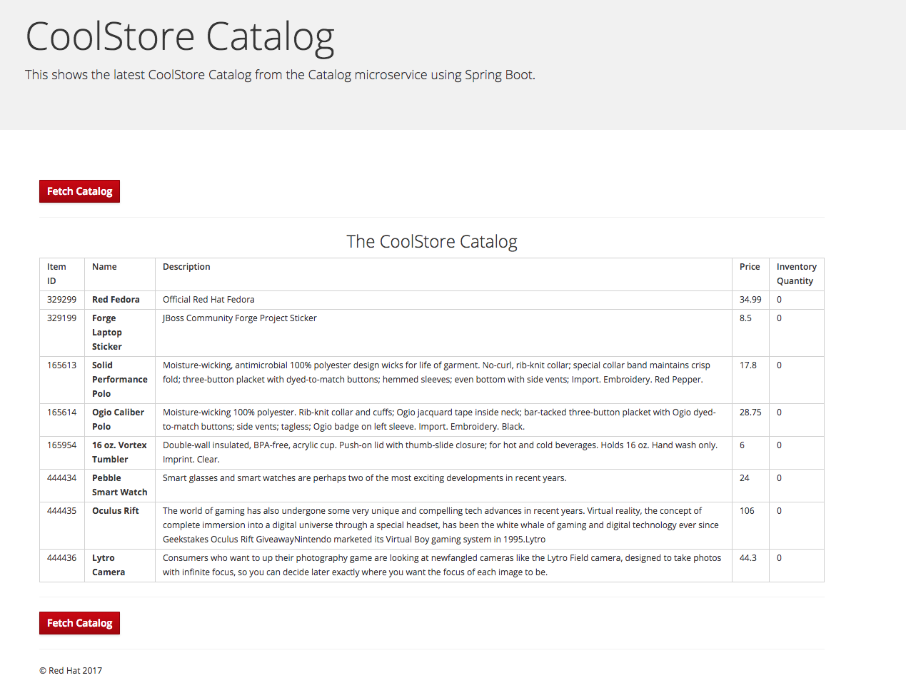

## Congratulations

You have now successfully executed the third step in this scenario. 

Now you've seen how to create REST application in Spring MVC and create a simple application that returns product. 

In the next scenario we will also call another service to enrich the endpoint response with inventory status.

## Before moving on

Be sure to stop the service by clicking on the first Terminal window and typing `CTRL-C` (or
click `clear`### Run it! to do it for you).

## Congratulations!

Next, we'll add a call to the existing Inventory service to enrich the above data with Inventory information. On to the next challenge!


## Get inventory data

So far our application has been kind of straight forward, but our monolith code for the catalog is also returning the inventory status. In the monolith since both the inventory data and catalog data is in the same database we used a OneToOne mapping in JPA like this:

```
@OneToOne(cascade = CascadeType.ALL,fetch=FetchType.EAGER)
@PrimaryKeyJoinColumn
private InventoryEntity inventory;
```
When redesigning our application to Microservices using domain driven design we have identified that Inventory and ProductCatalog are two separate domains. However our current UI expects to retrieve data from both the Catalog Service and Inventory service in a singe request.

**Service interaction**

Our problem is that the user interface requires data from two services when calling the REST service on `/services/products`. There are multiple ways to solve this like:

1. **Client Side integration** - We could extend our UI to first call `/services/products` and then for each product item call `/services/inventory/{prodId}` to get the inventory status and then combine the result in the web browser. This would be the least intrusive method, but it also means that if we have 100 of products the client will make 101 request to the server. If we have a slow internet connection this may cause issues. 
2. **Microservices Gateway** - Creating a gateway in-front of the `Catalog Service` that first calls the Catalog Service and then based on the response calls the inventory is another option. This way we can avoid lots of calls from the client to the server. Apache Camel provides nice capabilities to do this and if you are interested to learn more about this, please checkout the Coolstore Microservices example [here](http://github.com/jbossdemocentral/coolstore-microservice)
3. **Service-to-Service** - Depending on use-case and preferences another solution would be to do service-to-service calls instead. In our case means that the Catalog Service would call the Inventory service using REST to retrieve the inventory status and include that in the response.

There are no right or wrong answers here, but since this is a workshop on application modernization using RHOAR runtimes we will not choose option 1 or 2 here. Instead we are going to use option 3 and extend our Catalog to call the Inventory service. 

## Extending the test

In the [Test-Driven Development](https://en.wikipedia.org/wiki/Test-driven_development) style, let's first extend our test to test the Inventory functionality (which doesn't exist). 

Open ``src/test/java/com/redhat/coolstore/service/CatalogEndpointTest.java`` again.

Now at the markers `//TODO: Add check for Quantity` add the following line:

```java
.returns(9999,Product::getQuantity)
```

And add it to the second test as well:

```java
.returns(9999,Product::getQuantity)
```

Now if we run the test it **should fail**!

``mvn verify``### Run it!

It failed:

```console
Tests run: 4, Failures: 2, Errors: 0, Skipped: 0

[INFO] ------------------------------------------------------------------------
[INFO] BUILD FAILURE
[INFO] ------------------------------------------------------------------------
```

Again the test fails because we are trying to call the Inventory service which is not running. We will soon implement the code to call the inventory service, but first
we need a away to test this service without having to really on the inventory services to be up an running. For that we are going to use an API Simulator
called [HoverFly](http://hoverfly.io) and particular it's capability to simulate remote APIs. HoverFly is very convenient to use with Unit test and all we have to do is
to add a `ClassRule` that will simulate all calls to inventory like this (click to add):

<pre class="file" data-filename="src/test/java/com/redhat/coolstore/service/CatalogEndpointTest.java"
data-target="insert" data-marker="//TODO: Add ClassRule for HoverFly Inventory simulation">
@ClassRule
public static HoverflyRule hoverflyRule = HoverflyRule.inSimulationMode(dsl(
        service("inventory:8080")
//                    .andDelay(2500, TimeUnit.MILLISECONDS).forMethod("GET")
                .get(startsWith("/services/inventory"))
//                    .willReturn(serverError())
                .willReturn(success(json(new Inventory("9999",9999))))

));
```

This `ClassRule` means that if our tests are trying to call our inventory url Howeverfly will intercept this and respond with our hard coded response instead.

**Implementing the Inventory Client**

Since we now have a nice way to test our service-to-service interaction we can now create the client that calls the Inventory. Netflix has provided some nice extensions to the Spring Framework that are mostly captured in the Spring Cloud project, however Spring Cloud is mainly focused on Pivotal Cloud Foundry and because of that Red Hat and others have contributed Spring Cloud Kubernetes to the Spring Cloud project, which enables the same functionallity for Kubernetes based platforms like OpenShift. 

The inventory client will use a Netflix project called Feign, which provides a nice way to avoid having to write boiler plate code. Feign also integrate with Hystrix which gives us capability to Circute Break calls that doesn't work. We will discuss this more later, but let's start with the implementation of the Inventry Client. Using Feign all we have todo is to create a interface that details which parameters and return type we expect, annotate it with @RequestMapping and provide some details and then annotate the interface with @Feign and provide it with a name.

Create the Inventory client by clicking ``src/main/java/com/redhat/coolstore/client/InventoryClient.java``

Add the followng small code snippet to it (click to add):

```java
package com.redhat.coolstore.client;

import com.redhat.coolstore.model.Inventory;
import feign.hystrix.FallbackFactory;
import org.springframework.http.MediaType;
import org.springframework.stereotype.Component;
import org.springframework.cloud.netflix.feign.FeignClient;
import org.springframework.web.bind.annotation.PathVariable;
import org.springframework.web.bind.annotation.RequestMapping;
import org.springframework.web.bind.annotation.RequestMethod;

@FeignClient(name="inventory")
public interface InventoryClient {

    @RequestMapping(method = RequestMethod.GET, value = "/services/inventory/{itemId}", consumes = {MediaType.APPLICATION_JSON_VALUE})
    Inventory getInventoryStatus(@PathVariable("itemId") String itemId);

//TODO: Add Fallback factory here
}
```

There is one more thing that we need to do which is to tell Feign where the inventory service is running. Before that notice that we are setting the `@FeignClient(name="inventory")`.

Open ``src/main/resources/application-default.properties``

And add these properties by clicking **Copy to Editor**:

```java
inventory.ribbon.listOfServers=inventory:8080
feign.hystrix.enabled=true
```
 
By setting inventory.ribbon.listOfServers we are hard coding the actual URL of the service to `inventory:8080`. If we had multiple servers we could also add those using a comma. However using Kubernetes there is no need to have multiple endpoints listed here since Kubernetes has a concept of _Services_ that will internally route between multiple instances of the same service. Later on we will update this value to reflect our URL when deploying to OpenShift.


Now that we have a client we can make use of it in our `CatalogService`

Open ``src/main/java/com/redhat/coolstore/service/CatalogService.java``

And autowire (e.g. inject) the client into it. 

```java
@Autowired
InventoryClient inventoryClient;
```

Next, update the `read(String id)` method at the comment `//TODO: Update the quantity for the product by calling the Inventory service` add the following:

```java
product.setQuantity(inventoryClient.getInventoryStatus(product.getItemId()).getQuantity());
```

Also, don't forget to add the import statement for the new class:

```java
import com.redhat.coolstore.client.InventoryClient;
```

Also in the `readAll()` method replace the comment `//TODO: Update the quantity for the products by calling the Inventory service` with the following:
```java
productList.parallelStream()
            .forEach(p -> {
                p.setQuantity(inventoryClient.getInventoryStatus(p.getItemId()).getQuantity());
            });
```

>**NOTE:** The lambda expression to update the product list uses a `parallelStream`, which means that it will process the inventory calls asynchronously, which will be much faster than using synchronous calls. Optionally when we run the test you can test with both `parallelStream()` and `stream()` just to see the difference in how long the test takes to run.

We are now ready to test the service

``mvn verify``### Run it!

So even if we don't have any inventory service running we can still run our test. However to actually run the service using `mvn spring-boot:run` we need to have an inventory service or the calls to `/services/products/` will fail. We will fix this in the next step

## Congratulations
You now have the framework for retrieving products from the product catalog and enriching the data with inventory data from
an external service. But what if that external inventory service does not respond? That's the topic for the next step.


## Create a fallback for inventory

In the previous step we added a client to call the Inventory service. Services calling services is a common practice in Microservices Architecture, but as we add more and more services the likelihood of a problem increases dramatically. Even if each service has 99.9% update, if we have 100 of services our estimated up time will only be ~90%. We therefor need to plan for failures to happen and our application logic has to consider that dependent services are not responding.

In the previous step we used the Feign client from the Netflix cloud native libraries to avoid having to write
boilerplate code for doing a REST call. However Feign also have another good property which is that we easily create
fallback logic. In this case we will use static inner class since we want the logic for the fallback to be part of the
Client and not in a separate class.

Open: ``src/main/java/com/redhat/coolstore/client/InventoryClient.java``

And paste:

<pre class="file" data-filename="src/main/java/com/redhat/coolstore/client/InventoryClient.java"
data-target="insert" data-marker="//TODO: Add Fallback factory here">
@Component
static class InventoryClientFallbackFactory implements FallbackFactory<InventoryClient> {
    @Override
    public InventoryClient create(Throwable cause) {
        return new InventoryClient() {
            @Override
            public Inventory getInventoryStatus(@PathVariable("itemId") String itemId) {
                return new Inventory(itemId,-1);
            }
        };
    }
}

```

After creating the fallback factory all we have todo is to tell Feign to use that fallback in case of an issue, by adding the fallbackFactory property to the `@FeignClient` annotation. Click **Copy To Editor** to replace
it for you:

<pre class="file" data-filename="src/main/java/com/redhat/coolstore/client/InventoryClient.java"
data-target="insert" data-marker="@FeignClient(name=&quot;inventory&quot;)">
@FeignClient(name="inventory",fallbackFactory = InventoryClient.InventoryClientFallbackFactory.class)
```

**Test the Fallback**

Now let's see if we can test the fallback. Optimally we should create a different test that fails the request and then verify the fallback value, however in because we are limited in time we are just going to change our test so that it returns a server error and then verify that the test fails. 

Open ``src/test/java/com/redhat/coolstore/service/CatalogEndpointTest.java`` and change the following lines:

```
@ClassRule
public static HoverflyRule hoverflyRule = HoverflyRule.inSimulationMode(dsl(
        service("inventory:8080")
//                    .andDelay(2500, TimeUnit.MILLISECONDS).forMethod("GET")
                .get(startsWith("/services/inventory"))
//                    .willReturn(serverError())
                .willReturn(success(json(new Inventory("9999",9999))))

));
```

TO

```
@ClassRule
public static HoverflyRule hoverflyRule = HoverflyRule.inSimulationMode(dsl(
        service("inventory:8080")
//                    .andDelay(2500, TimeUnit.MILLISECONDS).forMethod("GET")
                .get(startsWith("/services/inventory"))
                .willReturn(serverError())
//                    .willReturn(success(json(new Inventory("9999",9999))))

));
```
Notice that the Hoverfly Rule will now return serverError for all request to inventory.

Now if you run ``mvn verify -Dtest=CatalogEndpointTest``### Run it! the test will fail with the following error message:

`Failed tests:   test_retriving_one_proudct(com.redhat.coolstore.service.CatalogEndpointTest): expected:<[9999]> but was:<[-1]>`

So since even if our inventory service fails we are still returning inventory quantity -1. The test fails because we are expecting the quantity to be 9999.

Change back the class rule so that we don't fail the tests like this:
```
@ClassRule
public static HoverflyRule hoverflyRule = HoverflyRule.inSimulationMode(dsl(
        service("inventory:8080")
//                    .andDelay(2500, TimeUnit.MILLISECONDS).forMethod("GET")
                .get(startsWith("/services/inventory"))
//                    .willReturn(serverError())
                .willReturn(success(json(new Inventory("9999",9999))))

));
```

Make sure the test works again by running ``mvn verify -Dtest=CatalogEndpointTest``### Run it!

**Slow running services**
Having fallbacks is good but that also requires that we can correctly detect when a dependent services isn't responding correctly. Besides from not responding a service can also respond slowly causing our services to also respond slow. This can lead to cascading issues that is hard to debug and pinpoint issues with. We should therefore also have sane defaults for our services. You can add defaults by adding it to the configuration.

Open ``src/main/resources/application-default.properties``

```java
hystrix.command.inventory.execution.isolation.thread.timeoutInMilliseconds=500
```

Open ``src/test/java/com/redhat/coolstore/service/CatalogEndpointTest.java`` and un-comment the `.andDelay(2500, TimeUnit.MILLISECONDS).forMethod("GET")`

Now if you run ``mvn verify -Dtest=CatalogEndpointTest``### Run it! the test will fail with the following error message:

`Failed tests:   test_retriving_one_proudct(com.redhat.coolstore.service.CatalogEndpointTest): expected:<[9999]> but was:<[-1]>`

This shows that the timeout works nicely. However, since we want our test to be successful **you should now comment out** `.andDelay(2500, TimeUnit.MILLISECONDS).forMethod("GET")` again and then verify that the test works by executing:

``mvn verify -Dtest=CatalogEndpointTest``### Run it!

## Congratulations
You have now successfully executed the fifth step in this scenario.

In this step you've learned how to add Fallback logic to your class and how to add timeout to service calls. 

In the next step we now test our service locally before we deploy it to OpenShift.


## Test Locally

As you have seen in previous steps, using the Spring Boot maven plugin (predefined in `pom.xml`), you can conveniently run the application locally and test the endpoint.

Execute the following command to run the new service locally:

`mvn spring-boot:run`### Run it!

>**INFO:** As an uber-jar, it could also be run with `java -jar target/catalog-1.0-SNAPSHOT-swarm.jar` but you don't need to do this now

Once the application is done initializing you should see:

```console
INFO  [           main] com.redhat.coolstore.RestApplication     : Started RestApplication ...
```

Running locally using `spring-boot:run` will use an in-memory database with default credentials. In a production application you
will use an external source for credentials using an OpenShift _secret_ in later steps, but for now this will work for development and
testing.

**3. Test the application**

To test the running application, click on the **Local Web Browser** tab in the console frame of this browser window. This will open another tab or window of your browser pointing to port 8081 on your client.


> or use [this](https://$OPENSHIFT_MASTER/) link.

You should now see a html page that looks like this

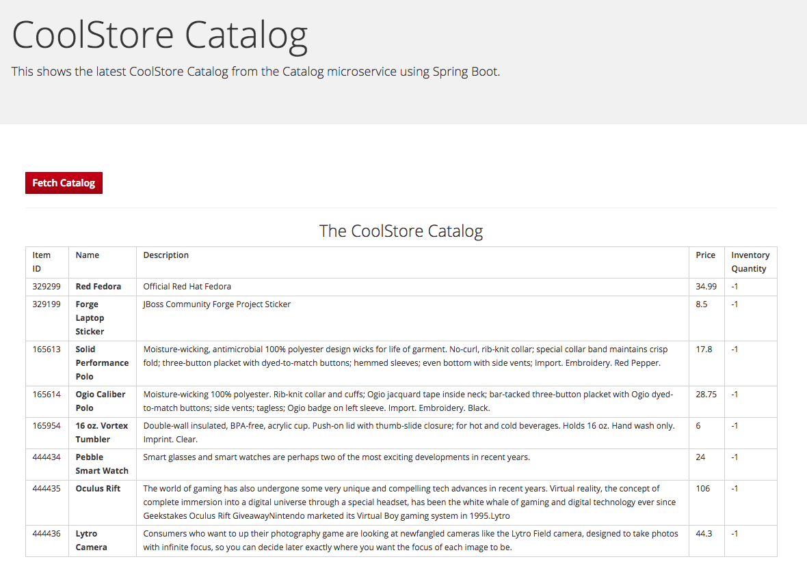

This is a simple webpage that will access the inventory *every 2 seconds* and refresh the table of product inventories.

You can also click the **Fetch Catalog** button to force it to refresh at any time.

To see the raw JSON output using `curl`, you can open an new terminal window by clicking on the plus (+)
icon on the terminal toolbar and then  choose **Open New Terminal**. You can also click on the following
command to automatically open a new terminal and run the test:

`curl http://localhost:8081/services/product/329299 ; echo`### Run it!

You would see a JSON response like this:

```
{"itemId":"329299","name":"Red Fedora","desc":"Official Red Hat Fedora","price":34.99,"quantity":-1}%
```
>**NOTE:** Since we do not have an inventory service running locally the value for the quantity is -1, which matches the fallback value that we have configured. 

The REST API returned a JSON object representing the inventory count for this product. Congratulations!

**4. Stop the application**

Before moving on, click in the first terminal window where the app is running and then press CTRL-C to stop the running application! Or click `clear`### Run it! to do it for you.

## Congratulations

You have now successfully created your the Catalog service using Spring Boot and implemented basic REST
API on top of the product catalog database. You have also learned how to deal with service failures. 

In next steps of this scenario we will deploy our application to OpenShift Container Platform and then start
adding additional features to take care of various aspects of cloud native microservice development.


## Create the OpenShift project

We have already deployed our coolstore monolith and inventory to OpenShift. In this step we will deploy our new Catalog microservice for our CoolStore application,
so let's create a separate project to house it and keep it separate from our monolith and our other microservices.

**1. Create project**

Create a new project for the *catalog* service:

```oc new-project catalog --display-name="CoolStore Catalog Microservice Application"```### Run it!

Next, we'll deploy your new microservice to OpenShift.

## Deploy to OpenShift

Now that you've logged into OpenShift, let's deploy our new catalog microservice:

**Deploy the Database**

Our production catalog microservice will use an external database (PostgreSQL) to house inventory data.
First, deploy a new instance of PostgreSQL by executing:

`oc new-app -e POSTGRESQL_USER=catalog \
             -e POSTGRESQL_PASSWORD=mysecretpassword \
             -e POSTGRESQL_DATABASE=catalog \
             openshift/postgresql:latest \
             --name=catalog-database`### Run it!

> **NOTE:** If you change the username and password you also need to update `src/main/fabric8/credential-secret.yml` which contains
the credentials used when deploying to OpenShift.

This will deploy the database to our new project. Wait for it to complete:

`oc rollout status -w dc/catalog-database`### Run it!

**Update configuration**
Create the file by clicking: `src/main/resources/application-openshift.properties`

Copy the following content to the file:
```java
server.port=8080
spring.datasource.url=jdbc:postgresql://${project.artifactId}-database:5432/catalog
spring.datasource.username=catalog
spring.datasource.password=mysecretpassword
spring.datasource.driver-class-name=org.postgresql.Driver

inventory.ribbon.listOfServers=inventory.inventory.svc.cluster.local:8080
```

>**NOTE:** The `application-openshift.properties` does not have all values of `application-default.properties`, that is because on the values that need to change has to be specified here. Spring will fall back to `application-default.properties` for the other values.


**Build and Deploy**

Build and deploy the project using the following command, which will use the maven plugin to deploy:

`mvn package fabric8:deploy -Popenshift -DskipTests`### Run it!

The build and deploy may take a minute or two. Wait for it to complete. You should see a **BUILD SUCCESS** at the
end of the build output.

After the maven build finishes it will take less than a minute for the application to become available.
To verify that everything is started, run the following command and wait for it complete successfully:

`oc rollout status -w dc/catalog`### Run it!

>**NOTE:** If you recall in the WildFly Swarm lab Fabric8 detected the `health` _fraction_ and generated health check definitions for us, the same is true for Spring Boot if you have the `spring-boot-starter-actuator` dependency in our project.

**3. Access the application running on OpenShift**

This sample project includes a simple UI that allows you to access the Inventory API. This is the same
UI that you previously accessed outside of OpenShift which shows the CoolStore inventory. Click on the
[route URL](http://catalog-catalog.$OPENSHIFT_MASTER)
to access the sample UI.

> You can also access the application through the link on the OpenShift Web Console Overview page.


The UI will refresh the catalog table every 2 seconds, as before.

>**NOTE:** Since we previously have a inventory service running you should now see the actual quantity value and not the fallback value of -1 

## Congratulations!

You have deployed the Catalog service as a microservice which in turn calls into the Inventory service to retrieve inventory data.
However, our monolih UI is still using its own built-in services. Wouldn't it be nice if we could re-wire the monolith to use the
new services, **without changing any code**? That's next!


## Strangling the monolith

So far we haven't started [strangling the monolith](https://www.martinfowler.com/bliki/StranglerApplication.html). To do this
we are going to make use of routing capabilities in OpenShift. Each external request coming into OpenShift (unless using
ingress, which we are not) will pass through a route. In our monolith the web page uses client side REST calls to load
different parts of pages.

For the home page the product list is loaded via a REST call to *http://<monolith-hostname>/services/products*. At the moment
calls to that URL will still hit product catalog in the monolith. By using a
[path based route](https://docs.openshift.com/container-platform/3.7/architecture/networking/routes.html#path-based-routes) in
OpenShift we can route these calls to our newly created catalog services instead and end up with something like:


Flow the steps below to create a path based route.

**1. Obtain hostname of monolith UI from our Dev environment**

`oc get route/www -n coolstore-dev`### Run it!

The output of this command shows us the hostname:

```console
NAME      HOST/PORT                                 PATH      SERVICES    PORT      TERMINATION   WILDCARD
www       www-coolstore-dev.apps.127.0.0.1.nip.io             coolstore   <all>                   None
```

My hostname is `www-coolstore-dev.apps.127.0.0.1.nip.io` but **yours will be different**.

**2. Open the openshift console for [Catalog - Applications - Routes](https://$OPENSHIFT_MASTER/console/project/catalog/browse/routes)**

**3. Click on Create Route, and set**

* **Name**: `catalog-redirect`
* **Hostname**: _the hostname from above_
* **Path**: `/services/products`
* **Service**: `catalog`

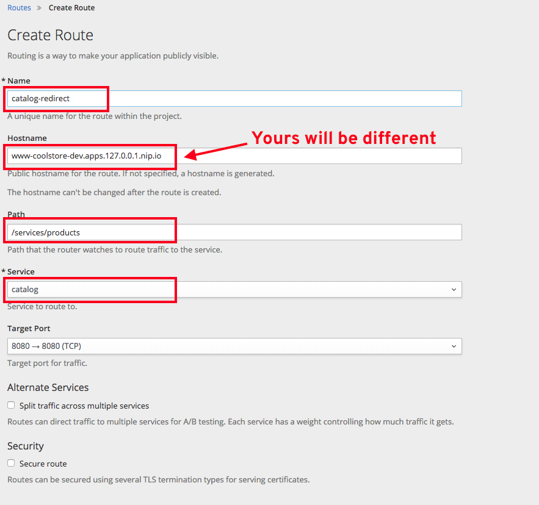

Leave other values set to their defaults, and click **Save**

**4. Test the route**

Test the route by running `curl http://www-coolstore-dev.$OPENSHIFT_MASTER/services/products`### Run it!

You should get a complete set of products, along with their inventory.

**5. Test the UI**

[Open the monolith UI](http://www-coolstore-dev.$OPENSHIFT_MASTER)
and observe that the new catalog is being used along with the monolith:


The screen will look the same, but notice that the earlier product *Atari 2600 Joystick* is now gone,
as it has been removed in our new catalog microservice.

## Congratulations!

You have now successfully begun to _strangle_ the monolith. Part of the monolith's functionality (Inventory and Catalog) are
now implemented as microservices, without touching the monolith. But there's a few more things left to do, which we'll do in the
next steps.


## Summary

In this scenario you learned a bit more about what Spring Boot and how it can be used together with OpenShift and OpenShift
Kubernetes.

You created a new product catalog microservice representing functionality previously implemented in the monolithic
CoolStore application. This new service also communicates with the inventory service to retrieve the inventory status
for each product.


# SCENARIO 6: Building Reactive Microservices

* Purpose: Introduce event based architecture and develop use-cases for reactive microservices
* Difficulty: `advanced`
* Time: `60-70 minutes`

## Intro
In this scenario, you will learn more about Reactive Microservices using [Eclipse Vert.x](https://vertx.io), one of the runtimes included in [Red Hat OpenShift Application Runtimes](https://developers.redhat.com/products/rhoar).

In this scenario you will create three different services that interact using an _EventBus_ which also does a REST call to the CatalogService we built in the previous steps.

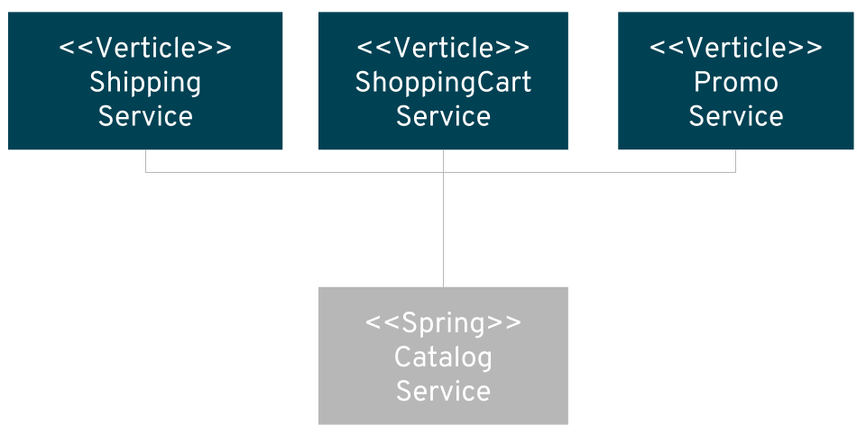

>**NOTE:** To simplify the deployment you will deploy all the services in a single Vert.x Server. However the code is 99% the same if we were to deploy these in separate services.

## What is Reactive?
Reactive is an overloaded term these days. The Oxford dictionary defines reactive as “showing a response to a stimulus.” So, reactive software reacts and adapts its behavior based on the stimuli it receives. However, the responsiveness and adaptability promoted by this definition are challenges when programming because the flow of computation isn’t controlled by the programmer but by the stimuli. In this chapter, we are going to see how Vert.x helps you be reactive by combining:
* **Reactive programming** - A development model focusing on the observation of data streams, reacting on changes, and propagating them
* **Reactive system** - An architecture style used to build responsive and robust distributed systems based on asynchronous message-passing

## Why Reactive Microservices?
In previous scenarios you've seen that building a single microservices is not very hard, but the traditional procedural programming style requires developers to control the flow of calls. Reactive microservices can be implemented more like "black boxes" where each service is only responsible for reacting to different events.

The asynchronous behavior or reactive systems will also save resources. In synchronous programming, all request processing including a call to another service is _blocking_. A _non-reactive_ system typically uses threading to achieve concurrency. In a chain of service calls where service A is calling service B that is calling service C, this means that a thread in service A will block while both B and C are processing. Service B will also block a thread while waiting for service C to return. In a complex Microservices Architecture, any single external request might use hundreds of threads. In a reactive system, network calls are typically asynchronous, meaning that requests sent to other services won't block the main thread, resulting in less resource utilization and better performance.

## What is Eclipse Vert.x?


Eclipse Vert.x is a reactive toolkit for the Java Virtual Machine that is polyglot (e.g., supports multiple programming languages).
In this session, we will focus on Java, but it is possible to build the same application in JavaScript, Groovy, Ruby, Ceylon, Scala, or Kotlin.

Eclipse Vert.x is event-driven and non-blocking, which means that applications in Vert.x can handle a lot of concurrent requests using a small number of kernel threads. 

* Vert.x lets your app scale with minimal hardware.
* Vert.x is incredibly flexible - whether it's network utilities, sophisticated modern web applications, HTTP/REST microservices, high volume event processing or a full-blown back-end message-bus application, Vert.x is a great fit.
* Vert.x is used by many [different companies](http://vertx.io/whos_using/) from real-time gaming to banking and everything in between.
* Vert.x is not a restrictive framework or container and we don't tell you a correct way to write an application. Instead, we give you a lot of useful bricks and let you create your app the way you want to.
* Vert.x is fun - Enjoy being a developer again. Unlike restrictive traditional application containers, Vert.x gives you incredible power and agility to create compelling, scalable, 21st-century applications the way you want to, with a minimum of fuss, in the language you want.
* Vert.x is lightweight - Vert.x core is around 650kB in size.
* Vert.x is fast. Here are some independent [numbers](https://www.techempower.com/benchmarks/#section=data-r8&hw=i7&test=plaintext).
* Vert.x is **not an application server**. There's no monolithic Vert.x instance into which you deploy applications. You just run your apps wherever you want to.
* Vert.x is modular - when you need more bits just add the bits you need and nothing more.
* Vert.x is simple but not simplistic. Vert.x allows you to create powerful apps, simply.
* Vert.x is an ideal choice for creating light-weight, high-performance, microservices.

>**NOTE:** There are not enough time in this workshop to cover all aspects and benefits of Reactive, but you will learn the basics and experience some of the benefits.


## Examine the sample project

The sample project shows the components of a basic Vert.x project laid out in different
subdirectories according to Maven best practices.

**1. Examine the Maven project structure.**

> Click on the `tree` command below to automatically copy it into the terminal and execute it

``tree``### Run it!

```sh
.
+-- pom.xml
\-- src
    \-- main
        +-- fabric8
        +-- java
        |   \-- com
        |       \-- redhat
        |           \-- coolstore
        |               +-- model
        |               |   +-- Product.java
        |               |   +-- ShoppingCart.java
        |               |   +-- ShoppingCartItem.java
        |               |   \-- impl
        |               |       +-- ProductImpl.java
        |               |       +-- ShoppingCartImpl.java
        |               |       \-- ShoppingCartItemImpl.java
        |               \-- utils
        |                   +-- Generator.java
        |                   \-- Transformers.java
        \-- resources
            \-- webroot
                \-- index.html
```

>**NOTE:** To generate a similar project skeleton you can visit the [Vert.x Starter](http://start.vertx.io/) webpage.

If you have used Maven and Java before this should look familiar. This is how a typical Vert.x Java project would looks like. To save time we have provided the domain model, util classes for transforming and generating item, an index.html, and OpenShift configuration.

The domain model consists of a ShoppingCart which has many ShoppingCartItems which has a one-to-one dependency to Product. The domain also consists of Different Promotions that uses the ShoppingCart state to see if it matches the criteria of the promotion.


## Create a web server and a simple rest service

## What is a verticle?

Verticles — the Building Blocks of Eclipse Vert.x

Vert.x gives you a lot of freedom in how you can shape your application and code. But it also provides bricks to start writing reactive applications. _Verticles_ are chunks of code that get deployed and run by Vert.x. An application, such as a microservice, would typically be comprised of many verticles. A verticle typically creates servers or clients, registers a set of Handlers', and encapsulates a part of the business logic of the system.

In Java, a verticle is a class extending the Abstract Verticle class. For example:

```java
public class MyVerticle extends AbstractVerticle {
    @Override
    public void start() throws Exception {
        // Executed when the verticle is deployed
    }

    @Override
    public void stop() throws Exception {
        // Executed when the verticle is un-deployed
    }
}
```

## Creating a simple web server that can serve static content

**1. Creating your first Verticle**

We will start by creating the `CartServiceVerticle` like this.

```java
package com.redhat.coolstore;

import com.redhat.coolstore.model.Product;
import com.redhat.coolstore.model.ShoppingCart;
import com.redhat.coolstore.model.ShoppingCartItem;
import com.redhat.coolstore.model.impl.ShoppingCartImpl;
import com.redhat.coolstore.model.impl.ShoppingCartItemImpl;
import com.redhat.coolstore.utils.Generator;
import com.redhat.coolstore.utils.Transformers;
import io.vertx.core.AbstractVerticle;
import io.vertx.core.AsyncResult;
import io.vertx.core.Future;
import io.vertx.core.Handler;
import io.vertx.core.eventbus.EventBus;
import io.vertx.core.http.HttpHeaders;
import io.vertx.core.json.JsonArray;
import io.vertx.core.json.JsonObject;
import io.vertx.core.logging.Logger;
import io.vertx.core.logging.LoggerFactory;
import io.vertx.ext.web.Router;
import io.vertx.ext.web.RoutingContext;
import io.vertx.ext.web.client.WebClient;
import io.vertx.ext.web.handler.StaticHandler;

import java.util.Map;
import java.util.concurrent.ConcurrentHashMap;

@SuppressWarnings("SameParameterValue")
public class CartServiceVerticle extends AbstractVerticle {

    /**
     * This is the HashMap that holds the shopping cart. This should be replace with a replicated cache like Infinispan etc
     */
    private final static Map<String,ShoppingCart> carts = new ConcurrentHashMap<>();

    private final Logger logger = LoggerFactory.getLogger(CartServiceVerticle.class.getName());

    static {
        carts.put("99999", Generator.generateShoppingCart("99999"));
    }


    @Override
    public void start() {
        logger.info("Starting " + this.getClass().getSimpleName());
        Integer serverPort = config().getInteger("http.port", 10080);
        logger.info("Starting the HTTP Server on port " + serverPort);

        //TODO: Create Router
        //TODO: Create hello router
        //TODO: Create carts router
        //TODO: Create cart router
        //TODO: Create checkout router
        //TODO: Create add router
        //TODO: Create remove router
        //TODO: Create static router

        //TODO: Create HTTP Server
    }

//TODO: Add handler for getting a list of shoppingCarts

//TODO: Add handler for getting a shoppingCart by id

//TODO: Add handler for adding a Item to the cart

//TODO: Add handler for removing an item from the cart

//TODO: Add handler for checking out a shopping cart

//TODO: Add method for getting products

//TODO: Add method for getting the shipping fee

    private void sendCart(ShoppingCart cart, RoutingContext rc) {
        sendCart(cart,rc,200);
    }

    private void sendCart(ShoppingCart cart, RoutingContext rc, int status) {
        rc.response()
            .setStatusCode(status)
            .putHeader(HttpHeaders.CONTENT_TYPE, "application/json")
            .end(Transformers.shoppingCartToJson(cart).encodePrettily());
    }


    private void sendError(RoutingContext rc) {
        sendError("Unknown",rc);
    }

    private void sendError(String reason, RoutingContext rc) {
        logger.error("Error processing " + rc.request().method().name() + " request to " + rc.request().absoluteURI() + " with reason " + reason);
        rc.response().setStatusCode(500).end();
    }

    private static ShoppingCart getCart(String cartId) {
        if(carts.containsKey(cartId)) {
            return carts.get(cartId);
        } else {
            ShoppingCart cart = new ShoppingCartImpl();
            cart.setCartId(cartId);
            carts.put(cartId,cart);
            return cart;
        }

    }
}
```


>**WARNING:** Don't remove the TODO markers. These will be used later to add new functionality. There are also some private method that we we will use later when we create our endpoints for the shopping cart.

Currently our verticle doesn't really do anything except logging some info. Let's try it out. Execute:

``mvn compile vertx:run``### Run it!

You should see output that looks like this:

```sh
[INFO] Launching Vert.x Application
[INFO] jan 12, 2018 11:25:40 FM com.redhat.coolstore.CartServiceVerticle
[INFO] INFO: Starting CartServiceVerticle
[INFO] jan 12, 2018 11:25:40 FM com.redhat.coolstore.CartServiceVerticle
[INFO] INFO: Starting the HTTP Server on port 10080
[INFO] jan 12, 2018 11:25:40 FM io.vertx.core.impl.launcher.commands.VertxIsolatedDeployer
[INFO] INFO: Succeeded in deploying verticle
```

**3. Add a router that can serve static content**
Now let's add a Web server that can server static content, which only requires three lines of code

Create the router object:
```java
Router router = Router.router(vertx);
```

Add the route for static content:
```java
router.get("/*").handler(StaticHandler.create());
```
This configure the router to use the `StaticHandler` (provided by Vert.x) for all GET request.

Create and start the web server listing to the port retrieved from the configuration
```java
vertx.createHttpServer().requestHandler(router::accept).listen(serverPort);
```

Now let's restart the application. Execute:

``mvn compile vertx:run``### Run it!

**3. Test the static router**

Click on the [this](https://$OPENSHIFT_MASTER/) link, which will open another tab or window of your browser pointing to port 10080 on your client.

You should now see an HTML page that looks like this:

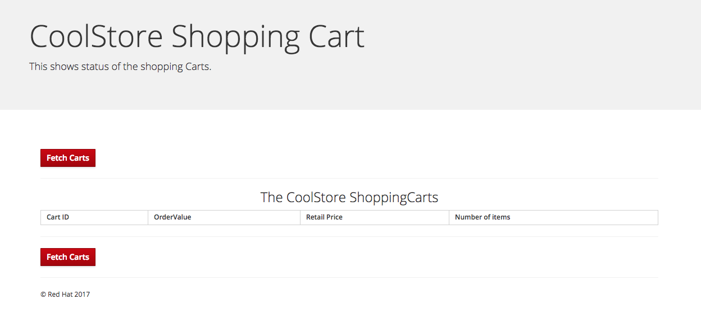

> **NOTE:** The Fetch button doesn't work yet, but we will fix that later in this lab.

**3. Add a simple REST Handler**

Now let's add a simple rest service. 

Create and start the web server listing to the port retrieved from the configuration
```java
router.get("/hello").handler(rc-> rc.response()
            .setStatusCode(200)
            .putHeader(HttpHeaders.CONTENT_TYPE, "application/json")
            .end(new JsonObject().put("message","Hello").encode()));
```

Notice that we add this handler above the static router. This is because the order we add routes does matter and if you added "/hello" after "/*" the hello router would never be used, since the static router is set to take care of all requests. However, since we add the hello router before the static router it will take priority over the static router.

If you've never used Lambda expressions in Java before this might look a bit complex, but it's actually very simple. As we discussed in the intro Vert.x is a Reactive toolkit and the web server is asynchronous and will react to incoming request. In order to register a handler we provide the implementation directly. `rc` is the input parameter of type `RoutingContext` and `->` indicated that the following is a method implementation. We could have wrapped it in `{..}`, but since it's only one line it's not required.

It's actually not necessary to set the status, since it will default to HTTP OK (e.g. 200), but for REST services it's recommended to be explicit since different action may return different status codes. We also set the content type to "application/json" so that the request knows what type of content we are returning. Finally we create a simple `JsonObject` and add a `message` with value `Hello`. The `encode()` method returns a `JsonObject` encoded as a string. E.g `{"message","Hello"}`

**3. Test the REST service**

Restart the application by running the following in the terminal or in clicking the execute button.

``mvn compile vertx:run``### Run it!

After Vert.x is start execute a curl command in another terminal so like this. 

```curl -X GET http://localhost:10080/hello; echo```### Run it!

The response body should be a JSON string `{"message":"Hello"}`.

## Congratulations

You have now successfully created a simple reactive rest service using Eclipse Vert.x.

It only took three lines of code to create an HTTP server that is capable of serving static content using the Vert.x Toolkit and a few lines to add a rest endpoint.

In next step of this scenario, we will discuss a bit a about configuration in Vert.x.

## Setup environment specific configuration

## Reactive programing
In the previous step you did a bit of reactive programming, but Vert.x also support using RxJava. RxJava is a Java VM implementation of [ReactiveX (Reactive Extensions)](http://reactivex.io/) a library for composing asynchronous and event-based programs by using observable sequences.

With the introduction of Lambda in Java8 there we don't have to use RxJava for programming in Vert.x, but depending on your preference and experience you might want to use RxJava instead. Everything we do in this lab is possible to also implement using RxJava. However for simplicity and since RxJava is harder to understand for someone that never used it before we will stick with Java8 and Lambda in this lab.

## 1. Configuration and Vert.x
Vert.x has a very powerful configuration library called [Vert.x Config](http://vertx.io/docs/vertx-config/java/). The Config library can read configuration as Properties, Json, YaML, etc and it support a number stores like files, directories, http, git (extension), redis (extension), system properties, environment properties. 

The Config library is structured around:

* A **Config Retriever** instantiated and used by the Vert.x application. It configures a set of configuration items in the Configuration Store.

* **Configuration store** defines a location from where the configuration data is read and and a syntax (the configuration is retrieved as a JSON Object by default)

By default you can access the configuration in verticle by calling `config().get...`, however it does not support environment-specific configuration like for example Spring Boot. If you recall from the previous lab we used different configuration files for local vs OpenShift. If we like the same behavior in Vert.x we need to implement this ourselves.

One thing that can seem a bit strange is that the **Config Retriever** reads the configuration asynchronously. So if we want to change the default behaviour we need to take that into consideration.

Consider the following example.

```java
private void setupConfiguration(Vertx vertx) {
    ConfigStoreOptions defaultFileStore = new ConfigStoreOptions()
        .setType("file")
        .setConfig(new JsonObject().put("path", "config-default.json"));
    ConfigRetrieverOptions options = new ConfigRetrieverOptions();
    options.addStore(defaultFileStore);
    String profilesStr = System.getProperty("vertx.profiles.active");
    if(profilesStr!=null && profilesStr.length()>0) {
        Arrays.stream(profilesStr.split(",")).forEach(s -> options.addStore(new ConfigStoreOptions()
        .setType("file")
        .setConfig(new JsonObject().put("path", "config-" + s + ".json"))));
    }
    ConfigRetriever retriever = ConfigRetriever.create(vertx, options);

    retriever.getConfig((AsyncResult<JsonObject> ar) -> {
        if (ar.succeeded()) {
            JsonObject result = ar.result();
            result.fieldNames().forEach(s -> config().put(s, result.getValue(s)));
    });
}
```

Then in our start method of our Verticle we could run

```java
public void start() {
    setupConfiguration(vertx);
    Integer serverPort = config().getInteger("http.port", 10080);
    Router router = Router.router(vertx);
    router.get("/*").handler(StaticHandler.create());
    vertx.createHttpServer().requestHandler(router::accept).listen(serverPort);
}
```

At a first glance this may look like a good way to implement an environment specific configuration. Basically it will use a default config call `config-default.json` and if we start he application with parameter `-Dvertx.profiles.active=[name]` it will overload the default config with values from `config-[name].json`.

**THIS WILL NOT WORK!**

The reason that it doesn't work is that when we calling `setupConfiguration()` the `ConfigStore` will execute synchronously, but the actual retrieval of the configuration values is asynchronous and while the program is waiting for async operation like opening a file and read it the `start()` method will continue to run and when it gets to `Integer serverPort = config().getInteger("http.port", 8889);` the value has not been populated yet. E.g. the config `http.port` will fail and the default value of `8889` will always be used.

**1. Load configuration and other Verticles**

One solution to this problem is to load our Verticle from another verticle and pass the configuration as a deployment option.

Let's add a `MainVerticle` that will load the `CartServiceVerticle` like this:

```java
package com.redhat.coolstore;

import io.vertx.config.ConfigRetriever;
import io.vertx.config.ConfigRetrieverOptions;
import io.vertx.config.ConfigStoreOptions;
import io.vertx.core.*;
import io.vertx.core.json.JsonObject;

import java.util.Arrays;
import java.util.concurrent.ArrayBlockingQueue;
import java.util.concurrent.BlockingQueue;

public class MainVerticle extends AbstractVerticle {

    @Override
    public void start() {
        ConfigRetriever.getConfigAsFuture(getRetriever())
            .setHandler(config ->  {
                vertx.deployVerticle(
                    CartServiceVerticle.class.getName(),
                    new DeploymentOptions().setConfig(config.result())
                );
                // TODO: Deploy PromoServiceVerticle
                // TODO: Deploy ShippingServiceVerticle
            });
    }

    private ConfigRetriever getRetriever() {
        ConfigStoreOptions defaultFileStore = new ConfigStoreOptions()
            .setType("file")
            .setConfig(new JsonObject().put("path", "config-default.json"));
        ConfigRetrieverOptions configStoreOptions = new ConfigRetrieverOptions();
        configStoreOptions.addStore(defaultFileStore);
        String profilesStr = System.getProperty("vertx.profiles.active");
        if(profilesStr!=null && profilesStr.length()>0) {
            Arrays.stream(profilesStr.split(",")).forEach(s -> configStoreOptions.addStore(new ConfigStoreOptions()
                .setType("file")
                .setConfig(new JsonObject().put("path", "config-" + s + ".json"))));
        }
        return ConfigRetriever.create(vertx, configStoreOptions);
    }
}
```

>**NOTE:** The MainVerticle deploys the `CartServiceVerticle` in a handler that will be called after the retriever has read the configuration. It then passes the new configuration as `DeploymentOptions` to the CartService. Later on we will use this to deploy other Verticles.

**2. Create the configuration file**
At the moment we only need one value in the configuration file, but we will add more later.

Copy this into the configuration file (or click the button):

```java
{
    "http.port" : 8082
}
```

Finally we need to tell the `vertx-maven-plugin` to use the MainVerticle instead of the CartServiceVerticle. In the ```pom.xml``` under `project->properties` there is a tag called `<vertx.verticle>` that currently specifies the full path to the `CartServiceVerticle`.

First open the ```pom.xml```

Then Change the `<vertx.verticle>com.redhat.coolstore.CartServiceVerticle</vertx.verticle>` to `<vertx.verticle>com.redhat.coolstore.MainVerticle</vertx.verticle>`

```java
com.redhat.coolstore.MainVerticle
```


**3. Test the default configuration**

Restart the application by running the following in the terminal or in clicking the execute button.

``mvn compile vertx:run``### Run it!

In the output you should now see that the server is starting on port 8082 and not 10080 like before.

Click on the **Local Web Browser** tab in the console frame of this browser window, which will open another tab or window of your browser pointing to port 8082 on your client. 


Or use [this](https://$OPENSHIFT_MASTER/) link.

Again you should now see an HTML page that looks like this:


## Congratulations

You have now successfully implemented environment specific configuration. Please note that future version of Eclipse Vert.x will probably include a better way to solve this, but this should have helped you understand a bit of how programming in a reactive world is different then for example Java EE or Spring (Spring 5 now includes some reactive extensions as well).

In next step of this scenario, we will start implementing our rest endpoints.


## Create a REST endpoints for /services/carts

So now that you have learned how to create a rest service and also how to implement environmental specific configuration let's start building our rest endpoints. But before that lets discuss the `Router`, which is part of Vert.x Web.

The `Router` in Vert.x is very flexible and makes it easy to deal with complex HTTP routing. Some of the key features of Vert.x-Web include:
* Routing (based on method, path, etc)
* Regular expression pattern matchingfor paths
* Extraction of parameters from paths
* Content negotiation
* Request body handling
* Body size limits
* ... and [much more](http://vertx.io/docs/vertx-web/js/)

In our example we will only use basic GET, POST and DELETE routing. Let's get started with the GET operations.

**1. Creating a GET /services/cart endpoint**
First we are going to create a very simple endpoint that returns a `ShopppingCart` object as a JSON String using the ```src/main/java/com/redhat/coolstore/utils/Transformers.java```{open} to get a `JsonObject` that we can then return as String

```java
private void getCart(RoutingContext rc) {
    logger.info("Retrieved " + rc.request().method().name() + " request to " + rc.request().absoluteURI());
    String cartId = rc.pathParam("cartId");
    ShoppingCart cart = getCart(cartId);
    sendCart(cart,rc);
}
```


**2. Creating a GET /services/carts endpoint that returns all carts**

Now let's create a bit more complex implementation that returns many `ShoppingCarts` as a JSON array.

```java
private void getCarts(RoutingContext rc) {
    logger.info("Retrieved " + rc.request().method().name() + " request to " + rc.request().absoluteURI());
    JsonArray cartList = new JsonArray();
    carts.keySet().forEach(cartId -> cartList.add(Transformers.shoppingCartToJson(carts.get(cartId))));
    rc.response()
        .setStatusCode(200)
        .putHeader(HttpHeaders.CONTENT_TYPE, "application/json")
        .end(cartList.encodePrettily());
}
```

The most important line in this method is this:
```java
carts.keySet().forEach(cartId ->; cartList.add(Transformers.shoppingCartToJson(carts.get(cartId))));
``` 

In this lambda expression we are iterating through the list of shopping carts and transforming them to JsonObject using the ```src/main/java/com/redhat/coolstore/utils/Transformers.java``` to get a `JsonObject` that we add to a `JsonArray`. We can then return a String encoding of that JsonArray to the response.

**3. Add a routes**

Add the first route by adding the following at `//TODO: Create cart router` marker (or click the button)
```java
router.get("/services/cart/:cartId").handler(this::getCart);
```

Add the second route by adding the following at //TODO: Create carts router marker (or click the button)
```java
router.get("/services/carts").handler(this::getCarts);
```

The `this::getCarts` is a lambda reference to the `getCarts(RoutingContext)`. Another way to write this would be like this

```java
router.get("/services/carts").handler(rc -> {
  this.getCarts(rc);
});
```

**4. Test the new Route**

Restart the application by running the following in the terminal or in clicking the execute button.

``mvn compile vertx:run``### Run it!

Now test the route with a curl command in the terminal like this:

```curl -X GET http://localhost:8082/services/carts; echo```### Run it!

This should print the body of the response  that looks somewhat like this. Note that the the content from this is generate from the ```src/main/java/com/redhat/coolstore/utils/Transformers.java``` and will return a random number of products, so you actual content may vary.


```json
[ {
  "cartId" : "99999",
  "cartTotal" : 632.36,
  "retailPrice" : 582.97,
  "cartItemPromoSavings" : 0.0,
  "shippingTotal" : 90.28,
  "shippingPromoSavings" : 40.89,
  "shoppingCartItemList" : [ {
    "product" : {
      "itemId" : "329299",
      "price" : 162.49,
      "name" : "Red Fedora",
      "desc" : null,
      "location" : null,
      "link" : null
    },
    "quantity" : 1
  } ]
} ]
```

Also test getting a single cart curl like this:
```curl -X GET http://localhost:8082/services/cart/99999; echo```### Run it!

Click on the **Local Web Browser** tab in the console frame of this browser window, which will open another tab or window of your browser pointing to port 8082 on your client. 


Or use [this](https://$OPENSHIFT_MASTER/) link.

Now the default page should have an entry in the table matching the values for your JSON file above.


## Congratulations

You have now successfully implemented the first out of many endpoints that we need to continue to strangle the monolith. You have also learned that `<object>::<method>` is a convenient way to reference a lambda expression.

In the next step we will implement another endpoint and this time it will also call out to an external service using rest.

## Create a REST endpoints for /services/cart

In this step we will implement POST operation for adding a product. The UI in Coolstore Monolith uses a POST operation when a user clicks `Add to Cart`.


The UI will then issue a POST request to `/services/cart/<cartId>/<prodId>/<quantity>`. However when adding a product to the ShoppingCartItem we need an actual `Product` object.


So our implementation of this service needs to retrieve a Product object from the `CatalogService`. Let's get started with this implementation.

**1. Add route**

Let's start by adding a router, by adding the following where at the `//TODO: Create add router` marker in class `CartServiceVerticle` 

```java
router.post("/services/cart/:cartId/:itemId/:quantity").handler(this::addToCart);
```

**2. Create handler for our route**

Our newly create route needs a handler. This method should look like this `void addCart(RoutingContext rc)`. The handler should add a product to the shopping cart, but it also have to consider that there might already be product with the same id in the shopping cart already.

Adding the following at the `//TODO: Add handler for adding a Item to the cart` marker in class `CartServiceVerticle`

```java
private void addToCart(RoutingContext rc) {
    logger.info("Retrieved " + rc.request().method().name() + " request to " + rc.request().absoluteURI());

    String cartId = rc.pathParam("cartId");
    String itemId = rc.pathParam("itemId");
    int quantity = Integer.parseInt(rc.pathParam("quantity"));

    ShoppingCart cart = getCart(cartId);

    boolean productAlreadyInCart = cart.getShoppingCartItemList().stream()
        .anyMatch(i -> i.getProduct().getItemId().equals(itemId));

    if(productAlreadyInCart) {
        cart.getShoppingCartItemList().forEach(item -> {
            if (item.getProduct().getItemId().equals(itemId)) {
                item.setQuantity(item.getQuantity() + quantity);
                sendCart(cart,rc); //TODO: update the shipping fee
            }
        });
    } else {
        ShoppingCartItem newItem = new ShoppingCartItemImpl();
        newItem.setQuantity(quantity);
//TODO: Get product from Catalog service and add it to the ShoppingCartItem
    }
}
```

We are not completely done with the addToCart method yet. We have a TODO for Getting a product from the `CatalogService`. Since we do not want to block the thread while waiting for the `CatalogService` to respond this should be a async operation. 

**3. Create a Async method for retrieving a Product**

Normally in Java you would probably implement this method as `Product getProduct(String prodId)`. However we need this operation to be Async. One way to do this is pass a `Handler<AsyncResult<T>>` as an argument. `T` would be replaced with return type we want, which in our case is `Product`.

For making calls to external HTTP services Vert.x supplies a WebClient. The `WebClient` methods like `get()`, `post()` etc and is very easy to use. In our case we are going to use get and pass in port, hostname and uri. We are also going to set a timeout for the operation. So let's first add those to our configuration. 

Copy this into the configuration file (or click the button):

```java
{
    "http.port" : 8082,
    "catalog.service.port" : 8081,
    "catalog.service.hostname" : "localhost",
    "catalog.service.timeout" : 3000
}
```

We are now ready to create our `getProduct` method

Adding the following at the `//TODO: Add method for getting products` marker in class `CartServiceVerticle`

```java
private void getProduct(String itemId, Handler<AsyncResult<Product>> resultHandler) {
    WebClient client = WebClient.create(vertx);
    Integer port = config().getInteger("catalog.service.port", 8080);
    String hostname = config().getString("catalog.service.hostname", "localhost");
    Integer timeout = config().getInteger("catalog.service.timeout", 0);
    client.get(port, hostname,"/services/product/"+itemId)
        .timeout(timeout)
        .send(handler -> {
            if(handler.succeeded()) {
                Product product = Transformers.jsonToProduct(handler.result().body().toJsonObject());
                resultHandler.handle(Future.succeededFuture(product));
            } else {
                resultHandler.handle(Future.failedFuture(handler.cause()));
            }


        });
}
```

Now we can call this method from the `addToCart` method and pass a Lambda call back. 

Adding the following at the `//TODO: Get product from Catalog service and add it to the ShoppingCartItem`

```java
this.getProduct(itemId, reply -> {
    if (reply.succeeded()) {
        newItem.setProduct(reply.result());
        cart.addShoppingCartItem(newItem);
        sendCart(cart,rc); //TODO: update the shipping fee, here as well
    } else {
        sendError(rc);
    }
});
```

To summarize our `addToCart` handler will now first check if the product already exists in the shopping cart. If it does exist we update the quantity and then send the response. If it doesn't exist we call the catalog service to retrieve the data about the product, create a new ShoppingCartItem, set the quantity, add the retrieved product, add it the `ShoppingCartItem`, add the item to the shopping cart and then finally send the response to the client. 

Phew! That wasn't easy... However, in real life thing are never as easy as they sometimes seem to appear. Rather than present you with a set of Hello World demos we believe that it's much more educational to use a more realistic example.


**4. Test our changes**

Let's first test to update the quantity for a product that is already in the shopping cart

Start the cart service
``mvn compile vertx:run``### Run it!

Then execute this to test retrieving a specific cart and the quantity of item `329299` in the cart:

```curl -s http://localhost:8082/services/cart/99999 | grep -A7  "\"itemId\" : \"329299\"" | grep quantity```### Run it!

This will return the quantity like below, but the actual number may be different.

`"quantity" : 3`

Now let's call our addToCart method.

```curl -s -X POST http://localhost:8082/services/cart/99999/329299/1 | grep -A7  "\"itemId\" : \"329299\"" | grep quantity```### Run it!
This should now return a shopping cart where one more instance of the product is added, because of our grep commands you would see something like this:

`"quantity" : 4`

Now let's try adding a new product.

The CartService depends on the CatalogService and just like in the Spring Boot example we could have created mocks for calling the Catalog Service, however since our example is already complex, we will simply test it with the CatalogService running. 

>**NOTE:** The CatalogService in it's turn depends on the InventoryService to retrieve the quantity in stock, however since we don't really care about that in the Shopping Cart we will just rely on the Fallback method of CatalogService when testing. 

First lets check if the catalog service is still running locally.

```curl -v http://localhost:8081/services/products 2>&1 | grep "HTTP/1.1 200"```### Run it!

If that prints `< HTTP/1.1 200` then our service is responding correctly otherwise we need to start the Catalog application in a separate terminal like this:

```cd ~/projects/catalog; mvn clean spring-boot:run -DskipTests```### Run it!

Wait for it to complete. You should see `Started RestApplication in xxxxx seconds`.

To test to add a product we are going to use a new shopping cart id. Execute:

```curl -s -X POST http://localhost:8082/services/cart/88888/329299/1 ; echo```### Run it!

This should print the follow:

```
{
  "cartId" : "88888",
  "cartTotal" : 34.99,
  "retailPrice" : 34.99,
  "cartItemPromoSavings" : 0.0,
  "shippingTotal" : 0.0,
  "shippingPromoSavings" : 0.0,
  "shoppingCartItemList" : [ {
    "product" : {
      "itemId" : "329299",
      "price" : 34.99,
      "name" : "Red Fedora",
      "desc" : "Official Red Hat Fedora",
      "location" : null,
      "link" : null
    },
    "quantity" : 1
  } ]
}
```

**5. Add endpoint for deleting items**
Since we are now so skilled in writing endpoints lets go ahead and also create the endpoint for removing a product. The only tricky part about removing is that the request might not remove all products in once. E.g. If we have 10 Red Hat Fedoras and the request just decreases 3 we should not remove the Shopping Cart item, but instead lower the quantity to 7. 


Adding the following at the `//TODO: Add handler for removing an item from the cart`

```java
private void removeShoppingCartItem(RoutingContext rc) {
    logger.info("Retrieved " + rc.request().method().name() + " request to " + rc.request().absoluteURI());
    String cartId = rc.pathParam("cartId");
    String itemId = rc.pathParam("itemId");
    int quantity = Integer.parseInt(rc.pathParam("quantity"));
    ShoppingCart cart = getCart(cartId);

    //If all quantity with the same Id should be removed then remove it from the list completely. The is the normal use-case
    cart.getShoppingCartItemList().removeIf(i -> i.getProduct().getItemId().equals(itemId) && i.getQuantity()<=quantity);

    //If not all quantities should be removed we need to update the list
    cart.getShoppingCartItemList().forEach(i ->  {
            if(i.getProduct().getItemId().equals(itemId))
                i.setQuantity(i.getQuantity()-quantity);
        }
    );
    sendCart(cart,rc);
}
```

Now let's go ahead and create the route.

Add the following where at the `//TODO: Create remove router` marker in class `CartServiceVerticle.start` 
```java
router.delete("/services/cart/:cartId/:itemId/:quantity").handler(this::removeShoppingCartItem);
```

**6. Test to remove a product**

Let's first test to decreasing the quantity for a product that is already in the shopping cart

Start the cart service
``mvn compile vertx:run``### Run it!

The run this to get the quantity of item `329299` in the cart:

```curl -s http://localhost:8082/services/cart/99999 | grep -A7  "\"itemId\" : \"329299\"" | grep quantity```### Run it!

This will return the quantity like below, but the actual number may be different.

`"quantity" : 4`

Now let's call our removeShoppingCartItem method.

```curl -s -X DELETE http://localhost:8082/services/cart/99999/329299/1 | grep -A7  "\"itemId\" : \"329299\"" | grep quantity```### Run it!

If this results in an empty cart (quantity =0 ) this command will not return any output.

If you have more than one items remaining in the cart, this will return a shopping cart where one more instance of the product is removed,
because of our grep commands you would see something like this.

`"quantity" : 3`


## Congratulations

Wow! You have now successfully created a Reactive microservices that are calling another REST service asynchronously. 

However, looking at the output you can see that the discount and shippingFee is `0.0`, which also means that the orderValue (price after shipping and discount) and retailPrice (sum of all products prices) are equal. That is because we haven't implemented the Shipping and Promotional Services yet. That's what we are going to do in the next scenario.


## Create a REST endpoints for /services/cart

In the previous steps we have added more and more functionality to the cart service and when we define our microservices it's often done using a domain model approach. The cart service is central, but we probably do not want it to handle things like calculating shipping fees. In our example we do not have enough data to do a complex shipping service since we lack information about the users shipping address as well as weight of the products etc. It does however make sense to create the shipping service so that if when we have that information we can extend upon it.

Since we are going to implement the Shipping service as another Vert.x Verticle we will not use REST this time. Instead we are going to use the Vert.x Event bus.

## The Event bus in Vert.x
The event bus is the nervous system of Vert.x.

The event bus allows different parts of your application to communicate with each other irrespective of what language they are written in, and whether they’re in the same Vert.x instance, or in a different Vert.x instance.

It can even be bridged to allow client side JavaScript running in a browser to communicate on the same event bus.

The event bus forms a distributed peer-to-peer messaging system spanning multiple server nodes and multiple browsers.

The event bus supports publish/subscribe, point to point, and request-response messaging.

The event bus API is very simple. It basically involves registering handlers, unregistering handlers and sending and publishing messages.

Internally the EventBus is an abstraction and Vert.x have several different implementations that can be used depending on demands. Default it uses a local java implementation that can't be shared between different java processes. However, for clustered solutions the event bus can use an distributed in-memory data store like Infinispan (also know as Red Hat JBoss Data Grid) or Hazelcast. There are also work in progress to be able to use a JMS implementation like Apache ActiveMQ (also known as Red Hat AMQ) 

>**NOTE:** In the near future RHOAR is planned to offer support for Red Hat JBoss Data Grid for clustering use-cases of Vert.x

## The Event bus API

Let's first discuss some Theory:

**Addressing**
Messages are sent on the event bus to an address.

Vert.x doesn’t bother with any fancy addressing schemes. In Vert.x an address is simply a string. Any string is valid. However it is wise to use some kind of scheme, e.g. using periods to demarcate a namespace.

Some examples of valid addresses are europe.news.feed1, acme.games.pacman, sausages, and X.

**Handlers**
Messages are received in handlers. You register a handler at an address.

Many different handlers can be registered at the same address.

A single handler can be registered at many different addresses.

**Publish / subscribe messaging**
The event bus supports publishing messages.

Messages are published to an address. Publishing means delivering the message to all handlers that are registered at that address.

This is the familiar publish/subscribe messaging pattern.

Point to point and Request-Response messaging
The event bus also supports point to point messaging.

Messages are sent to an address. Vert.x will then route it to just one of the handlers registered at that address.

If there is more than one handler registered at the address, one will be chosen using a non-strict round-robin algorithm.

With point to point messaging, an optional reply handler can be specified when sending the message.

When a message is received by a recipient, and has been handled, the recipient can optionally decide to reply to the message. If they do so the reply handler will be called.

When the reply is received back at the sender, it too can be replied to. This can be repeated ad-infinitum, and allows a dialog to be set-up between two different verticles.

This is a common messaging pattern called the request-response pattern. 

Let’s jump into the API

Getting the event bus
You get a reference to the event bus as follows:

```java
EventBus eb = vertx.eventBus();
```

There is a single instance of the event bus per Vert.x instance.

**Registering Handlers**
This simplest way to register a handler is using consumer. Here’s an example:

```java
EventBus eb = vertx.eventBus();

eb.consumer("news.uk.sport", message -> {
  System.out.println("I have received a message: " + message.body());
});
```

**Publishing messages**
Publishing a message is simple. Just use publish specifying the address to publish it to.

```java
eventBus.publish("news.uk.sport", "Yay! Someone kicked a ball");
```

**The Message object**
The object you receive in a message handler is a `Message`.

The body of the message corresponds to the object that was sent or published. The object has to be serializable, but it's recommended to use JSON encoded String as objects.

The headers of the message are available with headers.


**1. Add a Shipping Verticle**
Since RHOAR currently do not support using distributed event bus we will create the Verticle locally. For now our shipping service will only return a fixed ShippingFee of 37.0. RHOAR is planned to support distributes event bus early 2018. Since the Event Bus API is the same very little code changes (if any) will be required to move this to a separate service in OpenShift in the future.

```java
package com.redhat.coolstore;

import io.vertx.core.AbstractVerticle;
import io.vertx.core.eventbus.EventBus;
import io.vertx.core.eventbus.MessageConsumer;
import io.vertx.core.json.JsonObject;
import io.vertx.core.logging.Logger;
import io.vertx.core.logging.LoggerFactory;

public class ShippingServiceVerticle extends AbstractVerticle {
    private final Logger logger = LoggerFactory.getLogger(ShippingServiceVerticle.class.getName());

    @Override
    public void start() {
        logger.info("Starting " + this.getClass().getSimpleName());
        EventBus eb = vertx.eventBus();
        MessageConsumer<String> consumer = eb.consumer("shipping");
        consumer.handler(message -> {
            logger.info("Shipping Service recieved a message");
            message.reply(new JsonObject().put("shippingFee", 37.0)); //Hardcoded shipping Fee
        });
    }
}
```

We also need to start the Verticle by deploying it form the MainVerticle

```java
vertx.deployVerticle(
                    ShippingServiceVerticle.class.getName(),
                    new DeploymentOptions().setConfig(config.result())
                );
```

Done! That was easy. :-) We still have to update the shopping cart to use the Shipping service. Let's do that next.

**2. Update the Shopping cart to call the Shipping Service**
In the future we might want to base the shipping service on the actual content of the Shopping cart so it stands to reason that we call the shipping service every time someone updates the cart. In the training however we will only call the Shopping cart when someone adds a product to it. 

We will implement the shipping fee similary to how we implemented the `getProduct` that called out to the Catalog service. 

In the ``src/main/java/com/redhat/coolstore/CartServiceVerticle.java`` we will add the following method at the marker: `//TODO: Add method for getting the shipping fee`. Copy the content below or click on the CopyToEditor button.

```java
private void getShippingFee(ShoppingCart cart, Handler<AsyncResult<Double>> resultHandler) {
    EventBus eb = vertx.eventBus();

    eb.send("shipping",
        Transformers.shoppingCartToJson(cart).encode(),
        reply -> {
            if(reply.succeeded()) {
                resultHandler.handle(Future.succeededFuture(((JsonObject)reply.result().body()).getDouble("shippingFee")));

            } else {
                resultHandler.handle(Future.failedFuture(reply.cause()));
            }
        }
    );
}
```

Now, lets update the `addProduct` request handler method. Click to add:

```java
this.getShippingFee(cart, message -> {
    if(message.succeeded()) {
        cart.setShippingTotal(message.result());
        sendCart(cart,rc);
    } else {
        sendError(rc);
    }

});
```

Since we have the special case of product already exists we need to update it twice.  Click to add:

```java
this.getShippingFee(cart, message -> {
    if(message.succeeded()) {
        cart.setShippingTotal(message.result());
        sendCart(cart,rc);
    } else {
        sendError(rc);
    }

});
```

**3. Test our changes**

So now when we add something to the shopping cart it should also update the shipping fee and set it to 37.0

Firstly, build and start the cart service
``mvn compile vertx:run``### Run it!

Now issue a curl command to add a product that exists

```curl -s -X POST http://localhost:8082/services/cart/99999/329299/1 | grep -A7  "\"itemId\" : \"329299\"" | grep quantity```### Run it!

Let's also make sure that it works with a totally new shopping cart, which would test the second part of our changes:

```curl -s -X POST http://localhost:8082/services/cart/88888/329299/1 | grep -A7  "\"itemId\" : \"329299\"" | grep quantity```### Run it!

This should now return a new shopping cart where one only instance of the product is added, because of our grep commands you would see something like this:

`"quantity" : 1`

The CartService depends on the CatalogService and just like in the Spring Boot example we could have created mocks for calling the Catalog Service, however since our example is already complex, we will simply test it with the CatalogService running. 

## Summary

## Create a REST endpoints for /services/cart

**Red Hat OpenShift Container Platform** is the preferred runtime for cloud native application development
using **Red Hat OpenShift Application Runtimes**
like **Spring Boot**. OpenShift Container Platform is based on **Kubernetes** which is the most used Orchestration
for containers running in production. **OpenShift** is currently the only container platform based on Kubernetes
that offers multi-tenancy. This means that developers can have their own personal isolated projects to test and
verify applications before committing them to a shared code repository.

We have already deployed our coolstore monolith, inventory and catalog to OpenShift. In this step we will deploy our new Shopping Cart microservice for our CoolStore application,
so let's create a separate project to house it and keep it separate from our monolith and our other microservices.

**1. Create project**

Create a new project for the *cart* service:

```oc new-project cart --display-name="CoolStore Shopping Cart Microservice Application"```### Run it!

**3. Open the OpenShift Web Console**

You should be familiar with the OpenShift Web Console by now!
Click on the "OpenShift Console" tab:


And navigate to the new _catalog_ project overview page (or use [this quick link](https://$OPENSHIFT_MASTER/console/project/cart/)

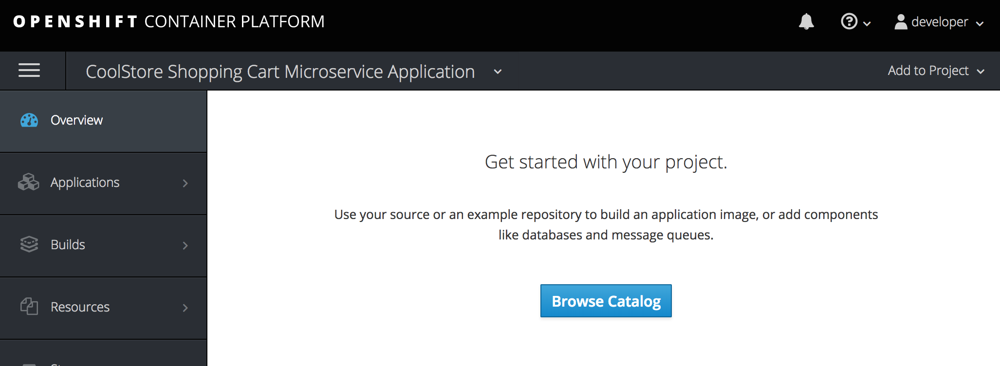

There's nothing there now, but that's about to change.


## Create a REST endpoints for /services/cart

Now that you've logged into OpenShift, let's deploy our new cart microservice:


**Update configuration**
Create the file by clicking on open ``src/main/resources/config-openshift.json``

Copy the following content to the file:

```java
{
    "http.port" : 8080,
    "catalog.service.port" : 8080,
    "catalog.service.hostname" : "catalog.catalog.svc.cluster.local"
}
```

>**NOTE:** The `config-openshift.json` does not have all values of `config-default.json`, that is because on the values that need to change has to be specified here. Our solution will fallback to the default configuration for values that aren't configured in the environment specific config.


**Build and Deploy**

Red Hat OpenShift Application Runtimes includes a powerful maven plugin that can take an
existing Eclipse Vert.x application and generate the necessary Kubernetes configuration.

You can also add additional config, like ``src/main/fabric8/deployment.yml`` which defines
the deployment characteristics of the app (in this case we declare a few environment variables which map our credentials
stored in the secrets file to the application), but OpenShift supports a wide range of [Deployment configuration options](https://docs.openshift.org/latest/architecture/core_concepts/deployments.html) for apps).

Let's add a deployment.yml that will set the system property to use our `config-openshift.json` config.

Create the file by clicking on open ``src/main/fabric8/deployment.yml``

Add the following content by clicking on *Copy to Editor*:

```java
apiVersion: v1
kind: Deployment
metadata:
  name: ${project.artifactId}
spec:
  template:
    spec:
      containers:
        - env:
            - name: JAVA_OPTIONS
              value: "-Dvertx.profiles.active=openshift -Dvertx.disableDnsResolver=true"

```

We also need to add a route.yml like this:

Create the file by clicking on open ``src/main/fabric8/route.yml``

Add the following content by clicking on *Copy to Editor*:

```java
apiVersion: v1
kind: Route
metadata:
  name: ${project.artifactId}
spec:
  port:
    targetPort: 8080
  to:
    kind: Service
    name: ${project.artifactId}
```

Build and deploy the project using the following command, which will use the maven plugin to deploy:

`mvn package fabric8:deploy -Popenshift`### Run it!

The build and deploy may take a minute or two. Wait for it to complete. You should see a **BUILD SUCCESS** at the
end of the build output.

After the maven build finishes it will take less than a minute for the application to become available.
To verify that everything is started, run the following command and wait for it complete successfully:

`oc rollout status -w dc/cart`### Run it!

**3. Access the application running on OpenShift**

This sample project includes a simple UI that allows you to access the Inventory API. This is the same
UI that you previously accessed outside of OpenShift which shows the CoolStore inventory. Click on the
[route URL](http://cart-cart.$OPENSHIFT_MASTER)
to access the sample UI.

> You can also access the application through the link on the OpenShift Web Console Overview page.

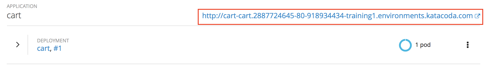


## Congratulations!

You have deployed the Catalog service as a microservice which in turn calls into the Inventory service to retrieve inventory data.
However, our monolih UI is still using its own built-in services. Wouldn't it be nice if we could re-wire the monolith to use the
new services, **without changing any code**? That's next!


## Create a REST endpoints for /services/cart

So far we haven't started [strangling the monolith](https://www.martinfowler.com/bliki/StranglerApplication.html). To do this
we are going to make use of routing capabilities in OpenShift. Each external request coming into OpenShift (unless using
ingress, which we are not) will pass through a route. In our monolith the web page uses client side REST calls to load
different parts of pages.

For the home page the product list is loaded via a REST call to *http://<monolith-hostname>/services/products*. At the moment
calls to that URL will still hit product catalog in the monolith. By using a
[path based route](https://docs.openshift.com/container-platform/3.7/architecture/networking/routes.html#path-based-routes) in
OpenShift we can route these calls to our newly created catalog services instead and end up with something like:


Flow the steps below to create a path based route.

**1. Obtain hostname of monolith UI from our Dev environment**

`oc get route/www -n coolstore-dev`### Run it!

The output of this command shows us the hostname:

```console
NAME      HOST/PORT                                 PATH      SERVICES    PORT      TERMINATION   WILDCARD
www       www-coolstore-dev.apps.127.0.0.1.nip.io             coolstore   <all>                   None
```

My hostname is `www-coolstore-dev.apps.127.0.0.1.nip.io` but **yours will be different**.

**2. Open the openshift console for [Cart - Applications - Routes](https://$OPENSHIFT_MASTER/console/project/cart/browse/routes)**

**3. Click on Create Route, and set**

* **Name**: `cart-redirect`
* **Hostname**: _the hostname from above_
* **Path**: `/services/cart`
* **Service**: `cart`

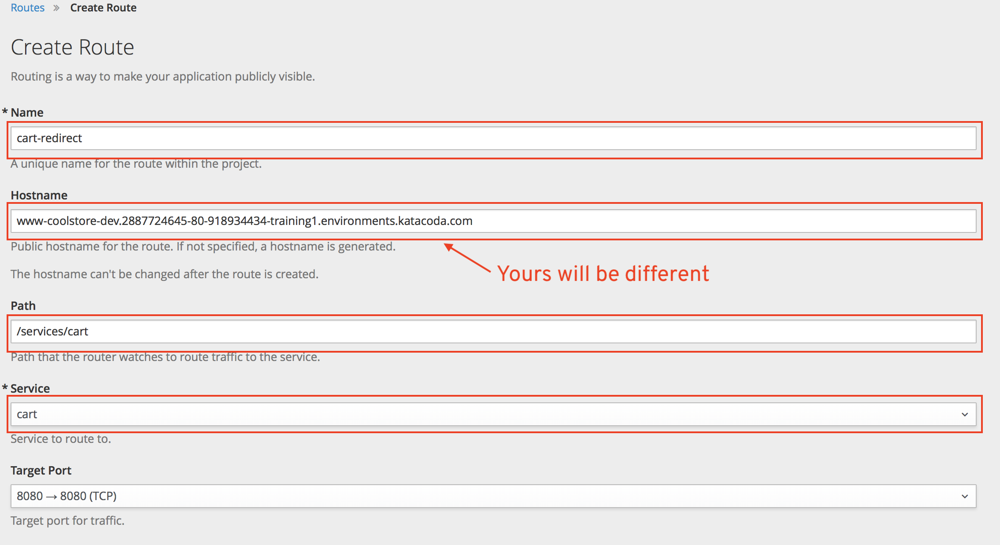

Leave other values set to their defaults, and click **Save**

**4. Test the route**

Test the route by running `curl http://www-coolstore-dev.$OPENSHIFT_MASTER/services/cart/99999`### Run it!

You should get a complete set of products, along with their inventory.

**5. Test the UI**

Open the monolith UI and observe that the new catalog is being used along with the monolith:


## Congratulations!

You have now successfully begun to _strangle_ the monolith. Part of the monolith's functionality (Inventory and Catalog) are
now implemented as microservices, without touching the monolith. But there's a few more things left to do, which we'll do in the
next steps.


## Summary

In this scenario, you learned a bit more about what Reactive Systems and Reactive programming are and why it's useful when building Microservices. Note that some of the code in here may have been hard to understand and part of that is that we are not using an IDE, like JBoss Developer Studio (based on Eclipse) or IntelliJ. Both of these have excellent tooling to build Vert.x applications. 

You created a new product catalog microservice almost finalizing the migration from a monolith to microservices. There are a couple of things that are also required. Firstly the checkout of the shopping cart was never implemented, and secondly, the monolith also has an order service. These were removed from this exercise because of time constraints. You have however so far almost completed a migration, so good work. You deserve a promotion. :-)

In the next chapter, we will talk more about how to make resilient microservices. 

# SCENARIO 7: Prevent and detect issues in a distributed system

* Purpose: How to prevent cascading failures in a distributed environment, how to detect misbehaving services. How to avoid having to implement resiliency and monitoring in your business logic
* Difficulty: `advanced`
* Time: `60-90 minutes`

## Intro
As we transition our applications towards a distributed architecture with microservices deployed across a distributed
network, Many new challenges await us.

Technologies like containers and container orchestration platforms like OpenShift solve the deployment of our distributed
applications quite well, but are still catching up to addressing the service communication necessary to fully take advantage
of distributed applications, such as dealing with:

* Unpredictable failure modes
* Verifying end-to-end application correctness
* Unexpected system degradation
* Continuous topology changes
* The use of elastic/ephemeral/transient resources

Today, developers are responsible for taking into account these challenges, and do things like:

* Circuit breaking and Bulkheading (e.g. with Netfix Hystrix)
* Timeouts/retries
* Service discovery (e.g. with Eureka)
* Client-side load balancing (e.g. with Netfix Ribbon)

Another challenge is each runtime and language addresses these with different libraries and frameworks, and in
some cases there may be no implementation of a particular library for your chosen language or runtime.

In this scenario we'll explore how to use a new project called _Istio_ to solve many of these challenges and result in
a much more robust, reliable, and resilient application in the face of the new world of dynamic distributed applications.

## What is Istio?


Istio is an open, platform-independent service mesh designed to manage communications between microservices and
applications in a transparent way.It provides behavioral insights and operational control over the service mesh
as a whole. It provides a number of key capabilities uniformly across a network of services:

* **Traffic Management** - Control the flow of traffic and API calls between services, make calls more reliable, and make the network more robust in the face of adverse conditions.

* **Observability** - Gain understanding of the dependencies between services and the nature and flow of traffic between them, providing the ability to quickly identify issues.

* **Policy Enforcement** - Apply organizational policy to the interaction between services, ensure access policies are enforced and resources are fairly distributed among consumers. Policy changes are made by configuring the mesh, not by changing application code.

* **Service Identity and Security** - Provide services in the mesh with a verifiable identity and provide the ability to protect service traffic as it flows over networks of varying degrees of trustability.

These capabilities greatly decrease the coupling between application code, the underlying platform, and policy. This decreased coupling not only makes services easier to implement, but also makes it simpler for operators to move application deployments between environments or to new policy schemes. Applications become inherently more portable as a result.

Sounds fun, right? Let's get started!

## Install Istio

In this step, we'll install Istio into our OpenShift platform.

In order to install Istio, you must be logged in as `admin`. This is required as this
user will need to run things in a privileged way, or even with containers as root.

Run the following to login as admin:

`oc login $OPENSHIFT_MASTER -u admin -p admin --insecure-skip-tls-verify=true`### Run it!

**If you are unable to login as admin or get any failures, ask an instructor for help.**

Because this scenario does not use any of the previous projects, let's shut down (but not delete) the services
to save memory and CPU. Execute this command to _scale_ the services down to 0 instances each:

`oc scale --replicas=0 dc/coolstore dc/coolstore-postgresql -n coolstore-dev ; \
 oc scale --replicas=0 dc/inventory dc/inventory-database -n inventory ; \
 oc scale --replicas=0 dc/catalog dc/catalog-database -n catalog ; \
 oc scale --replicas=0 dc/cart -n cart`### Run it!

Next, run the following command:

`sh ~/install-istio.sh`### Run it!

This command:

* Creates the project `istio-system` as the location to deploy all the components
* Adds necessary permissions
* Deploys Istio components
* Deploys additional add-ons, namely Prometheus, Grafana, Service Graph and Jaeger Tracing
* Exposes routes for those add-ons and for Istio's Ingress component

We'll use the above components througout this scenario, so don't worry if you don't know what they do!

Istio consists of a number of components, and you should wait for it to be completely initialized before continuing.
Execute the following commands to wait for the deployment to complete and result `deployment xxxxxx successfully rolled out` for each deployment:

`oc rollout status -w deployment/istio-pilot && \
 oc rollout status -w deployment/istio-mixer && \
 oc rollout status -w deployment/istio-ca && \
 oc rollout status -w deployment/istio-ingress && \
 oc rollout status -w deployment/prometheus && \
 oc rollout status -w deployment/grafana && \
 oc rollout status -w deployment/servicegraph && \
 oc rollout status -w deployment/jaeger-deployment`### Run it!

While you wait for the command to report success you can read a bit more about the [Istio](https://istio.io/docs) architecture below:

## Istio Details

An Istio service mesh is logically split into a _data plane_ and a _control plane_.

The _data plane_ is composed of a set of intelligent proxies (_Envoy_ proxies) deployed as _sidecars_ to your application's pods in OpenShift that mediate and control all network communication between microservices.

The _control plane_ is responsible for managing and configuring proxies to route traffic, as well as enforcing policies at runtime.

The following diagram shows the different components that make up each plane:


#### Istio Components

##### Envoy
Envoy is a high-performance proxy developed in C++ which handles all inbound and outbound traffic for all services in the service mesh. Istio leverages Envoy’s many built-in features such as dynamic service discovery, load balancing, TLS termination, HTTP/2 & gRPC proxying, circuit breakers, health checks, staged rollouts with %-based traffic split, fault injection, and rich metrics.

Envoy is deployed as a sidecar to application services in the same Kubernetes pod. This allows Istio to extract a wealth of signals about traffic behavior as attributes, which in turn it can use in Mixer to enforce policy decisions, and be sent to monitoring systems to provide information about the behavior of the entire mesh.

##### Mixer
Mixer is a platform-independent component responsible for enforcing access control and usage policies across the service mesh and collecting telemetry data from the Envoy proxy and other services. The proxy extracts request level attributes, which are sent to Mixer for evaluation.

##### Pilot
Pilot provides service discovery for the Envoy sidecars, traffic management capabilities for intelligent routing (e.g., A/B tests, canary deployments, etc.), and resiliency (timeouts, retries, circuit breakers, etc.). It converts a high level routing rules that control traffic behavior into Envoy-specific configurations, and propagates them to the sidecars at runtime. Pilot abstracts platform-specifc service discovery mechanisms and synthesizes them into a standard format consumable by any sidecar that conforms to the Envoy data plane APIs.

##### Istio-Auth
Istio-Auth provides strong service-to-service and end-user authentication using mutual TLS, with built-in identity and credential management. It can be used to upgrade unencrypted traffic in the service mesh, and provides operators the ability to enforce policy based on service identity rather than network controls.

##### Add-ons
Several components are used to provide additional visualizations, metrics, and tracing functions:

* [Prometheus](https://prometheus.io/) - Systems monitoring and alerting toolkit
* [Grafana](https://grafana.com/) - Allows you to query, visualize, alert on and understand your metrics
* [Jaeger Tracing](http://jaeger.readthedocs.io/) - Distributed tracing to gather timing data needed to troubleshoot latency problems in microservice architectures
* [Servicegraph](https://istio.io/docs/tasks/telemetry/servicegraph.html#about-the-servicegraph-add-on) - generates and visualizes a graph of services within a mesh

We will use these in future steps in this scenario!

Check out the [Istio docs](https://istio.io/docs) for more details.

Is your Istio deployment complete? If so, then you're ready to move on!

## Install Sample Application

In this step, we'll install a sample application into the system. This application
is included in Istio itself for demonstrating various aspects of it, but the application
isn't tied exclusively to Istio - it's an ordinary microservice application that could be
installed to any OpenShift instance with or without Istio.

The sample application is called _Bookinfo_, a simple application that displays information about a
book, similar to a single catalog entry of an online book store. Displayed on the page is a
description of the book, book details (ISBN, number of pages, and so on), and a few book reviews.

The BookInfo application is broken into four separate microservices:

* **productpage** - The productpage microservice calls the details and reviews microservices to populate the page.
* **details** - The details microservice contains book information.
* **reviews** - The reviews microservice contains book reviews. It also calls the ratings microservice.
* **ratings** - The ratings microservice contains book ranking information that accompanies a book review.

There are 3 versions of the reviews microservice:

* Version v1 does not call the ratings service.
* Version v2 calls the ratings service, and displays each rating as 1 to 5 black stars.
* Version v3 calls the ratings service, and displays each rating as 1 to 5 red stars.

The end-to-end architecture of the application is shown below.


## Install Bookinfo

Run the following command:

`sh ~/install-sample-app.sh`### Run it!

The application consists of the usual objects like Deployments, Services, and Routes.

As part of the installation, we use Istio to "decorate" the application with additional
components (the Envoy Sidecars you read about in the previous step).

Let's wait for our application to finish deploying.
Execute the following commands to wait for the deployment to complete and result `successfully rolled out`:

`oc rollout status -w deployment/productpage-v1 && \
 oc rollout status -w deployment/reviews-v1 && \
 oc rollout status -w deployment/reviews-v2 && \
 oc rollout status -w deployment/reviews-v3 && \
 oc rollout status -w deployment/details-v1 && \
 oc rollout status -w deployment/ratings-v1`### Run it!

## Access Bookinfo

Open the application in your browser to make sure it's working:

* [Bookinfo Application running with Istio](http://istio-ingress-istio-system.$OPENSHIFT_MASTER/productpage)

It should look something like:


Reload the page multiple times. The three different versions of the Reviews service
show the star ratings differently - `v1` shows no stars at all, `v2` shows black stars,
and `v3` shows red stars:

* `v1`: 
* `v2`: 
* `v3`: 

That's because there are 3 versions of reviews deployment for our reviews service. Istio’s
load-balancer is using a _round-robin_ algorithm to iterate through the 3 instances of this service.

You should now have your OpenShift Pods running and have an Envoy sidecar in each of them
alongside the microservice. The microservices are productpage, details, ratings, and
reviews. Note that you'll have three versions of the reviews microservice:

`oc get pods --selector app=reviews`### Run it!

```console
reviews-v1-1796424978-4ddjj          2/2       Running   0          28m
reviews-v2-1209105036-xd5ch          2/2       Running   0          28m
reviews-v3-3187719182-7mj8c          2/2       Running   0          28m
```

Notice that each of the microservices shows `2/2` containers ready for each service (one for the service and one for its
sidecar).

Now that we have our application deployed and linked into the Istio service mesh, let's take a look at the
immediate value we can get out of it without touching the application code itself!


## Collecting Metrics

## Visualize the network

The Servicegraph service is an example service that provides endpoints for generating and visualizing a graph of services within a mesh. It exposes the following endpoints:

* `/graph` which provides a JSON serialization of the servicegraph
* `/dotgraph` which provides a dot serialization of the servicegraph
* `/dotviz` which provides a visual representation of the servicegraph

## Examine Service Graph

The Service Graph addon provides a visualization of the different services and how they are connected. Open the link:

* [Bookinfo Service Graph (Dotviz)](http://servicegraph-istio-system.$OPENSHIFT_MASTER/dotviz)

It should look like:


This shows you a graph of the services and how they are connected, with some basic access metrics like
how many requests per second each service receives.

As you add and remove services over time in your projects, you can use this to verify the connections between services and provides
a high-level telemetry showing the rate at which services are accessed.

## Generating application load

To get a better idea of the power of metrics, let's setup an endless loop that will continually access
the application and generate load. We'll open up a separate terminal just for this purpose. Execute this command:

`while true; do
    curl -o /dev/null -s -w "%{http_code}\n" \
      http://istio-ingress-istio-system.$OPENSHIFT_MASTER/productpage
  sleep .2
done`### Run it!

This command will endlessly access the application and report the HTTP status result in a separate terminal window.

With this application load running, metrics will become much more interesting in the next few steps.

## Querying Metrics with Prometheus

[Prometheus](https://prometheus.io/) exposes an endpoint serving generated metric values. The Prometheus
add-on is a Prometheus server that comes pre-configured to scrape Mixer endpoints
to collect the exposed metrics. It provides a mechanism for persistent storage
and querying of Istio metrics.

Open the Prometheus UI:

* [Prometheus UI](http://prometheus-istio-system.$OPENSHIFT_MASTER)

In the “Expression” input box at the top of the web page, enter the text: `istio_request_count`.
Then, click the **Execute** button.

You should see a listing of each of the application's services along with a count of how many times it was accessed.


You can also graph the results over time by clicking on the _Graph_ tab (adjust the timeframe from 1h to 1minute for
example):


Other expressions to try:

* Total count of all requests to `productpage` service: `istio_request_count{destination_service=~"productpage.*"}`
* Total count of all requests to `v3` of the `reviews` service: `istio_request_count{destination_service=~"reviews.*", destination_version="v3"}`
* Rate of requests over the past 5 minutes to all `productpage` services: `rate(istio_request_count{destination_service=~"productpage.*", response_code="200"}[5m])`

There are many, many different queries you can perform to extract the data you need. Consult the
[Prometheus documentation](https://prometheus.io/docs) for more detail.

## Visualizing Metrics with Grafana

As the number of services and interactions grows in your application, this style of metrics may be a bit
overwhelming. [Grafana](https://grafana.com/) provides a visual representation of many available Prometheus
metrics extracted from the Istio data plane and can be used to quickly spot problems and take action.

Open the Grafana Dashboard:

* [Grafana Dashboard](http://grafana-istio-system.$OPENSHIFT_MASTER/dashboard/db/istio-dashboard)


The Grafana Dashboard for Istio consists of three main sections:

1. **A Global Summary View.** This section provides high-level summary of HTTP requests flowing through the service mesh.
1. **A Mesh Summary View.** This section provides slightly more detail than the Global Summary View, allowing per-service filtering and selection.
1. **Individual Services View.** This section provides metrics about requests and responses for each individual service within the mesh (HTTP and TCP).

Scroll down to the `ratings` service graph:


This graph shows which other services are accessing the `ratings` service. You can see that
`reviews:v2` and `reviews:v3` are calling the `ratings` service, and each call is resulting in
`HTTP 200 (OK)`. Since the default routing is _round-robin_, that means each reviews service is
calling the ratings service equally. And `ratings:v1` never calls it, as we expect.

For more on how to create, configure, and edit dashboards, please see the [Grafana documentation](http://docs.grafana.org/).

As a developer, you can get quite a bit of information from these metrics without doing anything to the application
itself. Let's use our new tools in the next section to see the real power of Istio to diagnose and fix issues in
applications and make them more resilient and robust.


## Request Routing

This task shows you how to configure dynamic request routing based on weights and HTTP headers.

_Route rules_ control how requests are routed within an Istio service mesh. Route rules provide:

* **Timeouts**
* **Bounded retries** with timeout budgets and variable jitter between retries
* **Limits** on number of concurrent connections and requests to upstream services
* **Active (periodic) health checks** on each member of the load balancing pool
* **Fine-grained circuit breakers** (passive health checks) – applied per instance in the load balancing pool

Requests can be routed based on
the source and destination, HTTP header fields, and weights associated with individual service versions.
For example, a route rule could route requests to different versions of a service.

Together, these features enable the service mesh to tolerate failing nodes and prevent localized failures from cascading instability to other nodes.
However, applications must still be designed to deal with failures by taking appropriate fallback actions.
For example, when all instances in a load balancing pool have failed, Istio will return HTTP 503. It is
the responsibility of the application to implement any fallback logic that is needed to handle the HTTP
503 error code from an upstream service.

If your application already provides some defensive measures (e.g. using [Netflix Hystrix](https://github.com/Netflix/Hystrix)), then that's OK:
Istio is completely transparent to the application. A failure response returned by Istio would not be
distinguishable from a failure response returned by the upstream service to which the call was made.

## Service Versions
Istio introduces the concept of a service version, which is a finer-grained way to subdivide
service instances by versions (`v1`, `v2`) or environment (`staging`, `prod`). These variants are not
necessarily different API versions: they could be iterative changes to the same service, deployed
in different environments (prod, staging, dev, etc.). Common scenarios where this is used include
A/B testing or canary rollouts. Istio’s [traffic routing rules](https://istio.io/docs/concepts/traffic-management/rules-configuration.html) can refer to service versions to
provide additional control over traffic between services.


As illustrated in the figure above, clients of a service have no knowledge of different versions of the service. They can continue to access the services using the hostname/IP address of the service. The Envoy sidecar/proxy intercepts and forwards all requests/responses between the client and the service.

## RouteRule objects
In addition to the usual OpenShift object types like `BuildConfig`, `DeploymentConfig`, `Service` and `Route`,
you also have new object types installed as part of Istio like `RouteRule`. Adding these objects to the running
OpenShift cluster is how you configure routing rules for Istio.

## Install a default route rule
Because the BookInfo sample deploys 3 versions of the reviews microservice, we need to set a default route.
Otherwise if you access the application several times, you’ll notice that sometimes the output contains star
ratings. This is because without an explicit default version set, Istio will route requests to all available
versions of a service in a random fashion, and anytime you hit `v1` version you'll get no stars.

First, let's set an environment variable to point to Istio:

`export ISTIO_VERSION=0.4.0; export ISTIO_HOME=${HOME}/istio-${ISTIO_VERSION}; export PATH=${PATH}:${ISTIO_HOME}/bin; cd ${ISTIO_HOME}`### Run it!

Now let's install a default set of routing rules which will direct all traffic to the `reviews:v1` service version:

`oc create -f samples/bookinfo/kube/route-rule-all-v1.yaml`### Run it!

You can see this default set of rules with:

`oc get routerules -o yaml`### Run it!

There are default routing rules for each service, such as the one that forces all traffic to the `v1` version of the `reviews` service:

`oc get routerules/reviews-default -o yaml`### Run it!

```yaml
    apiVersion: config.istio.io/v1alpha2
    kind: RouteRule
    metadata:
      name: reviews-default
      namespace: default
      ...
    spec:
      destination:
        name: reviews
      precedence: 1
      route:
      - labels:
          version: v1
```

Now, access the application again in your browser using the below link and reload the page several times - you should not see any rating stars since `reviews:v1` does not access the `ratings` service.

* [Bookinfo Application with no rating stars](http://istio-ingress-istio-system.$OPENSHIFT_MASTER/productpage)

To verify this, open the Grafana Dashboard:

* [Grafana Dashboard](http://grafana-istio-system.$OPENSHIFT_MASTER/dashboard/db/istio-dashboard)

Scroll down to the `ratings` service and notice that the requests coming from the reviews service have stopped:


## A/B Testing with Istio
Lets enable the ratings service for a test user named “jason” by routing `productpage` traffic to `reviews:v2`, but only for our test user. Execute:

`oc create -f samples/bookinfo/kube/route-rule-reviews-test-v2.yaml`### Run it!

Confirm the rule is created:

`oc get routerule reviews-test-v2 -o yaml`### Run it!

Notice the `match` element:

```yaml
  match:
    request:
      headers:
        cookie:
          regex: ^(.*?;)?(user=jason)(;.*)?$
```

This says that for any incoming HTTP request that has a cookie set to the `jason` user to direct traffic to
`reviews:v2`.

Now, [access the application](http://istio-ingress-istio-system.$OPENSHIFT_MASTER/productpage) and click **Sign In** (at the upper right) and sign in with:

* Username: `jason`
* Password: `jason`

> If you get any certificate security exceptions, just accept them and continue. This is due to the use of self-signed certs.

Once you login, refresh a few times - you should always see the black ratings stars coming from `ratings:v2`. If you logout,
you'll return to the `reviews:v1` version which shows no stars. You may even see a small blip of access to `ratings:v2` on the
Grafana dashboard if you refresh quickly 5-10 times while logged in as the test user `jason`.


## Congratulations!

In this step, you used Istio to send 100% of the traffic to the v1 version of each of the BookInfo services.
You then set a rule to selectively send traffic to version v2 of the reviews service based on a header
(i.e., a user cookie) in a request.

Once the v2 version has been tested to our satisfaction, we could use Istio to send traffic from all users to
v2, optionally in a gradual fashion. We’ll explore this in the next step.


## Fault Injection

This step shows how to inject faults and test the resiliency of your application.

Istio provides a set of failure recovery features that can be taken advantage of by the services
in an application. Features include:

* Timeouts
* Bounded retries with timeout budgets and variable jitter between retries
* Limits on number of concurrent connections and requests to upstream services
* Active (periodic) health checks on each member of the load balancing pool
* Fine-grained circuit breakers (passive health checks) – applied per instance in the load balancing pool

These features can be dynamically configured at runtime through Istio’s traffic management rules.

A combination of active and passive health checks minimizes the chances of accessing an unhealthy service.
When combined with platform-level health checks (such as readiness/liveness probes in OpenShift), applications
can ensure that unhealthy pods/containers/VMs can be quickly weeded out of the service mesh, minimizing the
request failures and impact on latency.

Together, these features enable the service mesh to tolerate failing nodes and prevent localized failures
from cascading instability to other nodes.

## Fault Injection
While Istio provides a host of failure recovery mechanisms outlined above, it is still imperative to test the
end-to-end failure recovery capability of the application as a whole. Misconfigured failure
recovery policies (e.g., incompatible/restrictive timeouts across service calls) could result
in continued unavailability of critical services in the application, resulting in poor user experience.

Istio enables protocol-specific fault injection into the network (instead of killing pods) by
delaying or corrupting packets at TCP layer.

Two types of faults can be injected: delays and aborts. Delays are timing failures, mimicking
increased network latency, or an overloaded upstream service. Aborts are crash failures that
mimic failures in upstream services. Aborts usually manifest in the form of HTTP error codes,
or TCP connection failures.

## Inject a fault
To test our application microservices for resiliency, we will inject a 7 second delay between the
`reviews:v2` and `ratings` microservices, for user `jason`. This will be a simulated bug in the code which
we will discover later.

Since the `reviews:v2` service has a
built-in 10 second timeout for its calls to the ratings service, we expect the end-to-end flow
to continue without any errors. Execute:

`oc create -f samples/bookinfo/kube/route-rule-ratings-test-delay.yaml`### Run it!

And confirm that the delay rule was created:

`oc get routerule ratings-test-delay -o yaml`### Run it!

Notice the `httpFault` element:

```yaml
  httpFault:
    delay:
      fixedDelay: 7.000s
      percent: 100
```

Now, [access the application](http://istio-ingress-istio-system.$OPENSHIFT_MASTER/productpage) and click **Login** and login with:

* Username: `jason`
* Password: `jason`

If the application’s front page was set to correctly handle delays, we expect it to load within
approximately 7 seconds. To see the web page response times, open the Developer Tools menu in
IE, Chrome or Firefox (typically, key combination `Ctrl`+`Shift`+`I` or `Alt`+`Cmd`+`I`), tab Network,
and reload the bookinfo web page.

You will see and feel that the webpage loads in about 6 seconds:


The reviews section will show: **Sorry, product reviews are currently unavailable for this book**:

## Use tracing to identify the bug
The reason that the entire reviews service has failed is because our BookInfo application has
a bug. The timeout between the `productpage` and `reviews` service is less (3s times 2 retries == 6s total)
than the timeout between the reviews and ratings service (10s). These kinds of bugs can occur in
typical enterprise applications where different teams develop different microservices independently.

Identifying this timeout mismatch is not so easy by observing the application, but is very easy when using
Istio's built-in tracing capabilities. We will explore tracing in depth later on in this scenario and re-visit
this issue.

## Fixing the bug
At this point we would normally fix the problem by either increasing the `productpage` timeout or
decreasing the `reviews` -> `ratings` service timeout, terminate and restart the fixed microservice,
and then confirm that the `productpage` returns its response without any errors.

However, we already have this fix running in `v3` of the reviews service, so we can simply fix the
problem by migrating all traffic to `reviews:v3`. We'll do this in the next step!


## Traffic Shifting

This step shows you how to gradually migrate traffic from an old to new version of a service.
With Istio, we can migrate the traffic in a gradual fashion by using a sequence of rules with
weights less than 100 to migrate traffic in steps, for example 10, 20, 30, … 100%. For simplicity
this task will migrate the traffic from `reviews:v1` to `reviews:v3` in just two steps: 50%, 100%.

## Remove test routes
Now that we've identified and fixed the bug, let's undo our previous testing routes. Execute:

`oc delete -f samples/bookinfo/kube/route-rule-reviews-test-v2.yaml \
           -f samples/bookinfo/kube/route-rule-ratings-test-delay.yaml`### Run it!

At this point, we are back to sending all traffic to `reviews:v1`. [Access the application](http://istio-ingress-istio-system.$OPENSHIFT_MASTER/productpage)
and verify that no matter how many times you reload your browser, you'll always get no ratings stars, since
`reviews:v1` doesn't ever access the `ratings` service:


Open the Grafana dashboard and verify that the ratings service is receiving no traffic at all:

* [Grafana Dashboard](http://grafana-istio-system.$OPENSHIFT_MASTER/dashboard/db/istio-dashboard)

Scroll down to the `reviews` service and observe that all traffic from `productpage` to to `reviews:v2` and
`reviews:v3` have stopped, and that only `reviews:v1` is receiving requests:


In Grafana you can click on each service version below each graph to only show one graph at a time. Try it by
clicking on `productpage.istio-system-v1 -> v1 : 200`. This shows a graph of all requests coming from
`productpage` to `reviews` version `v1` that returned HTTP 200 (Success). You can then click on
`productpage.istio-system-v1 -> v2 : 200` to verify no traffic is being sent to `reviews:v2`:


## Migrate users to v3

To start the process, let's send half (50%) of the users to our new `v3` version with the fix, to do a canary test.
Execute the following command which replaces the `reviews-default` rule with a new rule:

`oc replace -f samples/bookinfo/kube/route-rule-reviews-50-v3.yaml`### Run it!

Inspect the new rule:

`oc get routerule reviews-default -o yaml`### Run it!

Notice the new `weight` elements:

```yaml
  route:
  - labels:
      version: v1
    weight: 50
  - labels:
      version: v3
    weight: 50
```

Open the Grafana dashboard and verify this:

* [Grafana Dashboard](http://grafana-istio-system.$OPENSHIFT_MASTER/dashboard/db/istio-dashboard)

Scroll down to the `reviews` service and observe that half the traffic goes to each of `v1` and `v3` and none goes
to `v2`:


At this point, we see some traffic going to `v3` and are happy with the result. [Access the application](http://istio-ingress-istio-system.$OPENSHIFT_MASTER/productpage)
and verify that you either get no ratings stars (`v1`) or _red_ ratings stars (`v3`).

We are now happy with the new version `v3` and want to migrate everyone to it. Execute:

`oc replace -f samples/bookinfo/kube/route-rule-reviews-v3.yaml`### Run it!

Once again, open the Grafana dashboard and verify this:

* [Grafana Dashboard](http://grafana-istio-system.$OPENSHIFT_MASTER/dashboard/db/istio-dashboard)

Scroll down to the `reviews` service and observe that all traffic is now going to `v3`:


Also, [Access the application](http://istio-ingress-istio-system.$OPENSHIFT_MASTER/productpage)
and verify that you always get _red_ ratings stars (`v3`).

## Congratulations!

In this task we migrated traffic from an old to new version of the reviews service using Istio’s
weighted routing feature. Note that this is very different than version migration using deployment
features of OpenShift, which use instance scaling to manage the traffic. With Istio, we can allow
the two versions of the reviews service to scale up and down independently, without affecting the
traffic distribution between them. For more about version routing with autoscaling, check out
[Canary Deployments using Istio](https://istio.io/blog/canary-deployments-using-istio.html).

In the next step, we will explore circuit breaking, which is useful for avoiding cascading failures
and overloaded microservices, giving the system a chance to recover and minimize downtime.


## Circuit Breaking

In this step you will configure an Istio Circuit Breaker to protect the calls from `reviews` to `ratings` service.
If the `ratings` service gets overloaded due to call volume, Istio (in conjunction with Kubernetes) will limit
future calls to the service instances to allow them to recover.

Circuit breaking is a critical component of distributed systems.
It’s nearly always better to fail quickly and apply back pressure downstream
as soon as possible. Istio enforces circuit breaking limits at the network
level as opposed to having to configure and code each application independently.

Istio supports various types of circuit breaking:

* **Cluster maximum connections**: The maximum number of connections that Istio will establish to all hosts in a cluster.
* **Cluster maximum pending requests**: The maximum number of requests that will be queued while waiting for a
ready connection pool connection.
* **Cluster maximum requests**: The maximum number of requests that can be outstanding to all hosts in a
cluster at any given time. In practice this is applicable to HTTP/2 clusters since HTTP/1.1 clusters are
governed by the maximum connections circuit breaker.
* **Cluster maximum active retries**: The maximum number of retries that can be outstanding to all hosts
in a cluster at any given time. In general Istio recommends aggressively circuit breaking retries so that
retries for sporadic failures are allowed but the overall retry volume cannot explode and cause large
scale cascading failure.

> Note that HTTP 2 uses a single connection and never queues (always multiplexes), so max connections and
max pending requests are not applicable.

Each circuit breaking limit is configurable and tracked on a per upstream cluster and per priority basis.
This allows different components of the distributed system to be tuned independently and have different limits.
See the [Istio Circuit Breaker Spec](https://istio.io/docs/reference/config/traffic-rules/destination-policies.html#istio.proxy.v1.config.CircuitBreaker) for more details.

## Enable Circuit Breaker
Let's add a circuit breaker to the calls to the `ratings` service. Instead of using a _RouteRule_ object,
circuit breakers in isto are defined as _DestinationPolicy_ objects. DestinationPolicy defines client/caller-side policies
that determine how to handle traffic bound to a particular destination service. The policy specifies
configuration for load balancing and circuit breakers.

Add a circuit breaker to protect calls destined for the `ratings` service:

```
oc create -f - <<EOF
    apiVersion: config.istio.io/v1alpha2
    kind: DestinationPolicy
    metadata:
      name: ratings-cb
    spec:
      destination:
        name: ratings
        labels:
          version: v1
      circuitBreaker:
        simpleCb:
          maxConnections: 1
          httpMaxPendingRequests: 1
          httpConsecutiveErrors: 1
          sleepWindow: 15m
          httpDetectionInterval: 10s
          httpMaxEjectionPercent: 100
EOF
```### Run it!

We set the `ratings` service's maximum connections to 1 and maximum pending requests to 1. Thus, if we send more
than 2 requests within a short period of time to the reviews service, 1 will go through, 1 will be pending,
and any additional requests will be denied until the pending request is processed. Furthermore, it will detect any hosts that
return a server error (5XX) and eject the pod out of the load balancing pool for 15 minutes. You can visit
here to check the
[Istio spec](https://istio.io/docs/reference/config/traffic-rules/destination-policies.html#istio.proxy.v1.config.CircuitBreaker.SimpleCircuitBreakerPolicy)
for more details on what each configuration parameter does.

## Overload the service
Let's use some simple `curl` commands to send multiple concurrent requests to our application, and witness the
circuit breaker kicking in opening the circuit.

Execute this to simulate a number of users attampting to access the application simultaneously:


```
    for i in {1..10} ; do
        curl 'http://istio-ingress-istio-system.$OPENSHIFT_MASTER/productpage?foo=[1-1000]' >& /dev/null &
    done
```### Run it!

Due to the very conservative circuit breaker, many of these calls will fail with HTTP 503 (Server Unavailable). To see this,
open the Grafana console:

* [Grafana Dashboard](http://grafana-istio-system.$OPENSHIFT_MASTER/dashboard/db/istio-dashboard)

Notice at the top, the increase in the number of **5xxs Responses** at the top right of the dashboard:


Below that, in the **Service Mesh** section of the dashboard observe that the services are returning 503 (Service Unavailable) quite a lot:


That's the circuit breaker in action, limiting the number of requests to the service. In practice your limits would be much higher

### Stop overloading

Before moving on, stop the traffic generator by clicking here to stop them:

`for i in {1..10} ; do kill %${i} ; done`### Run it!

## Pod Ejection

In addition to limiting the traffic, Istio can also forcibly eject pods out of service if they are running slowly
or not at all. To see this, let's deploy a pod that doesn't work (has a bug).

First, let's define a new circuit breaker, very similar to the previous one but without the arbitrary connection
limits. To do this, execute:

```
oc replace -f - <<EOF
    apiVersion: config.istio.io/v1alpha2
    kind: DestinationPolicy
    metadata:
      name: ratings-cb
    spec:
      destination:
        name: ratings
        labels:
          version: v1
      circuitBreaker:
        simpleCb:
          httpConsecutiveErrors: 1
          sleepWindow: 15m
          httpDetectionInterval: 10s
          httpMaxEjectionPercent: 100
EOF
```### Run it!

This policy says that if any instance of the `ratings` service fails more than once, it will be ejected for
15 minutes.

Next, deploy a new instance of the `ratings` service which has been misconfigured and will return a failure
(HTTP 500) value for any request. Execute:

`${ISTIO_HOME}/bin/istioctl kube-inject -f ~/projects/ratings/broken.yaml | oc create -f -`### Run it!

Verify that the broken pod has been added to the `ratings` load balancing service:

`oc get pods -l app=ratings`### Run it!

You should see 2 pods, including the broken one:

```console
NAME                                 READY     STATUS    RESTARTS   AGE
ratings-v1-3080059732-5ts95          2/2       Running   0          3h
ratings-v1-broken-1694306571-c6zlk   2/2       Running   0          7s
```

Save the name of this pod to an environment variable:

`BROKEN_POD_NAME=$(oc get pods -l app=ratings,broken=true -o jsonpath='{.items[?(@.status.phase=="Running")].metadata.name}')`### Run it!

Requests to the `ratings` service will be load-balanced across these two pods. The circuit breaker will
detect the failures in the broken pod and eject it from the load balancing pool for a minimum of 15 minutes.
In the real world this would give the failing pod a chance to recover or be killed and replaced. For mis-configured
pods that will never recover, this means that the pod will very rarely be accessed (once every 15 minutes,
and this would also be very noticeable in production environment monitoring like those we are
using in this workshop).

To trigger this, simply access the application:

* [Application Link](http://istio-ingress-istio-system.$OPENSHIFT_MASTER/productpage)

Reload the webpage 5-10 times (click the reload icon, or press `CMD-R`, or `CTRL-R`) and notice that you
only see a failure (no stars) ONE time, due to the
circuit breaker's policy for `httpConsecutiveErrors=1`.  After the first error, the pod is ejected from
the load balancing pool for 15 minutes and you should see red stars from now on.

Verify that the broken pod only received one request that failed:

`oc logs -c ratings $BROKEN_POD_NAME`### Run it!

You should see:

```console
Server listening on: http://0.0.0.0:9080
GET /ratings/0
```

You should see one and only one `GET` request, no matter how many times you reload the webpage.
This indicates that the pod has been ejected from the load balancing pool and will not be accessed
for 15 minutes. You can also see this in the Prometheus logs for the Istio Mixer. Open the Prometheus query
console:

* [Prometheus UI](http://prometheus-istio-system.$OPENSHIFT_MASTER)

In the “Expression” input box at the top of the web page, enter the text: `envoy_cluster_out_ratings_istio_system_svc_cluster_local_http_version_v1_outlier_detection_ejections_active` and click
**Execute**. This expression refers to the number of _active ejections_ of pods from the `ratings:v1` destination that have failed more than the value of the `httpConsecutiveErrors` which
we have set to 1 (one).

Then, click the Execute button.

You should see a result of `1`:


In practice this means that the failing pod will not receive any traffic for the timeout period, giving it a chance
to recover and not affect the user experience.

## Congratulations!

Circuit breaking is a critical component of distributed systems. When we apply a circuit breaker to an
entity, and if failures reach a certain threshold, subsequent calls to that entity should automatically
fail without applying additional pressure on the failed entity and paying for communication costs.

In this step you implemented the Circuit Breaker microservice pattern without changing any of the application code.
This is one additional way to build resilient applications, ones designed to deal with failure rather than go to great lengths
to avoid it.

In the next step, we will explore rate limiting, which can be useful to give different service levels to
different customers based on policy and contractual requirements

#### Before moving on

Before moving on, in case your simulated user loads are still running, kill them with:

`for i in {1..10} ; do kill %${i}; done`### Run it!

## More references

* [Istio Documentation](https://istio.io/docs)
* [Christian Post's Blog on Envoy and Circuit Breaking](http://blog.christianposta.com/microservices/01-microservices-patterns-with-envoy-proxy-part-i-circuit-breaking/)


## Rate Limiting

In this step we will use Istio's Quota Management feature to apply
a rate limit on the `ratings` service.

## Quotas in Istio
Quota Management enables services to allocate and free quota on a
based on rules called _dimensions_. Quotas are used as a relatively
simple resource management tool to provide some fairness between
service consumers when contending for limited resources.
Rate limits are examples of quotas, and are handled by the
[Istio Mixer](https://istio.io/docs/concepts/policy-and-control/mixer.html).

## Generate some traffic

As before, let's start up some processes to generate load on the app. Execute this command:

`while true; do
    curl -o /dev/null -s -w "%{http_code}\n" \
      http://istio-ingress-istio-system.$OPENSHIFT_MASTER/productpage
  sleep .2
done`### Run it!

This command will endlessly access the application and report the HTTP status result in a separate terminal window.

With this application load running, we can witness rate limits in action.

## Add a rate limit

Execute the following command:

`oc create -f samples/bookinfo/kube/mixer-rule-ratings-ratelimit.yaml`### Run it!

This configuration specifies a default 1 qps (query per second) rate limit. Traffic reaching
the `ratings` service is subject to a 1qps rate limit. Verify this with Grafana:

* [Grafana Dashboard](http://grafana-istio-system.$OPENSHIFT_MASTER/dashboard/db/istio-dashboard)

Scroll down to the `ratings` service and observe that you are seeing that some of the requests sent
from `reviews:v3` service to the `ratings` service are returning HTTP Code 429 (Too Many Requests).


In addition, at the top of the dashboard, the '4xxs' report shows an increase in 4xx HTTP codes. We are being
rate-limited to 1 query per second:


## Inspect the rule

Take a look at the new rule:

`oc get memquota handler -o yaml`### Run it!

In particular, notice the _dimension_ that causes the rate limit to be applied:

```yaml
# The following override applies to 'ratings' when
# the source is 'reviews'.
- dimensions:
    destination: ratings
    source: reviews
  maxAmount: 1
  validDuration: 1s
```

You can also conditionally rate limit based on other dimensions, such as:

* Source and Destination project names (e.g. to limit developer projects from overloading the production services during testing)
* Login names (e.g. to limit certain customers or classes of customers)
* Source/Destination hostnames, IP addresses, DNS domains, HTTP Request header values, protocols
* API paths
* [Several other attributes](https://istio.io/docs/reference/config/mixer/attribute-vocabulary.html)

## Remove the rate limit

Before moving on, execute the following to remove our rate limit:

`oc delete -f samples/bookinfo/kube/mixer-rule-ratings-ratelimit.yaml`### Run it!

Verify that the rate limit is no longer in effect. Open the dashboard:

* [Grafana Dashboard](http://grafana-istio-system.$OPENSHIFT_MASTER/dashboard/db/istio-dashboard)

Notice at the top that the `4xx`s dropped back down to zero.


## Congratulations!

In the final step, we'll explore distributed tracing and how it can help diagnose and fix issues in
complex microservices architectures. Let's go!


## Tracing

This step shows you how Istio-enabled applications automatically collect
_trace spans_ telemetry and can visualize it with tools like using Jaeger or Zipkin.
After completing this task, you should
understand all of the assumptions about your application and how to have it
participate in tracing, regardless of what language/framework/platform you
use to build your application.

## Tracing Goals
Developers and engineering organizations are trading in old, monolithic systems
for modern microservice architectures, and they do so for numerous compelling
reasons: system components scale independently, dev teams stay small and agile,
deployments are continuous and decoupled, and so on.

Once a production system contends with real concurrency or splits into many
services, crucial (and formerly easy) tasks become difficult: user-facing
latency optimization, root-cause analysis of backend errors, communication
about distinct pieces of a now-distributed system, etc.

#### What is a trace?
At the highest level, a trace tells the story of a transaction or workflow as
it propagates through a (potentially distributed) system. A trace is a directed
acyclic graph (DAG) of _spans_: named, timed operations representing a
contiguous segment of work in that trace.

Each component (microservice) in a distributed trace will contribute its
own span or spans. For example:


This type of visualization adds the context of time, the hierarchy of
the services involved, and the serial or parallel nature of the process/task
execution. This view helps to highlight the system's critical path. By focusing
on the critical path, attention can focus on the area of code where the most
valuable improvements can be made. For example, you might want to trace the
resource allocation spans inside an API request down to the underlying blocking calls.

## Access Jaeger Console
With our application up and our script running to generate loads, visit the Jaeger Console:

* [Jaeger Query Dashboard](http://jaeger-query-istio-system.$OPENSHIFT_MASTER)


Select `istio-ingress` from the _Service_ dropdown menu, change the value of **Limit Results** to `200` and click **Find Traces**:


In the top right corner, a duration vs. time scatter plot gives a visual representation of the results, showing how and when
each service was accessed, with drill-down capability. The bottom right includes a list of all spans that were traced over the last
hour (limited to 200).

If you click on the first trace in the listing, you should see the details corresponding
to a recent access to `/productpage`. The page should look something like this:


As you can see, the trace is comprised of _spans_, where each span corresponds to a
microservice invoked during the execution of a `/productpage` request.

The first line represents the external call to the entry point of our application controlled by
 `istio-ingress`. It in thrn calls the `productpage` service. Each line below
represents the internal calls to the other services to construct the result, including the
time it took for each service to respond.

To demonstrate the value of tracing, let's re-visit our earlier timeout bug! If you recall, we had
injected a 7 second delay in the `ratings` microservice for our user _jason_. So when we loaded the
web page it should have taken 7 seconds before showing the star ratings.

In reality, the webpage loaded in 6 seconds and we saw no rating stars! Why did this happen? We know
from earlier that it was because the timeout from `reviews`->`ratings` was much shorter than the `ratings`
timeout itself, so it prematurely failed the access to `ratings` after 2 retries (of 3 seconds each), resulting
in a failed webpage after 6 seconds. But can we see this in the tracing? Yes, we can!

To see this bug, open the Jaeger tracing console:

* [Jaeger Query Dashboard](http://jaeger-query-istio-system.$OPENSHIFT_MASTER)

Since users of our application were reporting lengthy waits of 5 seconds or more, let's look for traces
that took at least 5 seconds. Select these options for the query:

* **Service**: `istio-ingress`
* **Min Duration**: `5s`

Then click **Find Traces**. Change the sorting to **Longest First** to see the ones that took the longest.
The result list should show several spans with errors:


Click on the top-most span that took ~10s and open details for it:


Here you can see the `reviews` service takes 2 attempts to access the `ratings` service, with each attempt
timing out after 3 seconds. After the second attempt, it gives up and returns a failure back to the product
page. Meanwhile, each of the attempts to get ratings finally succeeds after its fault-injected 7 second delay,
but it's too late as the reviews service has already given up by that point.

The timeouts are incompatible, and need to be adjusted. This is left as an exercise to the reader.

Istio’s fault injection rules and tracing capabilities help you identify such anomalies without impacting end users.

## Before moving on

Let's stop the load generator running against our app. Navigate to **Terminal 2** and type
`CTRL-C` to stop the generator or click `clear`### Run it!.

## Congratulations!

Distributed tracing speeds up troubleshooting by allowing developers to quickly understand
how different services contribute to the overall end-user perceived latency. In addition,
it can be a valuable tool to diagnose and troubleshoot distributed applications.


## Summary

In this scenario you used Istio to implement many of the
Istio provides an easy way to create a network of deployed services with load balancing, service-to-service authentication, monitoring, and more, without requiring any changes in service code. You add Istio support to services by deploying a special sidecar proxy throughout your environment that intercepts all network communication between microservices, configured and managed using Istio’s control plane functionality.

Technologies like containers and container orchestration platforms like OpenShift solve the deployment of our distributed
applications quite well, but are still catching up to addressing the service communication necessary to fully take advantage
of distributed microservice applications. With Istio you can solve many of these issues outside of your business logic,
freeing you as a developer from concerns that belong in the infrastructure. Congratulations!

Additional Resources:

* [Istio on OpenShift via Veer Muchandi](https://github.com/VeerMuchandi/istio-on-openshift)
* [Envoy resilience examples](http://blog.christianposta.com/microservices/00-microservices-patterns-with-envoy-proxy-series/)
* [Istio and Kubernetes workshop from KubeCon 2017 via Zach Butcher, et. al.]()
* [Istio and Kubernetes workshop](https://github.com/retroryan/istio-workshop)
* [Bookinfo from http://istio.io](https://istio.io/docs/tasks/traffic-management/request-routing.html)


