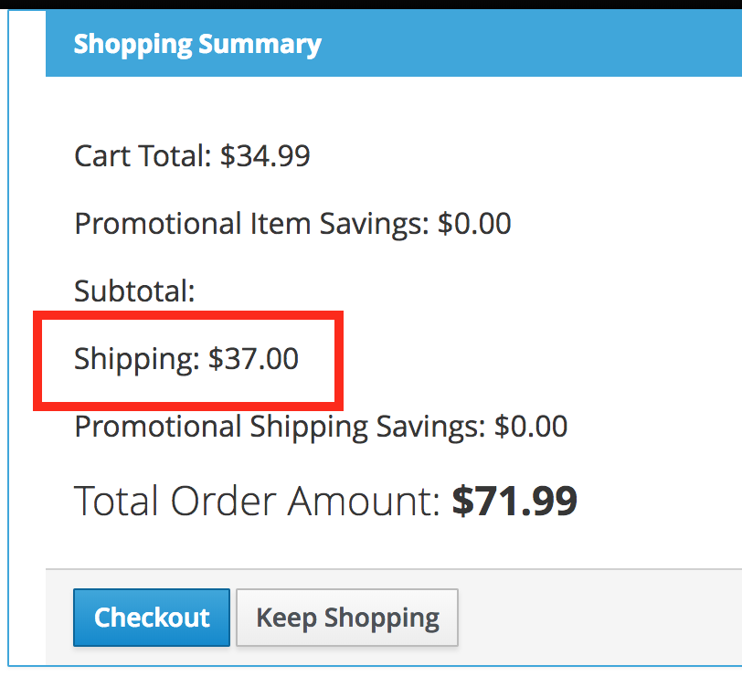
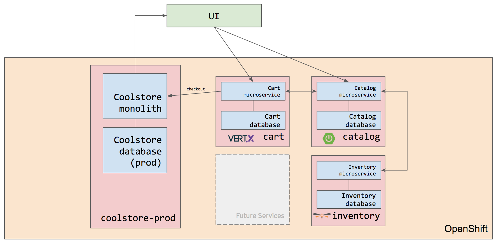

# SCENARIO 5: Building Reactive Microservices

* Purpose: Introduce event based architecture and develop use-cases for reactive microservices
* Difficulty: `advanced`
* Time: `60-70 minutes`

## Intro
In this scenario, you will learn more about Reactive Microservices using [Eclipse Vert.x](https://vertx.io), one of the runtimes included in [Red Hat OpenShift Application Runtimes](https://developers.redhat.com/products/rhoar).

In this scenario you will create three different services that interact using an _EventBus_ which also does a REST call to the CatalogService we built in the previous steps.


>**NOTE:** To simplify the deployment you will deploy all the services in a single Vert.x Server. However the code is 99% the same if we were to deploy these in separate services.

## What is Reactive?
Reactive is an overloaded term these days. The Oxford dictionary defines reactive as “showing a response to a stimulus.” So, reactive software reacts and adapts its behavior based on the stimuli it receives. However, the responsiveness and adaptability promoted by this definition are challenges when programming because the flow of computation isn’t controlled by the programmer but by the stimuli. In this chapter, we are going to see how Vert.x helps you be reactive by combining:
* **Reactive programming** - A development model focusing on the observation of data streams, reacting on changes, and propagating them
* **Reactive system** - An architecture style used to build responsive and robust distributed systems based on asynchronous message-passing

## Why Reactive Microservices?
In previous scenarios you've seen that building a single microservices is not very hard, but the traditional procedural programming style requires developers to control the flow of calls. Reactive microservices can be implemented more like "black boxes" where each service is only responsible for reacting to different events.

The asynchronous behavior or reactive systems will also save resources. In synchronous programming, all request processing including a call to another service is _blocking_. A _non-reactive_ system typically uses threading to achieve concurrency. In a chain of service calls where service A is calling service B that is calling service C, this means that a thread in service A will block while both B and C are processing. Service B will also block a thread while waiting for service C to return. In a complex Microservices Architecture, any single external request might use hundreds of threads. In a reactive system, network calls are typically asynchronous, meaning that requests sent to other services won't block the main thread, resulting in less resource utilization and better performance.

## What is Eclipse Vert.x?


Eclipse Vert.x is a reactive toolkit for the Java Virtual Machine that is polyglot (e.g., supports multiple programming languages).
In this session, we will focus on Java, but it is possible to build the same application in JavaScript, Groovy, Ruby, Ceylon, Scala, or Kotlin.

Eclipse Vert.x is event-driven and non-blocking, which means that applications in Vert.x can handle a lot of concurrent requests using a small number of kernel threads. 

* Vert.x lets your app scale with minimal hardware.
* Vert.x is incredibly flexible - whether it's network utilities, sophisticated modern web applications, HTTP/REST microservices, high volume event processing or a full-blown back-end message-bus application, Vert.x is a great fit.
* Vert.x is used by many [different companies](http://vertx.io/whos_using/) from real-time gaming to banking and everything in between.
* Vert.x is not a restrictive framework or container and we don't tell you a correct way to write an application. Instead, we give you a lot of useful bricks and let you create your app the way you want to.
* Vert.x is fun - Enjoy being a developer again. Unlike restrictive traditional application containers, Vert.x gives you incredible power and agility to create compelling, scalable, 21st-century applications the way you want to, with a minimum of fuss, in the language you want.
* Vert.x is lightweight - Vert.x core is around 650kB in size.
* Vert.x is fast. Here are some independent [numbers](https://www.techempower.com/benchmarks/#section=data-r8&hw=i7&test=plaintext).
* Vert.x is **not an application server**. There's no monolithic Vert.x instance into which you deploy applications. You just run your apps wherever you want to.
* Vert.x is modular - when you need more bits just add the bits you need and nothing more.
* Vert.x is simple but not simplistic. Vert.x allows you to create powerful apps, simply.
* Vert.x is an ideal choice for creating light-weight, high-performance, microservices.

>**NOTE:** There are not enough time in this workshop to cover all aspects and benefits of Reactive, but you will learn the basics and experience some of the benefits.


## Setup for Exercise

Run the following commands to set up your environment for this scenario and start in the right directory:

```sh
#!/usr/bin/env bash

cd ${HOME}/projects/cart
git pull --quiet


```

## Examine the sample project

The sample project shows the components of a basic Vert.x project laid out in different
subdirectories according to Maven best practices.

**1. Examine the Maven project structure.**

> Click on the `tree` command below to automatically copy it into the terminal and execute it

``tree``

```sh
.
+-- pom.xml
\-- src
    \-- main
        +-- fabric8
        +-- java
        |   \-- com
        |       \-- redhat
        |           \-- coolstore
        |               +-- model
        |               |   +-- Product.java
        |               |   +-- ShoppingCart.java
        |               |   +-- ShoppingCartItem.java
        |               |   \-- impl
        |               |       +-- ProductImpl.java
        |               |       +-- ShoppingCartImpl.java
        |               |       \-- ShoppingCartItemImpl.java
        |               \-- utils
        |                   +-- Generator.java
        |                   \-- Transformers.java
        \-- resources
            \-- webroot
                \-- index.html
```

>**NOTE:** To generate a similar project skeleton you can visit the [Vert.x Starter](http://start.vertx.io/) webpage.

If you have used Maven and Java before this should look familiar. This is how a typical Vert.x Java project would looks like. To save time we have provided the domain model, util classes for transforming and generating item, an index.html, and OpenShift configuration.

The domain model consists of a ShoppingCart which has many ShoppingCartItems which has a one-to-one dependency to Product. The domain also consists of Different Promotions that uses the ShoppingCart state to see if it matches the criteria of the promotion.


## Create a web server and a simple rest service

## What is a verticle?

Verticles — the Building Blocks of Eclipse Vert.x

Vert.x gives you a lot of freedom in how you can shape your application and code. But it also provides bricks to start writing reactive applications. _Verticles_ are chunks of code that get deployed and run by Vert.x. An application, such as a microservice, would typically be comprised of many verticles. A verticle typically creates servers or clients, registers a set of Handlers', and encapsulates a part of the business logic of the system.

In Java, a verticle is a class extending the Abstract Verticle class. For example:

```java
public class MyVerticle extends AbstractVerticle {
    @Override
    public void start() throws Exception {
        // Executed when the verticle is deployed
    }

    @Override
    public void stop() throws Exception {
        // Executed when the verticle is un-deployed
    }
}
```

## Creating a simple web server that can serve static content

**1. Creating your first Verticle**

We will start by creating the `CartServiceVerticle` like this. Create this file and add this code to the
`src/main/java/com/redhat/coolstore/CartServiceVerticle.java` file:

```java
package com.redhat.coolstore;

import com.redhat.coolstore.model.Product;
import com.redhat.coolstore.model.ShoppingCart;
import com.redhat.coolstore.model.ShoppingCartItem;
import com.redhat.coolstore.model.impl.ShoppingCartImpl;
import com.redhat.coolstore.model.impl.ShoppingCartItemImpl;
import com.redhat.coolstore.utils.Generator;
import com.redhat.coolstore.utils.Transformers;
import io.vertx.core.AbstractVerticle;
import io.vertx.core.AsyncResult;
import io.vertx.core.Future;
import io.vertx.core.Handler;
import io.vertx.core.eventbus.EventBus;
import io.vertx.core.http.HttpHeaders;
import io.vertx.core.json.JsonArray;
import io.vertx.core.json.JsonObject;
import io.vertx.core.logging.Logger;
import io.vertx.core.logging.LoggerFactory;
import io.vertx.ext.web.Router;
import io.vertx.ext.web.RoutingContext;
import io.vertx.ext.web.client.WebClient;
import io.vertx.ext.web.handler.StaticHandler;

import java.util.Map;
import java.util.concurrent.ConcurrentHashMap;

@SuppressWarnings("SameParameterValue")
public class CartServiceVerticle extends AbstractVerticle {

    /**
     * This is the HashMap that holds the shopping cart. This should be replace with a replicated cache like Infinispan etc
     */
    private final static Map<String,ShoppingCart> carts = new ConcurrentHashMap<>();

    private final Logger logger = LoggerFactory.getLogger(CartServiceVerticle.class.getName());

    static {
        carts.put("99999", Generator.generateShoppingCart("99999"));
    }


    @Override
    public void start() {
        logger.info("Starting " + this.getClass().getSimpleName());
        Integer serverPort = config().getInteger("http.port", 10080);
        logger.info("Starting the HTTP Server on port " + serverPort);

        //TODO: Create Router
        //TODO: Create hello router
        //TODO: Create carts router
        //TODO: Create cart router
        //TODO: Create checkout router
        //TODO: Create add router
        //TODO: Create remove router
        //TODO: Create static router

        //TODO: Create HTTP Server
    }

//TODO: Add handler for getting a list of shoppingCarts

//TODO: Add handler for getting a shoppingCart by id

//TODO: Add handler for adding a Item to the cart

//TODO: Add handler for removing an item from the cart

//TODO: Add handler for checking out a shopping cart

//TODO: Add method for getting products

//TODO: Add method for getting the shipping fee

    private void sendCart(ShoppingCart cart, RoutingContext rc) {
        sendCart(cart,rc,200);
    }

    private void sendCart(ShoppingCart cart, RoutingContext rc, int status) {
        rc.response()
            .setStatusCode(status)
            .putHeader(HttpHeaders.CONTENT_TYPE, "application/json")
            .end(Transformers.shoppingCartToJson(cart).encodePrettily());
    }


    private void sendError(RoutingContext rc) {
        sendError("Unknown",rc);
    }

    private void sendError(String reason, RoutingContext rc) {
        logger.error("Error processing " + rc.request().method().name() + " request to " + rc.request().absoluteURI() + " with reason " + reason);
        rc.response().setStatusCode(500).end();
    }

    private static ShoppingCart getCart(String cartId) {
        if(carts.containsKey(cartId)) {
            return carts.get(cartId);
        } else {
            ShoppingCart cart = new ShoppingCartImpl();
            cart.setCartId(cartId);
            carts.put(cartId,cart);
            return cart;
        }

    }
}
```


>**WARNING:** Don't remove the TODO markers. These will be used later to add new functionality. There are also some private method that we we will use later when we create our endpoints for the shopping cart.

Currently our verticle doesn't really do anything except logging some info. Let's try it out. Execute:

``mvn compile vertx:run``

You should see output that looks like this:

```sh
[INFO] Launching Vert.x Application
[INFO] jan 12, 2018 11:25:40 FM com.redhat.coolstore.CartServiceVerticle
[INFO] INFO: Starting CartServiceVerticle
[INFO] jan 12, 2018 11:25:40 FM com.redhat.coolstore.CartServiceVerticle
[INFO] INFO: Starting the HTTP Server on port 10080
[INFO] jan 12, 2018 11:25:40 FM io.vertx.core.impl.launcher.commands.VertxIsolatedDeployer
[INFO] INFO: Succeeded in deploying verticle
```

**3. Add a router that can serve static content**
Now let's add a Web server that can server static content, which only requires three lines of code at the `//TODO: Create Router` marker:

Create the router object:
```java
Router router = Router.router(vertx);
```

Add the route for static content at the `//TODO: Create static router` marker:

```java
router.get("/*").handler(StaticHandler.create());
```

This configure the router to use the `StaticHandler` (provided by Vert.x) for all GET request.

Create and start the web server listing to the port retrieved from the configuration by adding this to the `//TODO: Create HTTP Server` marker:

```java
vertx.createHttpServer().requestHandler(router::accept).listen(serverPort);
```

Now let's restart the application. Execute:

``mvn compile vertx:run``

**3. Test the static router**

Click on the this at 

`http://localhost:10080` link, which will open another tab or window of your browser pointing to port 10080 on your client.

You should now see an HTML page that looks like this:


> **NOTE:** The Fetch button doesn't work yet, but we will fix that later in this lab.

**3. Add a simple REST Handler**

Now let's add a simple rest service. Replace the `//TODO: Create hello router` marker with this code to
create and start the web server listing to the port retrieved from the configuration:

```java
router.get("/hello").handler(rc-> rc.response()
            .setStatusCode(200)
            .putHeader(HttpHeaders.CONTENT_TYPE, "application/json")
            .end(new JsonObject().put("message","Hello").encode()));
```

Notice that we add this handler above the static router. This is because the order we add routes does matter and if you added "/hello" after "/*" the hello router would never be used, since the static router is set to take care of all requests. However, since we add the hello router before the static router it will take priority over the static router.

If you've never used Lambda expressions in Java before this might look a bit complex, but it's actually very simple. As we discussed in the intro Vert.x is a Reactive toolkit and the web server is asynchronous and will react to incoming request. In order to register a handler we provide the implementation directly. `rc` is the input parameter of type `RoutingContext` and `->` indicated that the following is a method implementation. We could have wrapped it in `{..}`, but since it's only one line it's not required.

It's actually not necessary to set the status, since it will default to HTTP OK (e.g. 200), but for REST services it's recommended to be explicit since different action may return different status codes. We also set the content type to "application/json" so that the request knows what type of content we are returning. Finally we create a simple `JsonObject` and add a `message` with value `Hello`. The `encode()` method returns a `JsonObject` encoded as a string. E.g `{"message","Hello"}`

**3. Test the REST service**

Restart the application by running the following in the terminal or in clicking the execute button.

``mvn compile vertx:run``

After Vert.x is start execute a curl command in another terminal so like this. 

```curl -X GET http://localhost:10080/hello; echo```

The response body should be a JSON string `{"message":"Hello"}`.

## Congratulations

You have now successfully created a simple reactive rest service using Eclipse Vert.x.

It only took three lines of code to create an HTTP server that is capable of serving static content using the Vert.x Toolkit and a few lines to add a rest endpoint.

In next step of this scenario, we will discuss a bit a about configuration in Vert.x.

## Setup environment specific configuration

## Reactive programing
In the previous step you did a bit of reactive programming, but Vert.x also support using RxJava. RxJava is a Java VM implementation of [ReactiveX (Reactive Extensions)](http://reactivex.io/) a library for composing asynchronous and event-based programs by using observable sequences.

With the introduction of Lambda in Java8 there we don't have to use RxJava for programming in Vert.x, but depending on your preference and experience you might want to use RxJava instead. Everything we do in this lab is possible to also implement using RxJava. However for simplicity and since RxJava is harder to understand for someone that never used it before we will stick with Java8 and Lambda in this lab.

## 1. Configuration and Vert.x
Vert.x has a very powerful configuration library called [Vert.x Config](http://vertx.io/docs/vertx-config/java/). The Config library can read configuration as Properties, Json, YaML, etc and it support a number stores like files, directories, http, git (extension), redis (extension), system properties, environment properties. 

The Config library is structured around:

* A **Config Retriever** instantiated and used by the Vert.x application. It configures a set of configuration items in the Configuration Store.

* **Configuration store** defines a location from where the configuration data is read and and a syntax (the configuration is retrieved as a JSON Object by default)

By default you can access the configuration in verticle by calling `config().get...`, however it does not support environment-specific configuration like for example Spring Boot. If you recall from the previous lab we used different configuration files for local vs OpenShift. If we like the same behavior in Vert.x we need to implement this ourselves.

One thing that can seem a bit strange is that the **Config Retriever** reads the configuration asynchronously. So if we want to change the default behaviour we need to take that into consideration.

Consider the following example.

```java
private void setupConfiguration(Vertx vertx) {
    ConfigStoreOptions defaultFileStore = new ConfigStoreOptions()
        .setType("file")
        .setConfig(new JsonObject().put("path", "config-default.json"));
    ConfigRetrieverOptions options = new ConfigRetrieverOptions();
    options.addStore(defaultFileStore);
    String profilesStr = System.getProperty("vertx.profiles.active");
    if(profilesStr!=null && profilesStr.length()>0) {
        Arrays.stream(profilesStr.split(",")).forEach(s -> options.addStore(new ConfigStoreOptions()
        .setType("file")
        .setConfig(new JsonObject().put("path", "config-" + s + ".json"))));
    }
    ConfigRetriever retriever = ConfigRetriever.create(vertx, options);

    retriever.getConfig((AsyncResult<JsonObject> ar) -> {
        if (ar.succeeded()) {
            JsonObject result = ar.result();
            result.fieldNames().forEach(s -> config().put(s, result.getValue(s)));
    });
}
```

Then in our start method of our Verticle we could run

```java
public void start() {
    setupConfiguration(vertx);
    Integer serverPort = config().getInteger("http.port", 10080);
    Router router = Router.router(vertx);
    router.get("/*").handler(StaticHandler.create());
    vertx.createHttpServer().requestHandler(router::accept).listen(serverPort);
}
```

At a first glance this may look like a good way to implement an environment specific configuration. Basically it will use a default config call `config-default.json` and if we start he application with parameter `-Dvertx.profiles.active=[name]` it will overload the default config with values from `config-[name].json`.

**THIS WILL NOT WORK!**

The reason that it doesn't work is that when we calling `setupConfiguration()` the `ConfigStore` will execute synchronously, but the actual retrieval of the configuration values is asynchronous and while the program is waiting for async operation like opening a file and read it the `start()` method will continue to run and when it gets to `Integer serverPort = config().getInteger("http.port", 8889);` the value has not been populated yet. E.g. the config `http.port` will fail and the default value of `8889` will always be used.

**1. Load configuration and other Verticles**

One solution to this problem is to load our Verticle from another verticle and pass the configuration as a deployment option.

Let's add a `MainVerticle` that will load the `CartServiceVerticle`. Add a `src/main/java/com/redhat/coolstore/MainVerticle.java` file
and add the following content:

```java
package com.redhat.coolstore;

import io.vertx.config.ConfigRetriever;
import io.vertx.config.ConfigRetrieverOptions;
import io.vertx.config.ConfigStoreOptions;
import io.vertx.core.*;
import io.vertx.core.json.JsonObject;

import java.util.Arrays;
import java.util.concurrent.ArrayBlockingQueue;
import java.util.concurrent.BlockingQueue;

public class MainVerticle extends AbstractVerticle {

    @Override
    public void start() {
        ConfigRetriever.getConfigAsFuture(getRetriever())
            .setHandler(config ->  {
                vertx.deployVerticle(
                    CartServiceVerticle.class.getName(),
                    new DeploymentOptions().setConfig(config.result())
                );
                // TODO: Deploy PromoServiceVerticle
                // TODO: Deploy ShippingServiceVerticle
            });
    }

    private ConfigRetriever getRetriever() {
        ConfigStoreOptions defaultFileStore = new ConfigStoreOptions()
            .setType("file")
            .setConfig(new JsonObject().put("path", "config-default.json"));
        ConfigRetrieverOptions configStoreOptions = new ConfigRetrieverOptions();
        configStoreOptions.addStore(defaultFileStore);
        String profilesStr = System.getProperty("vertx.profiles.active");
        if(profilesStr!=null && profilesStr.length()>0) {
            Arrays.stream(profilesStr.split(",")).forEach(s -> configStoreOptions.addStore(new ConfigStoreOptions()
                .setType("file")
                .setConfig(new JsonObject().put("path", "config-" + s + ".json"))));
        }
        return ConfigRetriever.create(vertx, configStoreOptions);
    }
}
```

>**NOTE:** The MainVerticle deploys the `CartServiceVerticle` in a handler that will be called after the retriever has read the configuration. It then passes the new configuration as `DeploymentOptions` to the CartService. Later on we will use this to deploy other Verticles.

**2. Create the configuration file**
At the moment we only need one value in the configuration file, but we will add more later.

Copy this into the configuration file `src/main/resources/config-default.json`:

```java
{
    "http.port" : 8082
}
```

Finally we need to tell the `vertx-maven-plugin` to use the MainVerticle instead of the CartServiceVerticle. In the `pom.xml` under `project->properties` there is a tag called `<vertx.verticle>` that currently specifies the full path to the `CartServiceVerticle`.

First open the `pom.xml`

Then Change the `<vertx.verticle>com.redhat.coolstore.CartServiceVerticle</vertx.verticle>` to `<vertx.verticle>com.redhat.coolstore.MainVerticle</vertx.verticle>`

```java
com.redhat.coolstore.MainVerticle
```


**3. Test the default configuration**

Restart the application by running the following in the terminal or in clicking the execute button.

``mvn compile vertx:run``

In the output you should now see that the server is starting on port 8082 and not 10080 like before.

Click on the **Local Web Browser** tab in the console frame of this browser window, which will open another tab or window of your browser pointing to port 8082 on your client. 

> CDK Users will not have a **Local Web Browser** tab. Just open the link below:


Or use this at 

`http://localhost:8082` link.

Again you should now see an HTML page that looks like this:


## Congratulations

You have now successfully implemented environment specific configuration. Please note that future version of Eclipse Vert.x will probably include a better way to solve this, but this should have helped you understand a bit of how programming in a reactive world is different then for example Java EE or Spring (Spring 5 now includes some reactive extensions as well).

In next step of this scenario, we will start implementing our rest endpoints.


## Create REST endpoints for retrieving carts

So now that you have learned how to create a rest service and also how to implement environmental specific configuration let's start building our rest endpoints. But before that lets discuss the `Router`, which is part of Vert.x Web.

The `Router` in Vert.x is very flexible and makes it easy to deal with complex HTTP routing. Some of the key features of Vert.x-Web include:
* Routing (based on method, path, etc)
* Regular expression pattern matchingfor paths
* Extraction of parameters from paths
* Content negotiation
* Request body handling
* Body size limits
* ... and [much more](http://vertx.io/docs/vertx-web/js/)

In our example we will only use basic GET, POST and DELETE routing. Let's get started with the GET operations.

**1. Creating a GET /services/cart endpoint**
First we are going to create a very simple endpoint that returns a `ShopppingCart` object as a JSON String using some
utility methods from the `src/main/java/com/redhat/coolstore/utils/Transformers.java` to get a `JsonObject` that we can then return as String.

Add this code to the `src/main/java/com/redhat/coolstore/CartServiceVerticle.java` class at the `//TODO: Add handler for getting a shoppingCart by id` marker:

```java
private void getCart(RoutingContext rc) {
    logger.info("Retrieved " + rc.request().method().name() + " request to " + rc.request().absoluteURI());
    String cartId = rc.pathParam("cartId");
    ShoppingCart cart = getCart(cartId);
    sendCart(cart,rc);
}
```


**2. Creating a GET /services/carts endpoint that returns all carts**

Now let's create a bit more complex implementation that returns many `ShoppingCarts` as a JSON array.

Still in file `src/main/java/com/redhat/coolstore/CartServiceVerticle.java` add this code at
the `//TODO: Add handler for getting a list of shoppingCarts` marker:

```java
private void getCarts(RoutingContext rc) {
    logger.info("Retrieved " + rc.request().method().name() + " request to " + rc.request().absoluteURI());
    JsonArray cartList = new JsonArray();
    carts.keySet().forEach(cartId -> cartList.add(Transformers.shoppingCartToJson(carts.get(cartId))));
    rc.response()
        .setStatusCode(200)
        .putHeader(HttpHeaders.CONTENT_TYPE, "application/json")
        .end(cartList.encodePrettily());
}
```

The most important line in this method is this:
```java
carts.keySet().forEach(cartId ->; cartList.add(Transformers.shoppingCartToJson(carts.get(cartId))));
``` 

In this lambda expression we are iterating through the list of shopping carts and transforming them to JsonObject using the `Transformers` utility class to get a `JsonObject` that we add to a `JsonArray`. We can then return a String encoding of that JsonArray to the response.

**3. Add routes**

Open the `src/main/java/com/redhat/coolstore/CartServiceVerticle.java` file.

Add the first route by adding the following at `//TODO: Create cart router` marker
```java
router.get("/services/cart/:cartId").handler(this::getCart);
```

Add the second route by adding the following at `//TODO: Create carts router` marker
```java
router.get("/services/carts").handler(this::getCarts);
```

The `this::getCarts` is a lambda reference to the `getCarts(RoutingContext)`. Another way to write this would be like this

```java
router.get("/services/carts").handler(rc -> {
  this.getCarts(rc);
});
```

**4. Test the new Route**

Restart the application by running the following in the terminal or in clicking the execute button.

``mvn compile vertx:run``

Now test the route with a curl command in the terminal like this:

`curl -X GET http://localhost:8082/services/carts; echo`

This should print the body of the response  that looks somewhat like this. Note that the the content from this is generate from the ```src/main/java/com/redhat/coolstore/utils/Transformers.java``` and will return a random number of products, so you actual content may vary.


```json
[ {
  "cartId" : "99999",
  "cartTotal" : 632.36,
  "retailPrice" : 582.97,
  "cartItemPromoSavings" : 0.0,
  "shippingTotal" : 90.28,
  "shippingPromoSavings" : 40.89,
  "shoppingCartItemList" : [ {
    "product" : {
      "itemId" : "329299",
      "price" : 162.49,
      "name" : "Red Fedora",
      "desc" : null,
      "location" : null,
      "link" : null
    },
    "quantity" : 1
  } ]
} ]
```

Also test getting a single cart curl like this:
```curl -X GET http://localhost:8082/services/cart/99999; echo```

Click on the **Local Web Browser** tab in the console frame of this browser window, which will open another tab or window of your browser pointing to port 8082 on your client. 


Or use this at 

`http://localhost:8082` link.

Now the default page should have an entry in the table matching the values for your JSON file above.


## Congratulations

You have now successfully implemented the first out of many endpoints that we need to continue to strangle the monolith. You have also learned that `<object>::<method>` is a convenient way to reference a lambda expression.

In the next step we will implement another endpoint and this time it will also call out to an external service using rest.

## Create REST endpoints for adding and deleting products

In this step we will implement POST operation for adding a product. The UI in Coolstore Monolith uses a POST operation when a user clicks `Add to Cart`.


The UI will then issue a POST request to `/services/cart/<cartId>/<prodId>/<quantity>`. However when adding a product to the ShoppingCartItem we need an actual `Product` object.


So our implementation of this service needs to retrieve a Product object from the `CatalogService`. Let's get started with this implementation.

**1. Add route**

Make sure `src/main/java/com/redhat/coolstore/CartServiceVerticle.java` is open.

Let's start by adding a router, by adding the following where at the `//TODO: Create add router` marker in class `CartServiceVerticle` 

```java
router.post("/services/cart/:cartId/:itemId/:quantity").handler(this::addToCart);
```

**2. Create handler for our route**

Our newly create route needs a handler. This method should look like this `void addCart(RoutingContext rc)`. The handler should add a product to the shopping cart, but it also have to consider that there might already be product with the same id in the shopping cart already.

Adding the following at the `//TODO: Add handler for adding a Item to the cart` marker in class `CartServiceVerticle`

```java
private void addToCart(RoutingContext rc) {
    logger.info("Retrieved " + rc.request().method().name() + " request to " + rc.request().absoluteURI());

    String cartId = rc.pathParam("cartId");
    String itemId = rc.pathParam("itemId");
    int quantity = Integer.parseInt(rc.pathParam("quantity"));

    ShoppingCart cart = getCart(cartId);

    boolean productAlreadyInCart = cart.getShoppingCartItemList().stream()
        .anyMatch(i -> i.getProduct().getItemId().equals(itemId));

    if(productAlreadyInCart) {
        cart.getShoppingCartItemList().forEach(item -> {
            if (item.getProduct().getItemId().equals(itemId)) {
                item.setQuantity(item.getQuantity() + quantity);
                sendCart(cart,rc); //TODO: update the shipping fee
            }
        });
    } else {
        ShoppingCartItem newItem = new ShoppingCartItemImpl();
        newItem.setQuantity(quantity);
//TODO: Get product from Catalog service and add it to the ShoppingCartItem
    }
}
```

We are not completely done with the addToCart method yet. We have a TODO for Getting a product from the `CatalogService`. Since we do not want to block the thread while waiting for the `CatalogService` to respond this should be a async operation. 

**3. Create a Async method for retrieving a Product**

Normally in Java you would probably implement this method as `Product getProduct(String prodId)`. However we need this operation to be Async. One way to do this is pass a `Handler<AsyncResult<T>>` as an argument. `T` would be replaced with return type we want, which in our case is `Product`.

For making calls to external HTTP services Vert.x supplies a WebClient. The `WebClient` methods like `get()`, `post()` etc and is very easy to use. In our case we are going to use get and pass in port, hostname and uri. We are also going to set a timeout for the operation. So let's first add those to our configuration. 

Copy this into the configuration file `src/main/resources/config-default.json`:

```java
{
    "http.port" : 8082,
    "catalog.service.port" : 8081,
    "catalog.service.hostname" : "localhost",
    "catalog.service.timeout" : 3000
}
```

We are now ready to create our `getProduct` method

Adding the following at the `//TODO: Add method for getting products` marker in class `CartServiceVerticle`

```java
private void getProduct(String itemId, Handler<AsyncResult<Product>> resultHandler) {
    WebClient client = WebClient.create(vertx);
    Integer port = config().getInteger("catalog.service.port", 8080);
    String hostname = config().getString("catalog.service.hostname", "localhost");
    Integer timeout = config().getInteger("catalog.service.timeout", 0);
    client.get(port, hostname,"/services/product/"+itemId)
        .timeout(timeout)
        .send(handler -> {
            if(handler.succeeded()) {
                Product product = Transformers.jsonToProduct(handler.result().body().toJsonObject());
                resultHandler.handle(Future.succeededFuture(product));
            } else {
                resultHandler.handle(Future.failedFuture(handler.cause()));
            }


        });
}
```

Now we can call this method from the `addToCart` method and pass a Lambda call back. 

Adding the following at the `//TODO: Get product from Catalog service and add it to the ShoppingCartItem`

```java
this.getProduct(itemId, reply -> {
    if (reply.succeeded()) {
        newItem.setProduct(reply.result());
        cart.addShoppingCartItem(newItem);
        sendCart(cart,rc); //TODO: update the shipping fee, here as well
    } else {
        sendError(rc);
    }
});
```

To summarize our `addToCart` handler will now first check if the product already exists in the shopping cart. If it does exist we update the quantity and then send the response. If it doesn't exist we call the catalog service to retrieve the data about the product, create a new ShoppingCartItem, set the quantity, add the retrieved product, add it the `ShoppingCartItem`, add the item to the shopping cart and then finally send the response to the client. 

Phew! That wasn't easy... However, in real life thing are never as easy as they sometimes seem to appear. Rather than present you with a set of Hello World demos we believe that it's much more educational to use a more realistic example.


**4. Test our changes**

Let's first test to update the quantity for a product that is already in the shopping cart

Start the cart service
``mvn compile vertx:run``

Then execute this to test retrieving a specific cart and the quantity of item `329299` in the cart:

```curl -s http://localhost:8082/services/cart/99999 | grep -A7  "\"itemId\" : \"329299\"" | grep quantity```

This will return the quantity like below, but the actual number may be different.

`"quantity" : 3`

Now let's call our addToCart method.

```curl -s -X POST http://localhost:8082/services/cart/99999/329299/1 | grep -A7  "\"itemId\" : \"329299\"" | grep quantity```
This should now return a shopping cart where one more instance of the product is added, because of our grep commands you would see something like this:

`"quantity" : 4`

Now let's try adding a new product.

The CartService depends on the CatalogService and just like in the Spring Boot example we could have created mocks for calling the Catalog Service, however since our example is already complex, we will simply test it with the CatalogService running. 

>**NOTE:** The CatalogService in it's turn depends on the InventoryService to retrieve the quantity in stock, however since we don't really care about that in the Shopping Cart we will just rely on the Fallback method of CatalogService when testing. 

First lets check if the catalog service is still running locally.

```curl -v http://localhost:8081/services/products 2>&1 | grep "HTTP/1.1 200"```

If that prints `< HTTP/1.1 200` then our service is responding correctly otherwise we need to start the Catalog application in a separate terminal like this:

```cd ~/projects/catalog; mvn clean spring-boot:run -DskipTests```

Wait for it to complete. You should see `Started RestApplication in xxxxx seconds`.

To test to add a product we are going to use a new shopping cart id. Execute:

```curl -s -X POST http://localhost:8082/services/cart/88888/329299/1 ; echo```

This should print the follow:

```
{
  "cartId" : "88888",
  "cartTotal" : 34.99,
  "retailPrice" : 34.99,
  "cartItemPromoSavings" : 0.0,
  "shippingTotal" : 0.0,
  "shippingPromoSavings" : 0.0,
  "shoppingCartItemList" : [ {
    "product" : {
      "itemId" : "329299",
      "price" : 34.99,
      "name" : "Red Fedora",
      "desc" : "Official Red Hat Fedora",
      "location" : null,
      "link" : null
    },
    "quantity" : 1
  } ]
}
```

**5. Add endpoint for deleting items**
Since we are now so skilled in writing endpoints lets go ahead and also create the endpoint for removing a product. The only tricky part about removing is that the request might not remove all products in once. E.g. If we have 10 Red Hat Fedoras and the request just decreases 3 we should not remove the Shopping Cart item, but instead lower the quantity to 7. 


Again in the `src/main/java/com/redhat/coolstore/CartServiceVerticle.java` file add the following at the `//TODO: Add handler for removing an item from the cart`

```java
private void removeShoppingCartItem(RoutingContext rc) {
    logger.info("Retrieved " + rc.request().method().name() + " request to " + rc.request().absoluteURI());
    String cartId = rc.pathParam("cartId");
    String itemId = rc.pathParam("itemId");
    int quantity = Integer.parseInt(rc.pathParam("quantity"));
    ShoppingCart cart = getCart(cartId);

    //If all quantity with the same Id should be removed then remove it from the list completely. The is the normal use-case
    cart.getShoppingCartItemList().removeIf(i -> i.getProduct().getItemId().equals(itemId) && i.getQuantity()<=quantity);

    //If not all quantities should be removed we need to update the list
    cart.getShoppingCartItemList().forEach(i ->  {
            if(i.getProduct().getItemId().equals(itemId))
                i.setQuantity(i.getQuantity()-quantity);
        }
    );
    sendCart(cart,rc);
}
```

Now let's go ahead and create the route.

Add the following at the `//TODO: Create remove router` marker in class `CartServiceVerticle.start`:

```java
router.delete("/services/cart/:cartId/:itemId/:quantity").handler(this::removeShoppingCartItem);
```

**6. Test to remove a product**

Let's first test to decreasing the quantity for a product that is already in the shopping cart

Start the cart service
``mvn compile vertx:run``

The run this to get the quantity of item `329299` in the cart:

```curl -s http://localhost:8082/services/cart/99999 | grep -A7  "\"itemId\" : \"329299\"" | grep quantity```

This will return the quantity like below, but the actual number may be different.

`"quantity" : 4`

Now let's call our removeShoppingCartItem method.

```curl -s -X DELETE http://localhost:8082/services/cart/99999/329299/1 | grep -A7  "\"itemId\" : \"329299\"" | grep quantity```

If this results in an empty cart (quantity =0 ) this command will not return any output.

If you have more than one items remaining in the cart, this will return a shopping cart where one more instance of the product is removed,
because of our grep commands you would see something like this.

`"quantity" : 3`


## Congratulations

Wow! You have now successfully created a Reactive microservices that are calling another REST service asynchronously. 

However, looking at the output you can see that the discount and shippingFee is `0.0`, which also means that the orderValue (price after shipping and discount) and retailPrice (sum of all products prices) are equal. That is because we haven't implemented the Shipping and Promotional Services yet. That's what we are going to do in the next scenario.


## Using the Vert.x Event Bus for shipping services

In the previous steps we have added more and more functionality to the cart service and when we define our microservices it's often done using a domain model approach. The cart service is central, but we probably do not want it to handle things like calculating shipping fees. In our example we do not have enough data to do a complex shipping service since we lack information about the users shipping address as well as weight of the products etc. It does however make sense to create the shipping service so that if when we have that information we can extend upon it.

Since we are going to implement the Shipping service as another Vert.x Verticle we will not use REST this time. Instead we are going to use the Vert.x Event bus.

## The Event bus in Vert.x
The event bus is the nervous system of Vert.x.

The event bus allows different parts of your application to communicate with each other irrespective of what language they are written in, and whether they’re in the same Vert.x instance, or in a different Vert.x instance.

It can even be bridged to allow client side JavaScript running in a browser to communicate on the same event bus.

The event bus forms a distributed peer-to-peer messaging system spanning multiple server nodes and multiple browsers.

The event bus supports publish/subscribe, point to point, and request-response messaging.

The event bus API is very simple. It basically involves registering handlers, unregistering handlers and sending and publishing messages.

Internally the EventBus is an abstraction and Vert.x have several different implementations that can be used depending on demands. Default it uses a local java implementation that can't be shared between different java processes. However, for clustered solutions the event bus can use an distributed in-memory data store like Infinispan (also know as Red Hat JBoss Data Grid) or Hazelcast. There are also work in progress to be able to use a JMS implementation like Apache ActiveMQ (also known as Red Hat AMQ) 

>**NOTE:** In the near future RHOAR is planned to offer support for Red Hat JBoss Data Grid for clustering use-cases of Vert.x

## The Event bus API

Let's first discuss some Theory:

**Addressing**
Messages are sent on the event bus to an address.

Vert.x doesn’t bother with any fancy addressing schemes. In Vert.x an address is simply a string. Any string is valid. However it is wise to use some kind of scheme, e.g. using periods to demarcate a namespace.

Some examples of valid addresses are europe.news.feed1, acme.games.pacman, sausages, and X.

**Handlers**
Messages are received in handlers. You register a handler at an address.

Many different handlers can be registered at the same address.

A single handler can be registered at many different addresses.

**Publish / subscribe messaging**
The event bus supports publishing messages.

Messages are published to an address. Publishing means delivering the message to all handlers that are registered at that address.

This is the familiar publish/subscribe messaging pattern.

Point to point and Request-Response messaging
The event bus also supports point to point messaging.

Messages are sent to an address. Vert.x will then route it to just one of the handlers registered at that address.

If there is more than one handler registered at the address, one will be chosen using a non-strict round-robin algorithm.

With point to point messaging, an optional reply handler can be specified when sending the message.

When a message is received by a recipient, and has been handled, the recipient can optionally decide to reply to the message. If they do so the reply handler will be called.

When the reply is received back at the sender, it too can be replied to. This can be repeated ad-infinitum, and allows a dialog to be set-up between two different verticles.

This is a common messaging pattern called the request-response pattern. 

Let’s jump into the API

Getting the event bus
You get a reference to the event bus as follows:

```java
EventBus eb = vertx.eventBus();
```

There is a single instance of the event bus per Vert.x instance.

**Registering Handlers**
This simplest way to register a handler is using consumer. Here’s an example:

```java
EventBus eb = vertx.eventBus();

eb.consumer("news.uk.sport", message -> {
  System.out.println("I have received a message: " + message.body());
});
```

**Publishing messages**
Publishing a message is simple. Just use publish specifying the address to publish it to.

```java
eventBus.publish("news.uk.sport", "Yay! Someone kicked a ball");
```

**The Message object**
The object you receive in a message handler is a `Message`.

The body of the message corresponds to the object that was sent or published. The object has to be serializable, but it's recommended to use JSON encoded String as objects.

The headers of the message are available with headers.


**1. Add a Shipping Verticle**
Since RHOAR currently do not support using distributed event bus we will create the Verticle locally. For now our shipping service will only return a fixed ShippingFee of 37.0. RHOAR is planned to support distributes event bus early 2018. Since the Event Bus API is the same very little code changes (if any) will be required to move this to a separate service in OpenShift in the future.

Add this code to the `src/main/java/com/redhat/coolstore/ShippingServiceVerticle.java` file:

```java
package com.redhat.coolstore;

import io.vertx.core.AbstractVerticle;
import io.vertx.core.eventbus.EventBus;
import io.vertx.core.eventbus.MessageConsumer;
import io.vertx.core.json.JsonObject;
import io.vertx.core.logging.Logger;
import io.vertx.core.logging.LoggerFactory;

public class ShippingServiceVerticle extends AbstractVerticle {
    private final Logger logger = LoggerFactory.getLogger(ShippingServiceVerticle.class.getName());

    @Override
    public void start() {
        logger.info("Starting " + this.getClass().getSimpleName());
        EventBus eb = vertx.eventBus();
        MessageConsumer<String> consumer = eb.consumer("shipping");
        consumer.handler(message -> {
            logger.info("Shipping Service recieved a message");
            message.reply(new JsonObject().put("shippingFee", 37.0)); //Hardcoded shipping Fee
        });
    }
}
```

We also need to start the Verticle by deploying it form the MainVerticle. So add this code
to the `src/main/java/com/redhat/coolstore/MainVerticle.java` file at the `// TODO: Deploy PromoServiceVerticle` marker:

```java
vertx.deployVerticle(
                    ShippingServiceVerticle.class.getName(),
                    new DeploymentOptions().setConfig(config.result())
                );
```

Done! That was easy. :-) We still have to update the shopping cart to use the Shipping service. Let's do that next.

**2. Update the Shopping cart to call the Shipping Service**
In the future we might want to base the shipping service on the actual content of the Shopping cart so it stands to reason that we call the shipping service every time someone updates the cart. In the training however we will only call the Shopping cart when someone adds a product to it. 

We will implement the shipping fee similary to how we implemented the `getProduct` that called out to the Catalog service. 

In `src/main/java/com/redhat/coolstore/CartServiceVerticle.java` we will add the following method at the marker: `//TODO: Add method for getting the shipping fee`. Copy the content below:

```java
private void getShippingFee(ShoppingCart cart, Handler<AsyncResult<Double>> resultHandler) {
    EventBus eb = vertx.eventBus();

    eb.send("shipping",
        Transformers.shoppingCartToJson(cart).encode(),
        reply -> {
            if(reply.succeeded()) {
                resultHandler.handle(Future.succeededFuture(((JsonObject)reply.result().body()).getDouble("shippingFee")));

            } else {
                resultHandler.handle(Future.failedFuture(reply.cause()));
            }
        }
    );
}
```

Now, lets update the `addProduct` request handler method. Click to add it at the `sendCart(cart,rc); //TODO: update the shipping fee` marker replacing
the existing `sendCart(cart, rc);` with an updated code block:

```java
this.getShippingFee(cart, message -> {
    if(message.succeeded()) {
        cart.setShippingTotal(message.result());
        sendCart(cart,rc);
    } else {
        sendError(rc);
    }

});
```

Since we have the special case of product already exists we need to update it twice.  Replace the line with
`sendCart(cart, rc)` that you just added with another duplicate block:

```java
this.getShippingFee(cart, message -> {
    if(message.succeeded()) {
        cart.setShippingTotal(message.result());
        sendCart(cart,rc);
    } else {
        sendError(rc);
    }

});
```

**3. Test our changes**

So now when we add something to the shopping cart it should also update the shipping fee and set it to 37.0

Firstly, build and start the cart service
``mvn compile vertx:run``

Now issue a curl command to add a product that exists

```curl -s -X POST http://localhost:8082/services/cart/99999/329299/1 | grep -A7  "\"itemId\" : \"329299\"" | grep quantity```

Let's also make sure that it works with a totally new shopping cart, which would test the second part of our changes:

```curl -s -X POST http://localhost:8082/services/cart/88888/329299/1 | grep -A7  "\"itemId\" : \"329299\"" | grep quantity```

This should now return a new shopping cart where one only instance of the product is added, because of our grep commands you would see something like this:

`"quantity" : 1`

The CartService depends on the CatalogService and just like in the Spring Boot example we could have created mocks for calling the Catalog Service, however since our example is already complex, we will simply test it with the CatalogService running. 


## Create an OpenShift Project for the Cart microservice

We have already deployed our coolstore monolith, inventory and catalog to OpenShift. In this step we will deploy our new Shopping Cart microservice for our CoolStore application,
so let's create a separate project to house it and keep it separate from our monolith and our other microservices.

**1. Create project**

Create a new project for the *cart* service:

```oc new-project cart --display-name="CoolStore Shopping Cart Microservice Application"```

**3. Open the OpenShift Web Console**

You should be familiar with the OpenShift Web Console by now!
Click on the "OpenShift Console" tab:


And navigate to the new _catalog_ project overview page (or use this quick link at 

`https://$OPENSHIFT_MASTER/console/project/cart/`


There's nothing there now, but that's about to change.


## Deploy Cart microservice to OpenShift

Now that you've logged into OpenShift, let's deploy our new cart microservice:

**Update configuration**

Create the file: ``src/main/resources/config-openshift.json``

Copy the following content to the file:

```java
{
    "http.port" : 8080,
    "catalog.service.port" : 8080,
    "catalog.service.hostname" : "catalog.catalog.svc.cluster.local"
}
```

>**NOTE:** The `config-openshift.json` does not have all values of `config-default.json`, that is because on the values that need to change has to be specified here. Our solution will fallback to the default configuration for values that aren't configured in the environment specific config.


**Build and Deploy**

Red Hat OpenShift Application Runtimes includes a powerful maven plugin that can take an
existing Eclipse Vert.x application and generate the necessary Kubernetes configuration.

You can also add additional config, like ``src/main/fabric8/deployment.yml`` which defines
the deployment characteristics of the app (in this case we declare a few environment variables which map our credentials
stored in the secrets file to the application), but OpenShift supports a wide range of [Deployment configuration options](https://docs.openshift.org/latest/architecture/core_concepts/deployments.html) for apps).

Let's add a deployment.yml that will set the system property to use our `config-openshift.json` config.

Create the file by clicking on open ``src/main/fabric8/deployment.yml``

Add the following content the the file (by clicking on *Copy to Editor* or copying it in directly):

```java
apiVersion: v1
kind: Deployment
metadata:
  name: ${project.artifactId}
spec:
  template:
    spec:
      containers:
        - env:
            - name: JAVA_OPTIONS
              value: "-Dvertx.profiles.active=openshift -Dvertx.disableDnsResolver=true"

```

We also need to add a route.yml like this:

Create the file by clicking on open ``src/main/fabric8/route.yml``

Add the following content by clicking on *Copy to Editor* or copying it in directly:

```java
apiVersion: v1
kind: Route
metadata:
  name: ${project.artifactId}
spec:
  port:
    targetPort: 8080
  to:
    kind: Service
    name: ${project.artifactId}
```

Build and deploy the project using the following command, which will use the maven plugin to deploy:

`mvn package fabric8:deploy -Popenshift`

The build and deploy may take a minute or two. Wait for it to complete. You should see a **BUILD SUCCESS** at the
end of the build output.

After the maven build finishes it will take less than a minute for the application to become available.
To verify that everything is started, run the following command and wait for it complete successfully:

`oc rollout status -w dc/cart`

**3. Access the application running on OpenShift**

This sample project includes a simple UI that allows you to access the Inventory API. This is the same
UI that you previously accessed outside of OpenShift which shows the CoolStore inventory. Click on the
route URL at 

`http://cart-cart.$ROUTE_SUFFIX`
to access the sample UI.

> You can also access the application through the link on the OpenShift Web Console Overview page.


## Congratulations!

You have deployed the Catalog service as a microservice which in turn calls into the Inventory service to retrieve inventory data.
However, our monolih UI is still using its own built-in services. Wouldn't it be nice if we could re-wire the monolith to use the
new services, **without changing any code**? That's next!


## Replace (Strangle) monolith Cart services

In earlier scenarios we started [strangling the monolith](https://www.martinfowler.com/bliki/StranglerApplication.html) by redirecting
calls the product catalog microservice. We will now do the same with our new shopping cart microservice. To do this
we are going to again make use of routing capabilities in OpenShift.

Adding items to, or removing items from your cart in the monolith UI is accomplished via a REST call to `http://<monolith-hostname>/services/cart`. At the moment
calls to that URL will still hit embedded cart service in the monolith. By using a
[path based route](https://docs.openshift.com/container-platform/3.7/architecture/networking/routes.html#path-based-routes) in
OpenShift we can route these calls to our newly created cart services instead, just like we did with the Catalog microservice!

Flow the steps below to create a path based route.

**1. Obtain hostname of monolith UI from our Dev environment**

`oc get route/www -n coolstore-dev`

The output of this command shows us the hostname:

```
NAME      HOST/PORT                                 PATH      SERVICES    PORT      TERMINATION   WILDCARD
www       www-coolstore-dev.apps.127.0.0.1.nip.io             coolstore   <all>                   None
```

My hostname is `www-coolstore-dev.apps.127.0.0.1.nip.io` but **yours will be different**.

**2. Open the openshift console for Cart - Applications - Routes at 

`https://$OPENSHIFT_MASTER/console/project/cart/browse/routes`**

**3. Click on Create Route, and set**

* **Name**: `cart-redirect`
* **Hostname**: _the hostname from above_
* **Path**: `/services/cart`
* **Service**: `cart`


Leave other values set to their defaults, and click **Save**

**4. Test the route**

Test the route by running `curl http://www-coolstore-dev.[[HOST_SUBDOMAIN]]-80-[[KATACODA_HOST]].environments.katacoda.com/services/cart/99999`

You should get a complete set of products, along with their inventory.

**5. Test the UI**

Open the monolith UI and observe that the new catalog is being used along with the monolith:


Add some items to your cart, then visit the **Shopping Cart** tab to observe the new shipping fees we hard-coded earlier:



The **Checkout** functionality is yet to be implemented, so won't work, but it's not too far away and if you have time
after this workshop feel free to contribute the changes and make this workshop even better!

## Congratulations!

You have now successfully begun to _strangle_ the monolith. Part of the monolith's functionality (Inventory, Catalog and Shopping Cart) are
now implemented as microservices, without touching the monolith.

## Summary

In this scenario, you learned a bit more about what Reactive Systems and Reactive programming are and why it's useful when building Microservices. Note that some of the code in here may have been hard to understand and part of that is that we are not using an IDE, like JBoss Developer Studio (based on Eclipse) or IntelliJ. Both of these have excellent tooling to build Vert.x applications. 

You created a new shopping cart microservice almost finalizing the migration from a monolith to microservices. There are a couple of things that are also required. Firstly the checkout of the shopping cart was never implemented, and secondly, the monolith also has an order service. These were removed from this exercise because of time constraints. You have however so far almost completed a migration, so good work. You deserve a promotion. :-)

Your final strangled monolith now looks like:



In the next chapter, we will talk more about how to make these microservices more resilient.

